---
## Front matter
lang: ru-RU
title: Презентация к первой лабораторной работе
subtitle: Операционные системы
author:
  - Четвергова Мария Викторовна
institute:
  - Российский университет дружбы народов, Москва, Россия
date: 1 марта 2024 г.

## i18n babel
babel-lang: russian
babel-otherlangs: english

## Formatting pdf
toc: false
toc-title: Содержание
slide_level: 2
aspectratio: 169
section-titles: true
theme: metropolis
header-includes:
 - \metroset{progressbar=frametitle,sectionpage=progressbar,numbering=fraction}
 - '\makeatletter'
 - '\beamer@ignorenonframefalse'
 - '\makeatother'
 
## Fonts
mainfont: PT Serif
romanfont: PT Serif
sansfont: PT Sans
monofont: PT Mono
mainfontoptions: Ligatures=TeX
romanfontoptions: Ligatures=TeX
sansfontoptions: Ligatures=TeX,Scale=MatchLowercase
monofontoptions: Scale=MatchLowercase,Scale=0.9
---

# Информация

## Докладчик

:::::::::::::: {.columns align=center}
::: {.column width="50%"}

  * Четвергова Мария Викторовна
  * студент НПИбд-02-23
  * Российский университет дружбы народов
  * 1132232886@pfur.ru
:::
::: {.column width="30%"}

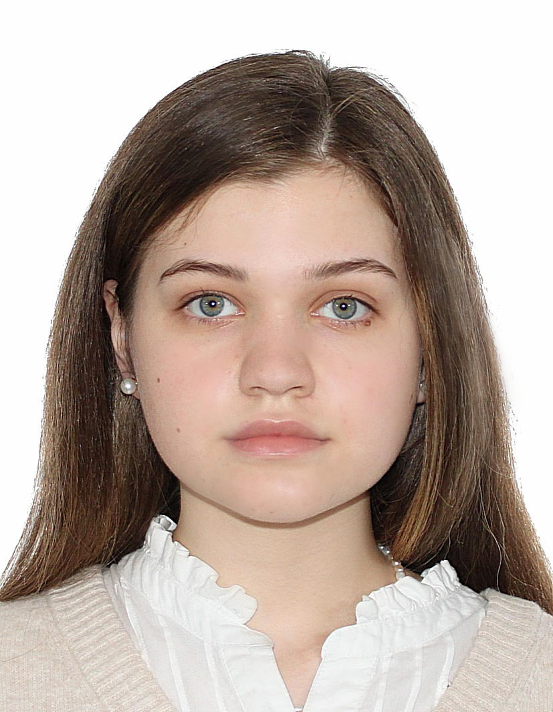

:::
::::::::::::::

# Вводная часть
## Цели и задачи

Целью данной работы является приобретение практических навыков установки операционной системы на виртуальную машину, настройки минимально необходимых для дальнейшей работы сервисов.

# Последовательность выполнения работы

## Настройка хост-клавиши
Хост-клавишей по умолчанию является правый Ctrl.

# Последовательность выполнения работы

### Графический интерфейс

В меню выберем Файл, Настройки.
Выберем Ввод, вкладка Виртуальная машина.
Выберем Сочетание клавиш в строке Хост-комбинация(RCtrl)
Нажмите новое сочетание клавиш.
Нажмите ОК, чтобы сохранить изменения.

# Последовательность выполнения работы
## Создание виртуальной машины

Для создания виртуальной машины используем графический интерфейс. при создании заполняем необходимые данные:
имя виртуальной машины (логин в дисплейном классе), тип операционной системы — Fedora, размер основной памяти виртуальной машины — от 2048 МБ.

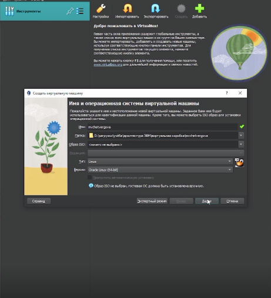{#fig:002 width=50%}

# Последовательность выполнения работы

Сразу обозначим настройки оборудования: Основная память 2167 МБ и 2 ЦП процессора

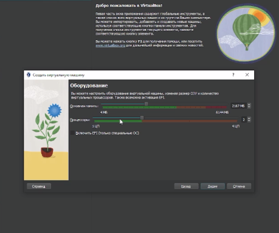{#fig:003 width=50%}

# Последовательность выполнения работы

Задайте конфигурацию жёсткого диска — загрузочный, VDI (VirtualBox Disk Image), динамический виртуальный диск.

Задайте размер диска — 80 ГБ (или больше), его расположение — в данном случае /var/tmp/имя_пользователя/имя_машины/имя_машины.vdi.

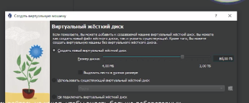{#fig:004 width=50%}

# Последовательность выполнения работы
Перейдём в общие настройки ВиртуалБокс и в разделе "Общие" -> "Дополнительно" для "Общего буфера обмена" и Функции  Drag'n'Drop выьираем параметр "Двунаправленный"

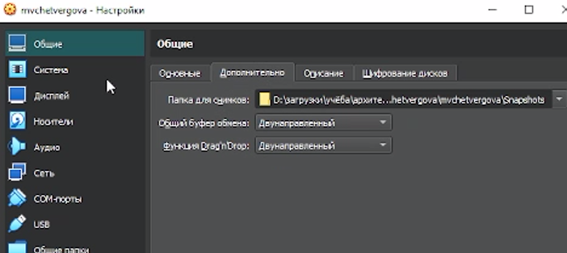{#fig:005 width=50%}

# Последовательность выполнения работы
Далее переходим в раздел "Носители"  и добавляем образ fedora в нашу виртуальную машину. 

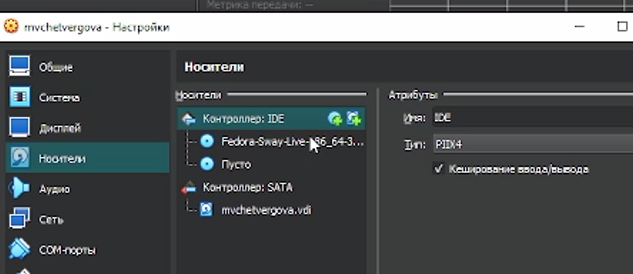{#fig:006 width=50%}

# Последовательность выполнения работы
Добавляем  Живой  CD/DVD:

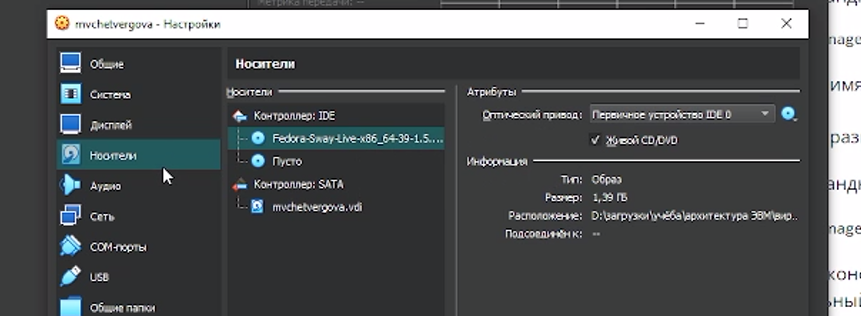{#fig:007 width=50%}

# Последовательность выполнения работы
В разделе "Дисплей" включаем 3D-ускорение:

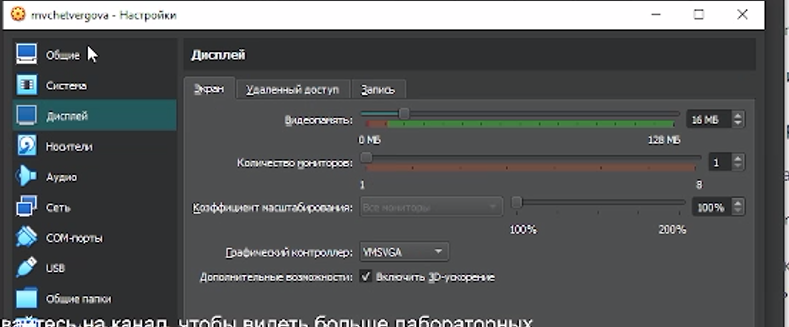{#fig:008 width=50%}

# Последовательность выполнения работы
Отлично! Теперь запускаем виртуальную машину:

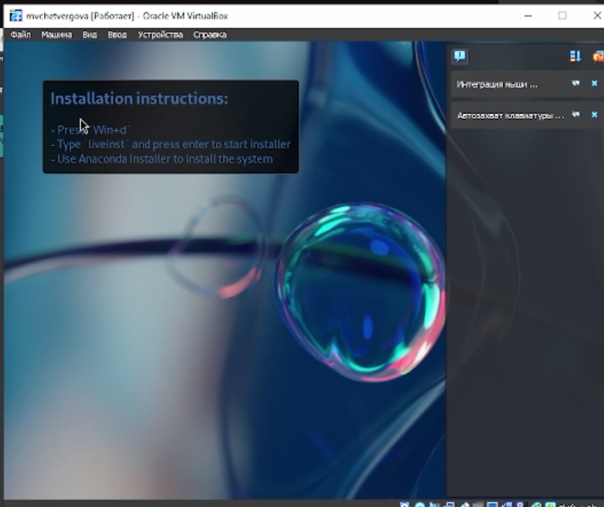{#fig:009 width=50%}

# Последовательность выполнения работы
## Установка операционной системы

После запуска виртуальной машины необходимо установить ОС. Для этого при запуске необходимо открыть окно терминала и ввести команду:
*liveinst* 

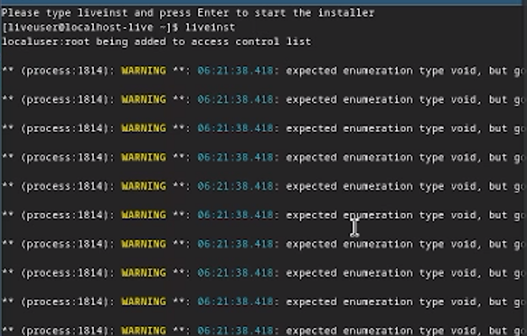{#fig:010 width=50%}

# Последовательность выполнения работы

Затем нажмём на  Win+w для перехода к раскладке окон с табами:

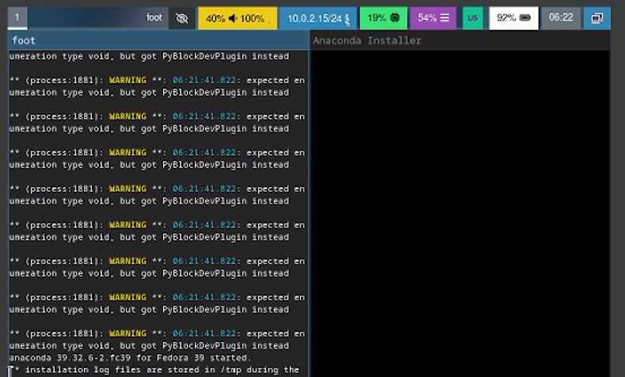{#fig:011 width=50%}

# Последовательность выполнения работы

Установим систему на диск. 

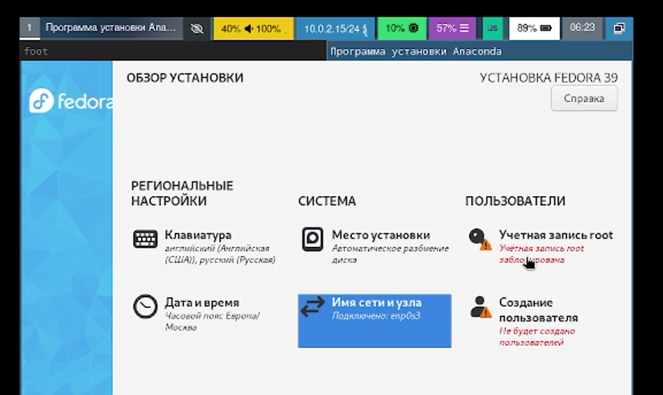{#fig:012 width=50%}

Выбираем язык интерфейса и переходим к настройкам установки операционной системы.
Указываем имя и пароль для пользователя root и для своего пользователя. Задаём сетевое имя для компьютера. по завершении установки - перезапускаем машину.

# Последовательность выполнения работы
## После установки

Входим в ОС под заданной учётной записью и откроем терминал. 

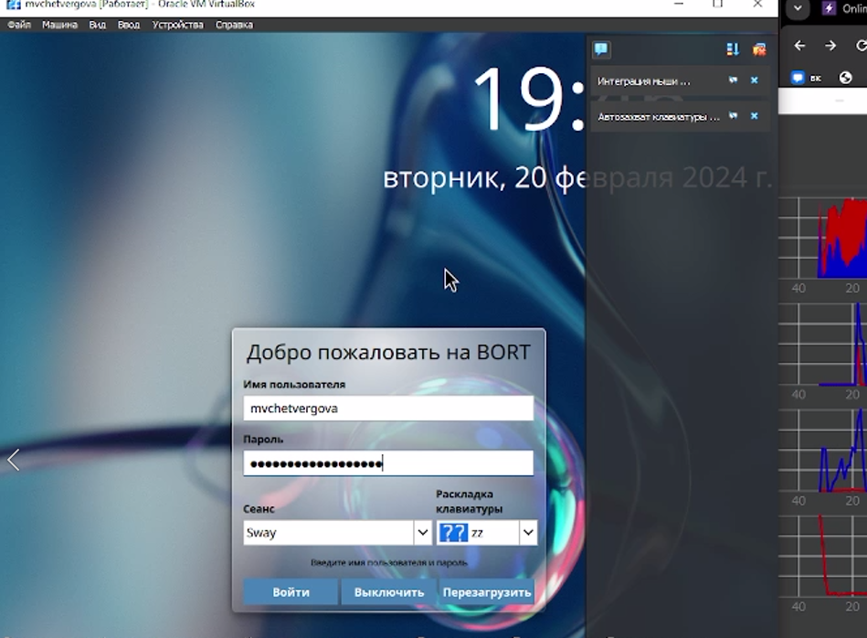{#fig:013 width=50%}

# Последовательность выполнения работы
Переключимся на роль супер-пользователя и для его активации введём пароль:

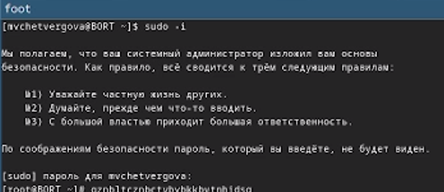{#fig:014 width=50%}

# Последовательность выполнения работы
Обновим все пакеты с помощью команды *dnf -y update*, а также установим программы для повышения комфорта работы и автоматического обновления:

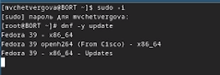{#fig:015width=50%}

# Последовательность выполнения работы

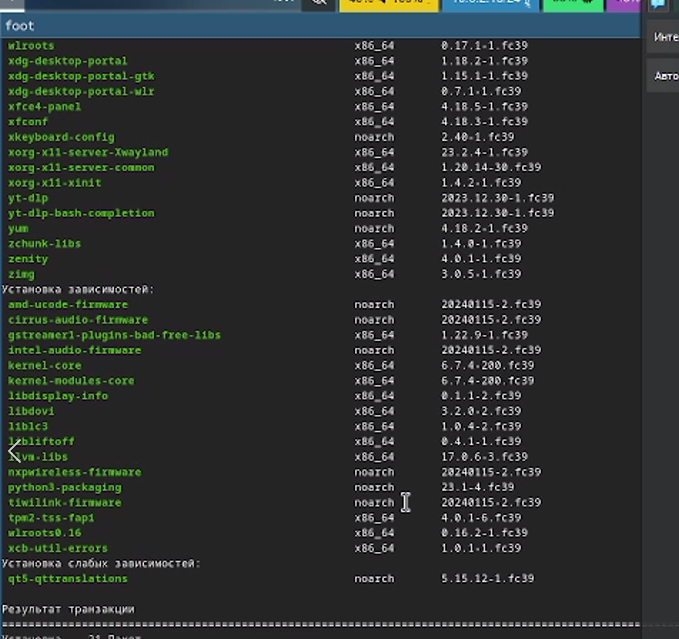{#fig:016width=50%}

# Последовательность выполнения работы
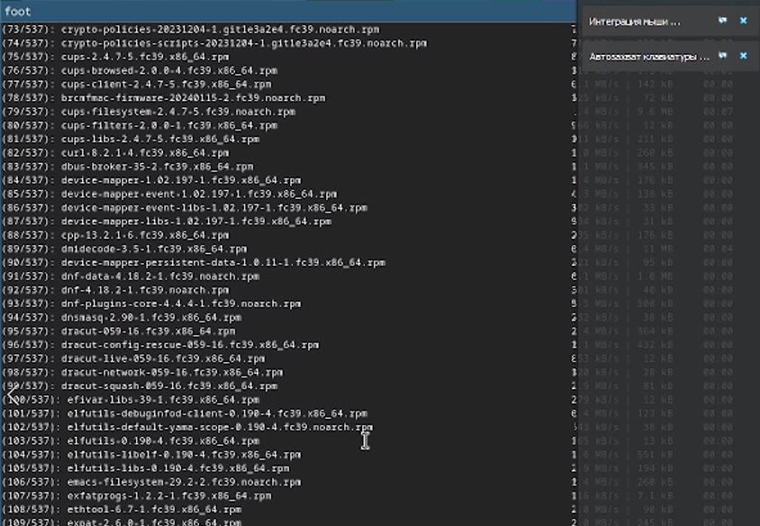{#fig:017width=50%}

# Последовательность выполнения работы
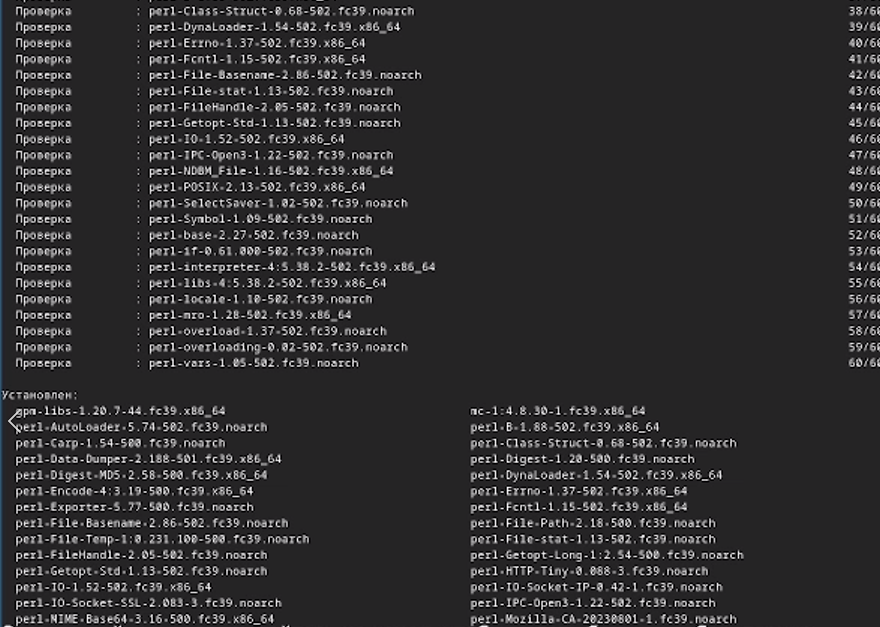{#fig:018width=50%}

# Последовательность выполнения работы
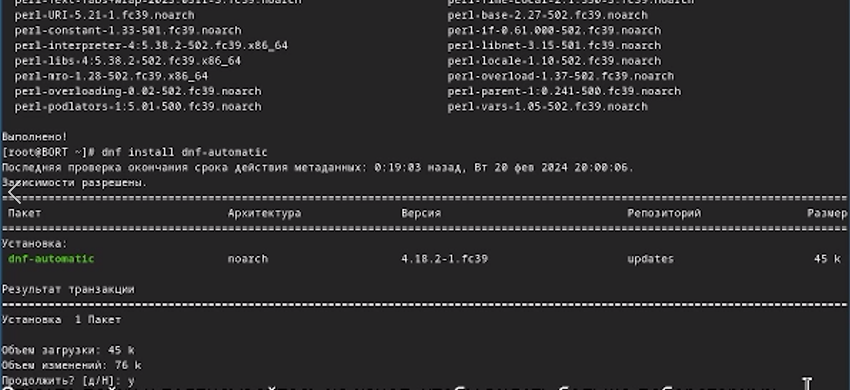{#fig:019width=50%}

# Последовательность выполнения работы
Отключение SELinux. 
В ходе курса система безопасности  SELinux  не будет рассматриваться, так что отключим её. Через команду

*mc*

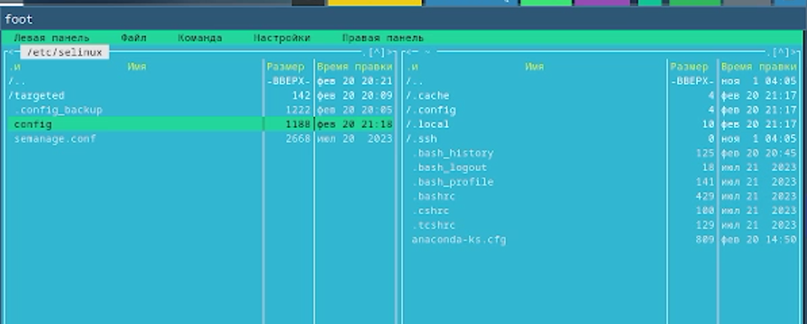{#fig:020width=50%}

# Последовательность выполнения работы

находим файл по адресу */etc/selinux/config* и редактируем его через mcedit:

Заменяем значениe SELINUX=enforcing

На значение  SELINUX=permissive

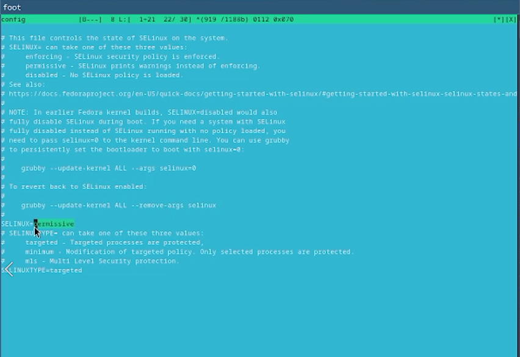{#fig:021width=50%}

# Последовательность выполнения работы
и перезапускаем виртуальную машину через команду 
*root*

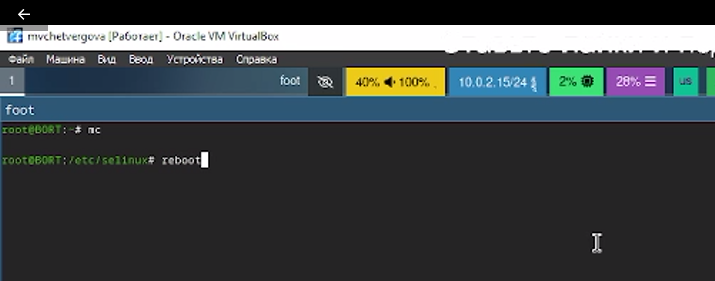{#fig:022width=50%}

# Последовательность выполнения работы
## Установка Драйверов для Virtualbox

После перезагрузки вновь входим в систему и открываем терминал
Запускаем терминальный мультиплексор tmux и переходим в режим суперпозьзователя:

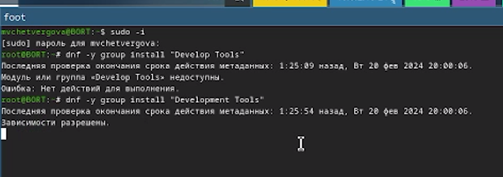{#fig:023width=50%}

# Последовательность выполнения работы
С помощью команды 

*dnf -y install "Development Tools"* 

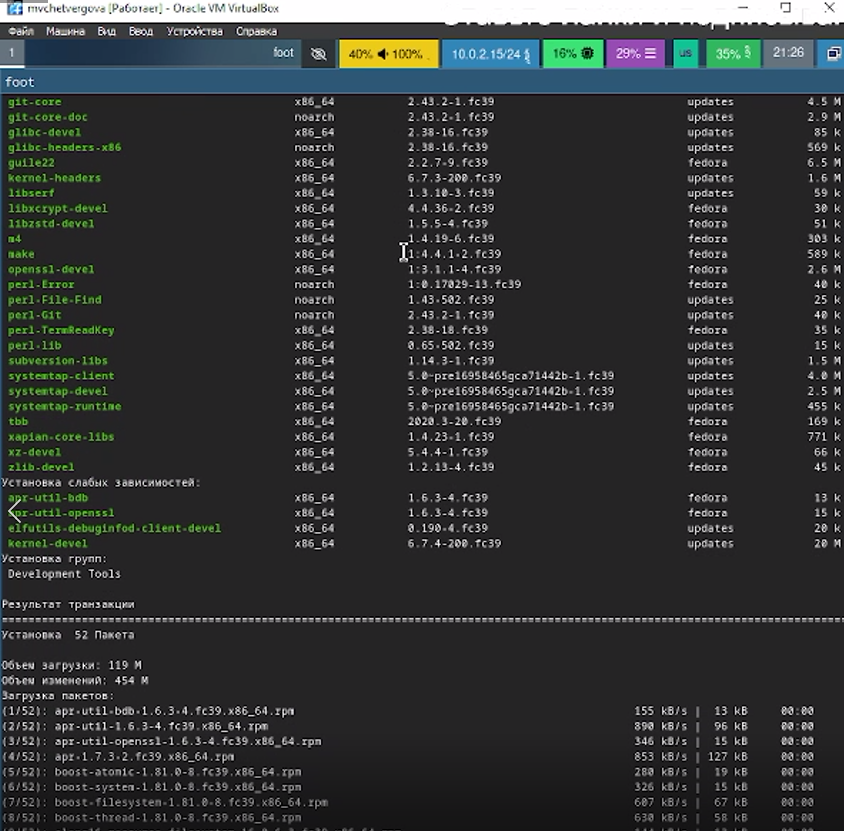{#fig:024width=50%}

# Последовательность выполнения работы

установим средства разработки. Затем используем команду 

*dnf -y install dkms*

устанавливаем пакет DKMS.

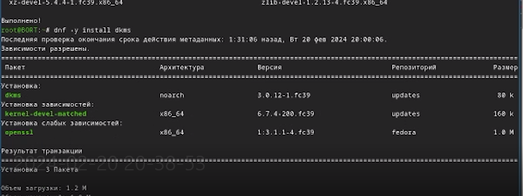{#fig:025width=50%}

# Последовательность выполнения работы

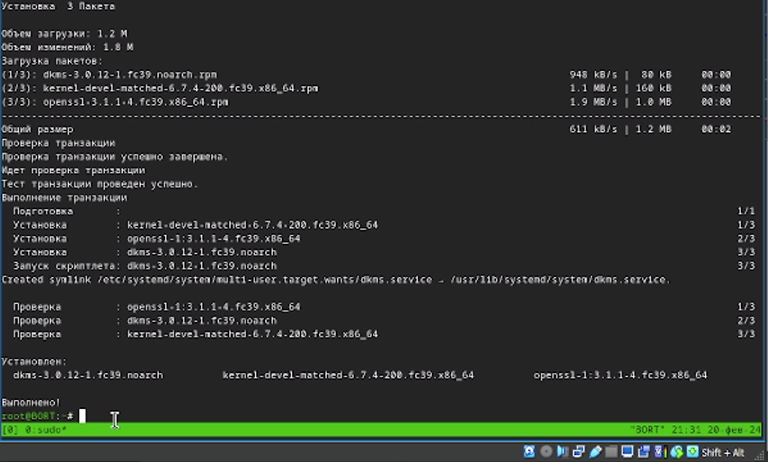{#fig:026width=50%}

# Последовательность выполнения работы
В меню виртуальной машины подключим образ диска дополнений гостевой ОС. Подмонтируем диск, установим драйверы и перезагрузим виртуальную машину.

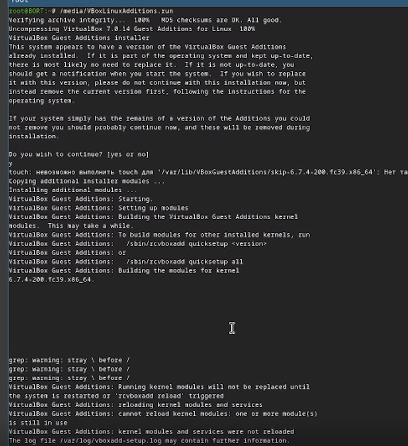{#fig:027width=50%}

# Последовательность выполнения работы
##  Настройка раскладки клавиатуры

Входим в ОС и в терминале вводим *tmux* - запускаем терминальный мультиплексор

С помощью команды *mkdir* и  *touch* создаём нужные каталоги и файл:

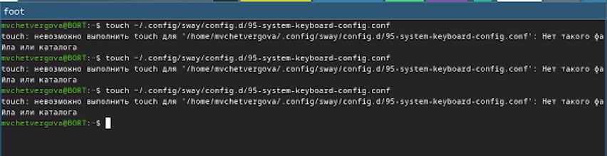{#fig:028width=50%}

# Последовательность выполнения работы
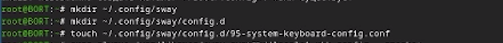{#fig:029width=50%}

# Последовательность выполнения работы
Через мс найдём этот файл и отредактируем его: необходимо ввести:

*exec_always /usr/libexec/sway-systemd/locale1-xkb-config --oneshot*

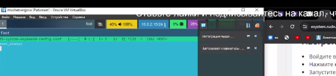{#fig:030width=50%}

# Последовательность выполнения работы
Переключимся в режим суперпользователя  *sudo -i* и отредактируем конфигурационный файл.
На этот раз замениль нужно н одну строчку, а целый блок программы:

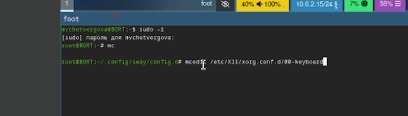{#fig:031width=50%}

# Последовательность выполнения работы
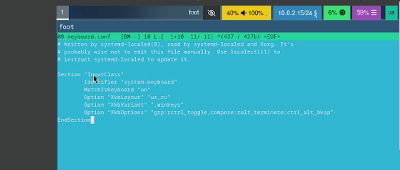{#fig:032width=50%}

В конце перезагружаем виртуальную машину.

# Последовательность выполнения работы
## Установка имени пользователя и названия хоста

Если при установке машины было задано неверное имя, то необходимо исправить это прямо сейчас. 
в терминале запускаем tmux и sudo -i

создадим пользователя mvchetvergova:

*adduser -G wheel mvchetvergova*

Далее задаём пароль для пользователя через команду 

*passwd mvchetvergova*

Устанавливаем имя хоста через 
*hostnamectl set-hostname mvchetvergova* 
И проверяем, что имя хоста установлено верно:
*hostnamectl*

# Последовательность выполнения работы

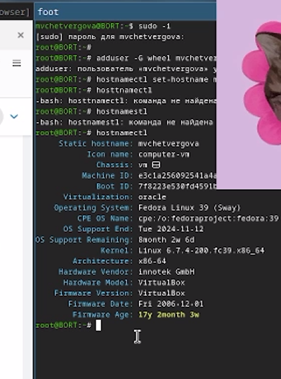{#fig:033width=50%}

# Последовательность выполнения работы
## Подключение общей папки

Внутри машины добавим пользователя в группу vboxsf:
*gpasswd -a mvchetvergova vboxsf*

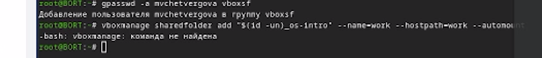{#fig:034width=50%}

# Последовательность выполнения работы

В хостовой системе подключим разделяемуб папку

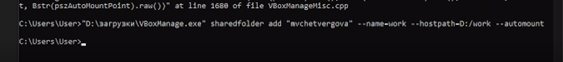{#fig:035width=50%}

# Последовательность выполнения работы

И перезагружаем машину. Папка будет монтироваться в /media/sf_work.

# Последовательность выполнения работы
## Установка программного обеспечения для создания документации

Откроем терминал и перейдём в режимы суперпользователя и tmux.

- средство pandoc  работает с языком разметки markdown.
Установим с помощью менеджера пакетов:

*dnf -y install pandoc*

# Последовательность выполнения работы
Для работы с перекрёстными ссылками мы используем пакет pandoc-crossfer, который отсутствует в стандартном репозитории, поэтому его придётся скачать.
Скачиваем его с гитхаба в соответствующей версии. Помещаем в каталог /usr/local/bin

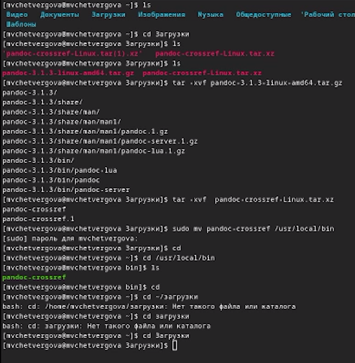{#fig:036width=50%}

# Последовательность выполнения работы
Установим дистрибутив Texlive:
*dnf -y install texlive-scheme-full*

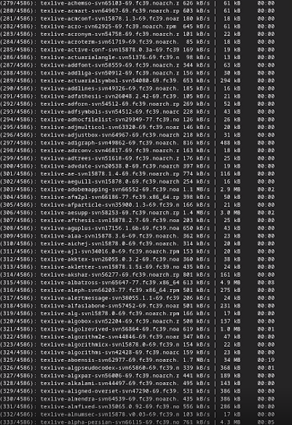{#fig:037width=30%}

# Последовательность выполнения работы
## Домашнее задание

1. Рассмотрим вывод команды  и проанализируем последовательность загрузки системы
*dmesg | less* 	или *dmesg | grep -i "то, что ищем"*

2. Получаем следующую информацию: 
- версия ядра = 
- частота процессора
- модель процессора
- объём доступной оперативной памяти
- тип обнаруженного гипервизора
- тип файловой системы корневого раздела
- последовательность монтирования файловых систем

# Последовательность выполнения работы
## Скриншоты домашнего задания

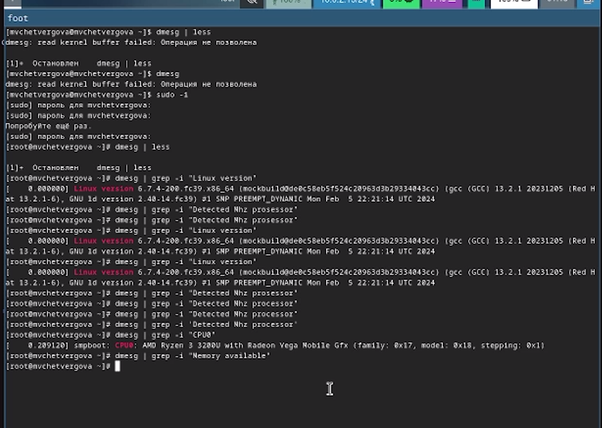{#fig:038width=50%}

# Последовательность выполнения работы
## Скриншоты домашнего задания

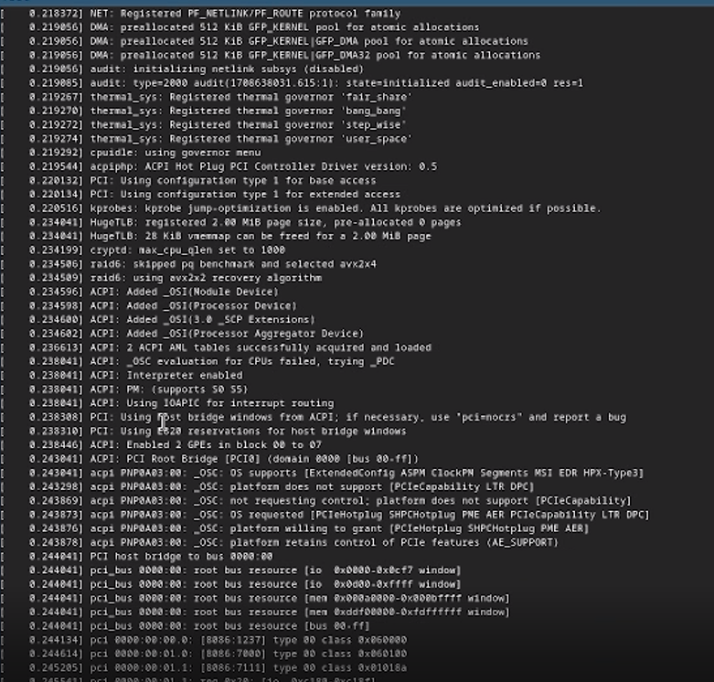{#fig:039width=50%}

результаты поиска приведены на скриншотах.

