---
## Front matter
title: "Отчёт к лабораторной работе №1"
subtitle: "Операционные системы"
author: "Четвергова Мария Викторовна"

## Generic otions
lang: ru-RU
toc-title: "Содержание"

## Bibliography
bibliography: bib/cite.bib
csl: pandoc/csl/gost-r-7-0-5-2008-numeric.csl

## Pdf output format
toc: true # Table of contents
toc-depth: 2
lof: true # List of figures
lot: true # List of tables
fontsize: 12pt
linestretch: 1.5
papersize: a4
documentclass: scrreprt
## I18n polyglossia
polyglossia-lang:
  name: russian
  options:
	- spelling=modern
	- babelshorthands=true
polyglossia-otherlangs:
  name: english
## I18n babel
babel-lang: russian
babel-otherlangs: english
## Fonts
mainfont: PT Serif
romanfont: PT Serif
sansfont: PT Sans
monofont: PT Mono
mainfontoptions: Ligatures=TeX
romanfontoptions: Ligatures=TeX
sansfontoptions: Ligatures=TeX,Scale=MatchLowercase
monofontoptions: Scale=MatchLowercase,Scale=0.9
## Biblatex
biblatex: true
biblio-style: "gost-numeric"
biblatexoptions:
  - parentracker=true
  - backend=biber
  - hyperref=auto
  - language=auto
  - autolang=other*
  - citestyle=gost-numeric
## Pandoc-crossref LaTeX customization
figureTitle: "Рис."
tableTitle: "Таблица"
listingTitle: "Листинг"
lofTitle: "Список иллюстраций"
lotTitle: "Список таблиц"
lolTitle: "Листинги"
## Misc options
indent: true
header-includes:
  - \usepackage{indentfirst}
  - \usepackage{float} # keep figures where there are in the text
  - \floatplacement{figure}{H} # keep figures where there are in the text
---

# Цель работы

Целью данной работы является приобретение практических навыков установки операционной системы на виртуальную машину, настройки минимально необходимых для дальнейшей работы сервисов.

# Последовательность выполнения работы

## Настройка хост-клавиши
Хост-клавишей по умолчанию является правый Ctrl.
### Графический интерфейс

В меню выберем Файл, Настройки.
Выберем Ввод, вкладка Виртуальная машина.
Выберем Сочетание клавиш в строке Хост-комбинация(RCtrl)
Нажмите новое сочетание клавиш.
Нажмите ОК, чтобы сохранить изменения.

## Создание виртуальной машины

Для создания виртуальной машины используем графический интерфейс. при создании заполняем необходимые данные:
имя виртуальной машины (логин в дисплейном классе), тип операционной системы — Fedora, размер основной памяти виртуальной машины — от 2048 МБ.

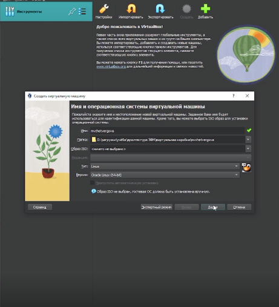{#fig:002 width=70%}

Сразу обозначим настройки оборудования: Основная память 2167 МБ и 2 ЦП процессора

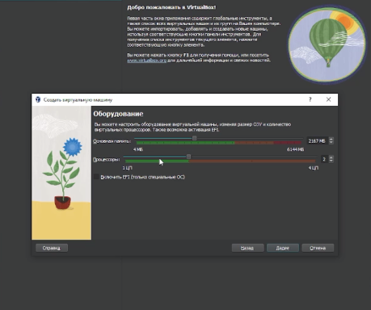{#fig:003 width=70%}

Задайте конфигурацию жёсткого диска — загрузочный, VDI (VirtualBox Disk Image), динамический виртуальный диск.

Задайте размер диска — 80 ГБ (или больше), его расположение — в данном случае /var/tmp/имя_пользователя/имя_машины/имя_машины.vdi.

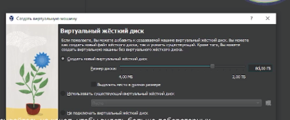{#fig:004 width=70%}

Перейдём в общие настройки ВиртуалБокс и в разделе "Общие" -> "Дополнительно" для "Общего буфера обмена" и Функции  Drag'n'Drop выьираем параметр "Двунаправленный"

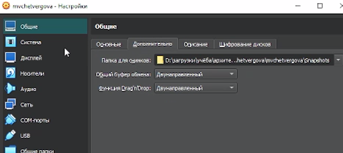{#fig:005 width=70%}

Далее переходим в раздел "Носители"  и добавляем образ fedora в нашу виртуальную машину. 

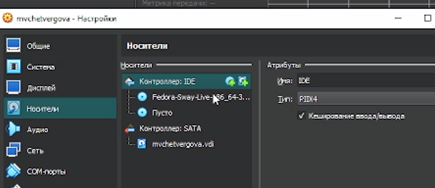{#fig:006 width=70%}

Добавляем  Живой  CD/DVD:

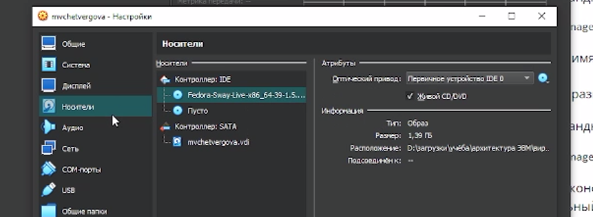{#fig:007 width=70%}

В разделе "Дисплей" включаем 3D-ускорение:

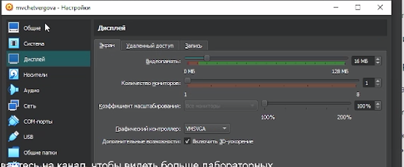{#fig:008 width=70%}

Отлично! Теперь запускаем виртуальную машину:

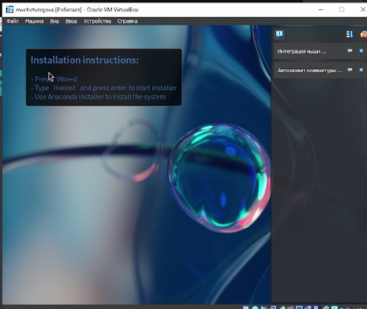{#fig:009 width=70%}

## Установка операционной системы

После запуска виртуальной машины необходимо установить ОС. Для этого при запуске необходимо открыть окно терминала и ввести команду:
*liveinst* 

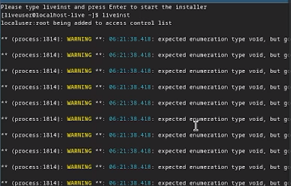{#fig:010 width=70%}

Затем нажмём на  Win+w для перехода к раскладке окон с табами:

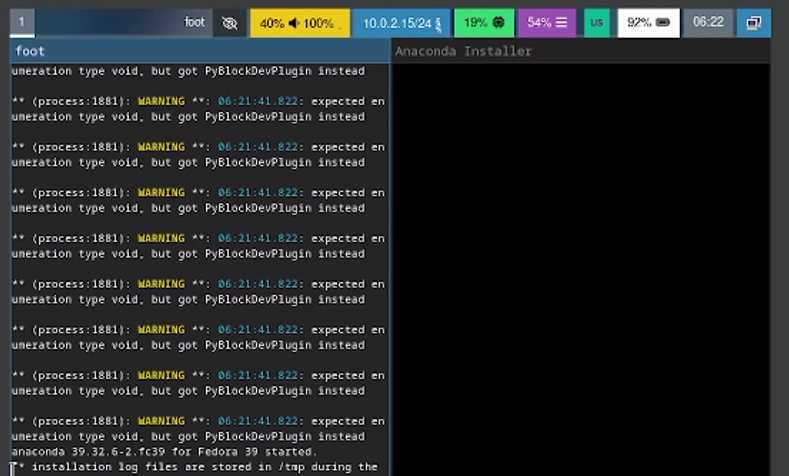{#fig:011 width=70%}

Установим систему на диск. 

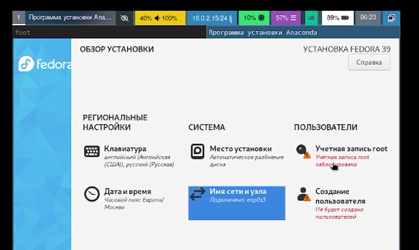{#fig:012 width=70%}

Выбираем язык интерфейса и переходим к настройкам установки операционной системы.
Указываем имя и пароль для пользователя root и для своего пользователя. Задаём сетевое имя для компьютера. по завершении установки - перезапускаем машину.

## После установки

Входим в ОС под заданной учётной записью и откроем терминал. 

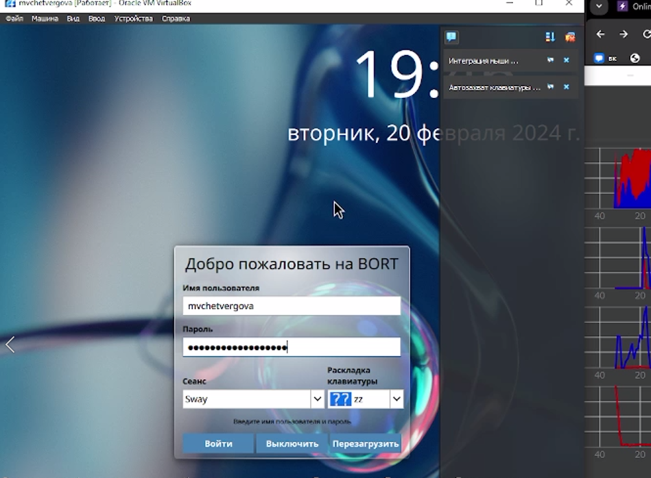{#fig:013 width=70%}

Переключимся на роль супер-пользователя и для его активации введём пароль:

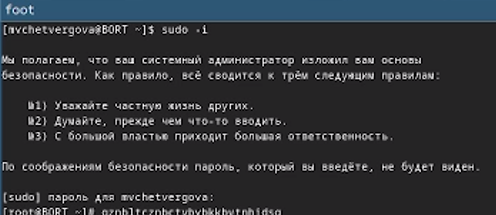{#fig:014 width=70%}

Обновим все пакеты с помощью команды *dnf -y update*, а также установим программы для повышения комфорта работы и автоматического обновления:

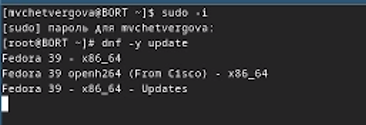{#fig:015width=70%}

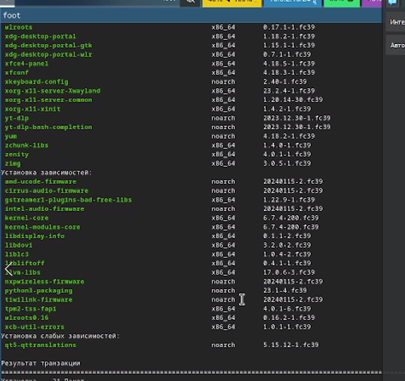{#fig:016width=70%}

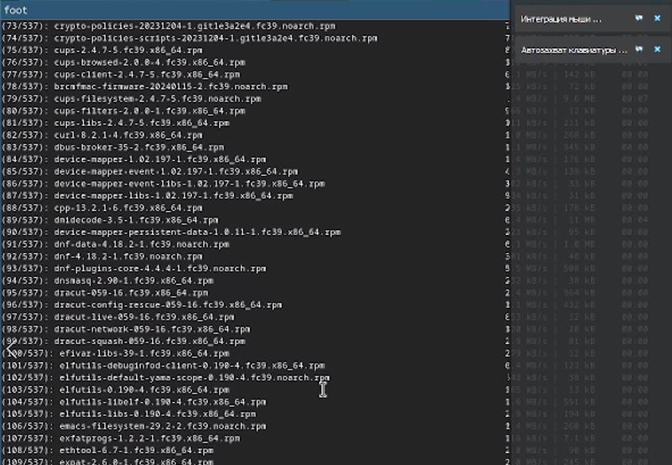{#fig:017width=70%}

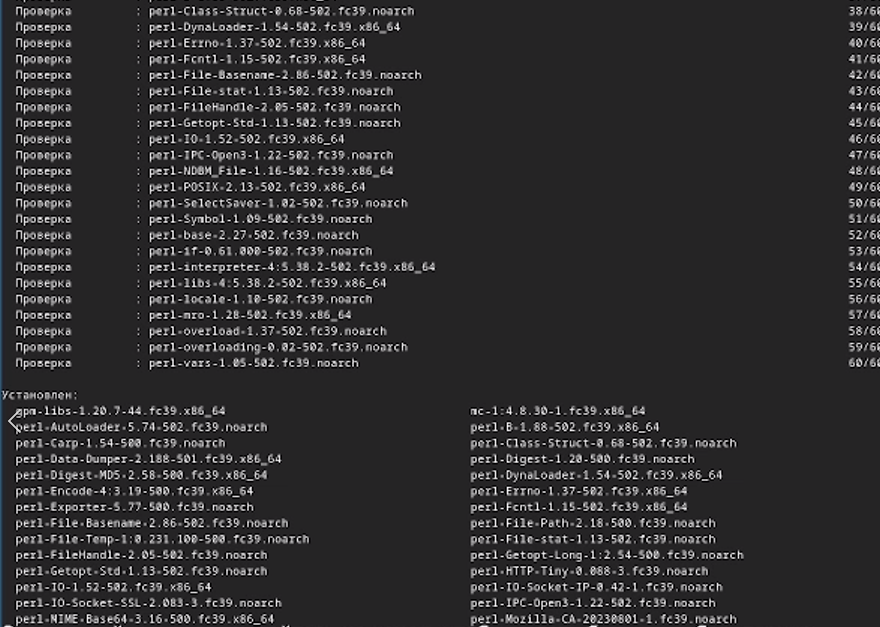{#fig:018width=70%}

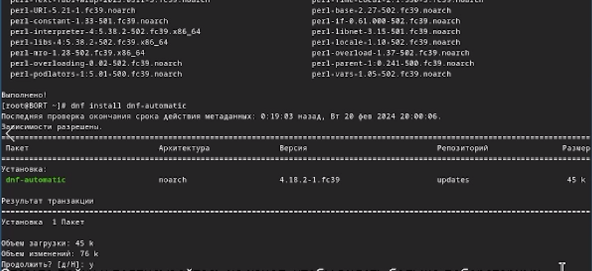{#fig:019width=70%}

Отключение SELinux. 
В ходе курса система безопасности  SELinux  не будет рассматриваться, так что отключим её. Через команду

*mc*

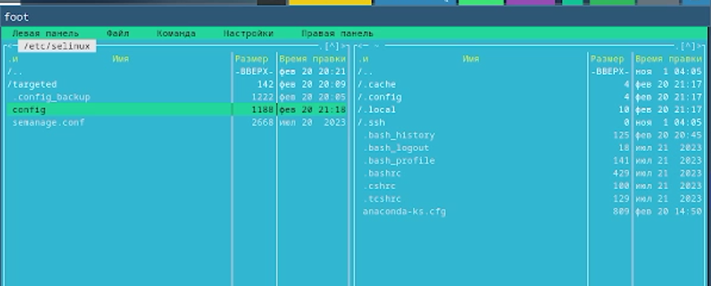{#fig:020width=70%}

находим файл по адресу */etc/selinux/config* и редактируем его через mcedit:

Заменяем значениe SELINUX=enforcing

На значение  SELINUX=permissive

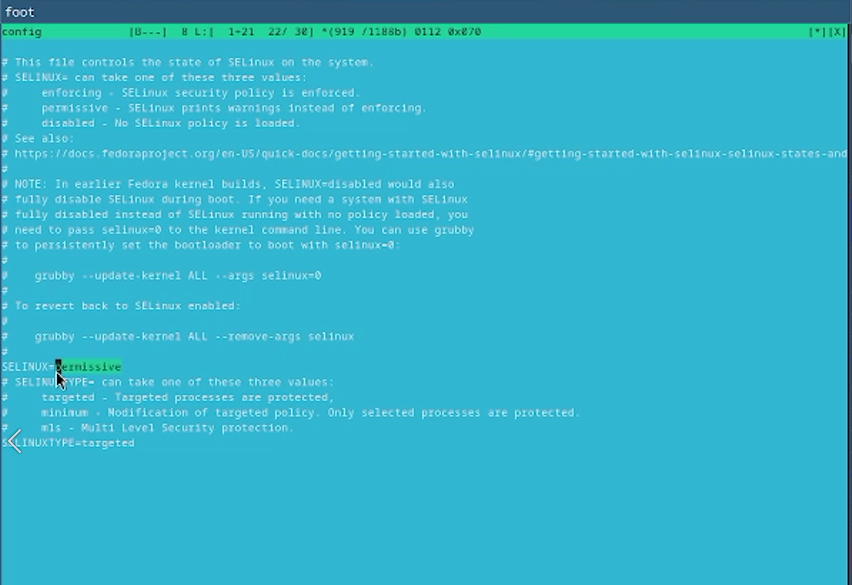{#fig:021width=70%}

и перезапускаем виртуальную машину через команду 
*root*

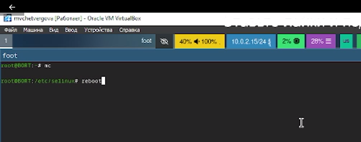{#fig:022width=70%}

## Установка Драйверов для Virtualbox

После перезагрузки вновь входим в систему и открываем терминал
Запускаем терминальный мультиплексор tmux и переходим в режим суперпозьзователя:

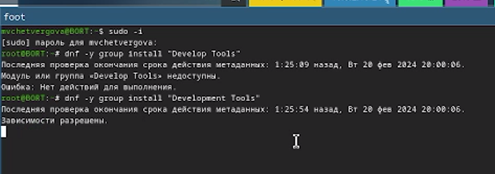{#fig:023width=70%}

С помощью команды 

*dnf -y install "Development Tools"* 

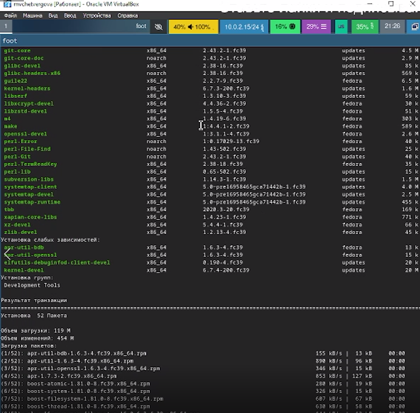{#fig:024width=70%}

установим средства разработки. Затем используем команду 

*dnf -y install dkms*

устанавливаем пакет DKMS.

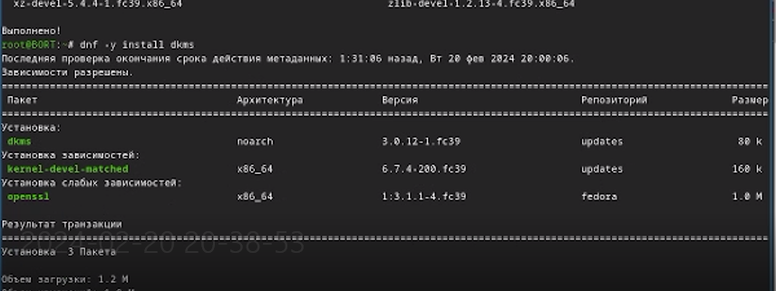{#fig:025width=70%}

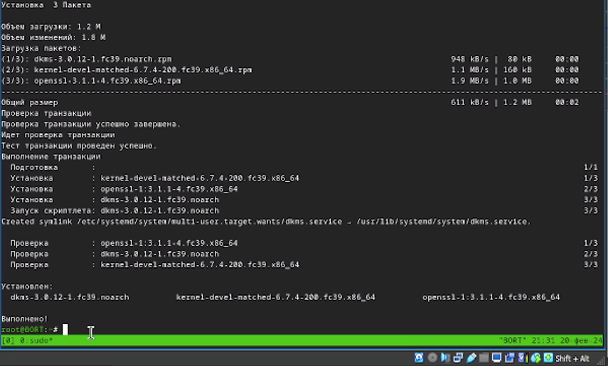{#fig:026width=70%}

В меню виртуальной машины подключим образ диска дополнений гостевой ОС. Подмонтируем диск, установим драйверы и перезагрузим виртуальную машину.

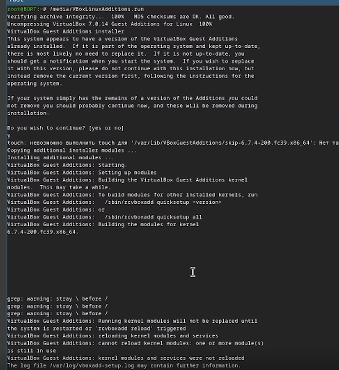{#fig:027width=70%}

##  Настройка раскладки клавиатуры

Входим в ОС и в терминале вводим *tmux* - запускаем терминальный мультиплексор

С помощью команды *mkdir* и  *touch* создаём нужные каталоги и файл:

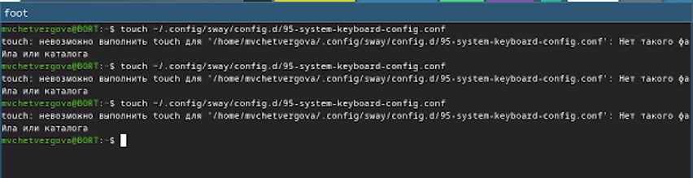{#fig:028width=70%}

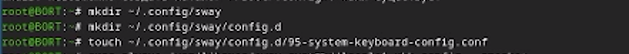{#fig:029width=70%}

Через мс найдём этот файл и отредактируем его: необходимо ввести:

*exec_always /usr/libexec/sway-systemd/locale1-xkb-config --oneshot*

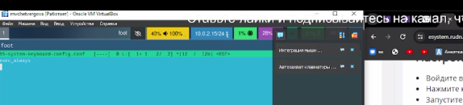{#fig:030width=70%}

Переключимся в режим суперпользователя  *sudo -i* и отредактируем конфигурационный файл.
На этот раз замениль нужно н одну строчку, а целый блок программы:

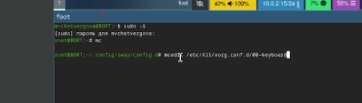{#fig:031width=70%}

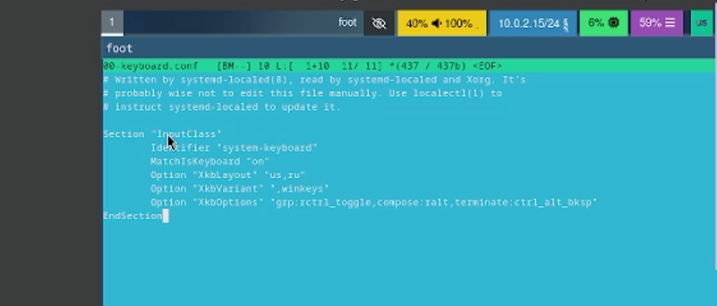{#fig:032width=70%}

В конце перезагружаем виртуальную машину.

## Установка имени пользователя и названия хоста

Если при установке машины было задано неверное имя, то необходимо исправить это прямо сейчас. 
в терминале запускаем tmux и sudo -i

создадим пользователя mvchetvergova:

*adduser -G wheel mvchetvergova*

Далее задаём пароль для пользователя через команду 

*passwd mvchetvergova*

Устанавливаем имя хоста через 
*hostnamectl set-hostname mvchetvergova* 
И проверяем, что имя хоста установлено верно:
*hostnamectl*

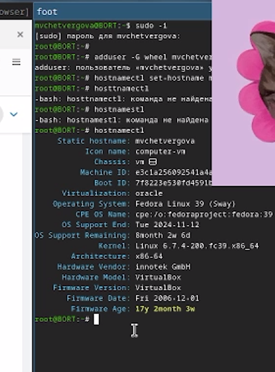{#fig:033width=70%}

## Подключение общей папки

Внутри машины добавим пользователя в группу vboxsf:
*gpasswd -a mvchetvergova vboxsf*

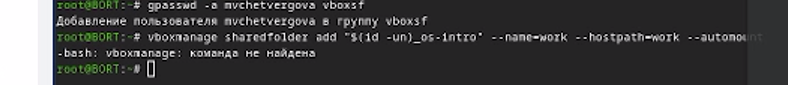{#fig:034width=70%}

В хостовой системе подключим разделяемуб папку

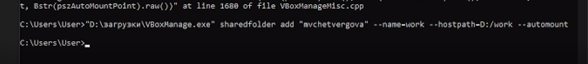{#fig:035width=70%}

И перезагружаем машину. Папка будет монтироваться в /media/sf_work.

## Установка программного обеспечения для создания документации

Откроем терминал и перейдём в режимы суперпользователя и tmux.

- средство pandoc  работает с языком разметки markdown.
Установим с помощью менеджера пакетов:

*dnf -y install pandoc*

Для работы с перекрёстными ссылками мы используем пакет pandoc-crossfer, который отсутствует в стандартном репозитории, поэтому его придётся скачать.
Скачиваем его с гитхаба в соответствующей версии. Помещаем в каталог /usr/local/bin

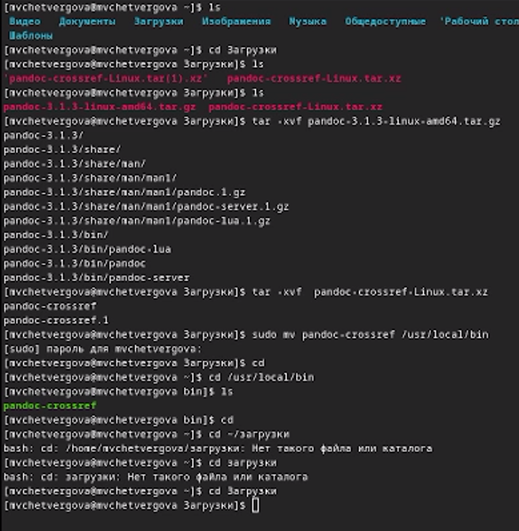{#fig:036width=70%}

Установим дистрибутив Texlive:
*dnf -y install texlive-scheme-full*

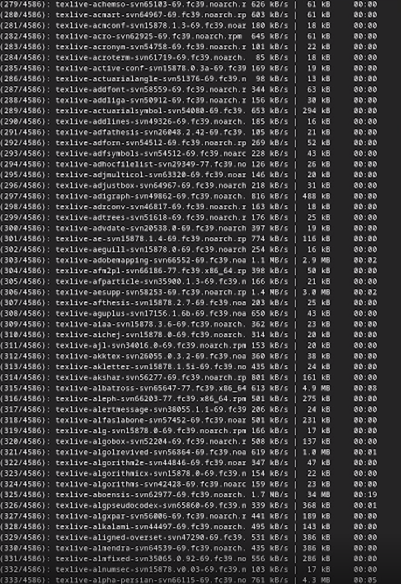{#fig:037width=70%}

## Домашнее задание

1. Рассмотрим вывод команды  и проанализируем последовательность загрузки системы
*dmesg | less* 	или *dmesg | grep -i "то, что ищем"*

2. Получаем следующую информацию: 
- версия ядра = 
- частота процессора
- модель процессора
- объём доступной оперативной памяти
- тип обнаруженного гипервизора
- тип файловой системы корневого раздела
- последовательность монтирования файловых систем

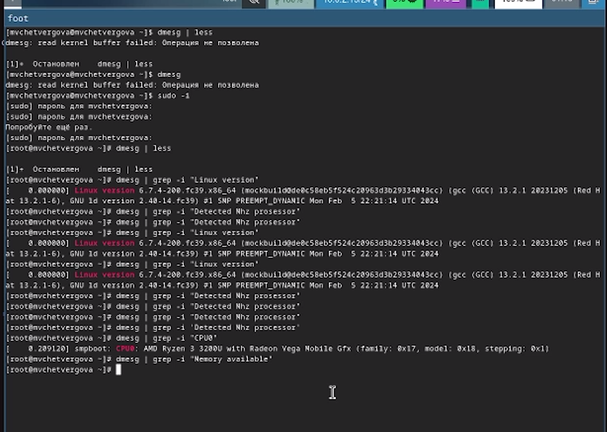{#fig:038width=70%}

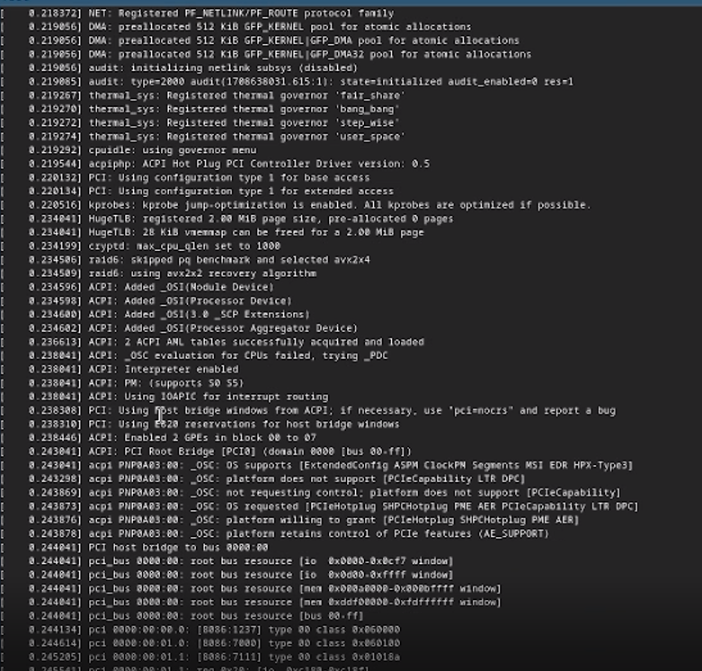{#fig:039width=70%}

результаты поиска приведены на скриншотах.

## Ответы на контрольные вопросы

1. Учетная запись содержит необходимые для идентификации пользователя при подключении к системе данные, а так же информацию для авторизации и учета: системного имени (user name) (оно может содержать только латинские буквы и знак нижнее подчеркивание, еще оно должно быть уникальным), идентификатор пользователя (UID) (уникальный идентификатор пользователя в системе, целое положительное число), идентификатор группы (CID) (группа, к к-рой относится пользователь. Она, как минимум, одна, по умолчанию - одна), полное имя (full name) (Могут быть ФИО), домашний каталог (home directory) (каталог, в к-рый попадает пользователь после входа в систему и в к-ром хранятся его данные), начальная оболочка (login shell) (командная оболочка, к-рая запускается при входе в систему).

2. Для получения справки по команде: <команда> --help; для перемещения по файловой системе - cd; для просмотра содержимого каталога - ls; для определения объёма каталога - du <имя каталога>; для создания / удаления каталогов - mkdir/rmdir; для создания / удаления файлов - touch/rm; для задания определённых прав на файл / каталог - chmod; для просмотра истории команд - history

3. Файловая система - это порядок, определяющий способ организации и хранения и именования данных на различных носителях информации. Примеры: FAT32 представляет собой пространство, разделенное на три части: олна область для служебных структур, форма указателей в виде таблиц и зона для хранения самих файлов. ext3/ext4 - журналируемая файловая система, используемая в основном в ОС с ядром Linux.

4. С помощью команды df, введя ее в терминале. Это утилита, которая показывает список всех файловых систем по именам устройств, сообщает их размер и данные о памяти. Также посмотреть подмонтированные файловые системы можно с помощью утилиты mount.

5. Чтобы удалить зависший процесс, вначале мы должны узнать, какой у него id: используем команду ps. Далее в терминале вводим команду kill < id процесса >. Или можно использовать утилиту killall, что "убьет" все процессы, которые есть в данный момент, для этого не нужно знать id процесса.

::: {#refs}
:::
