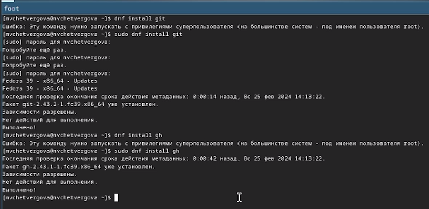
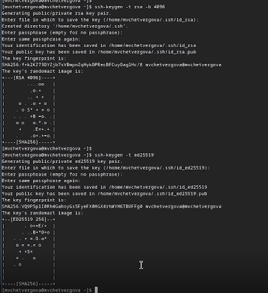
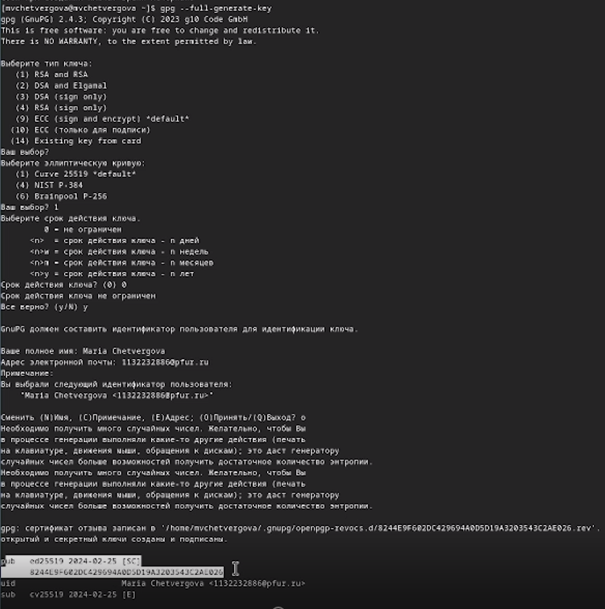
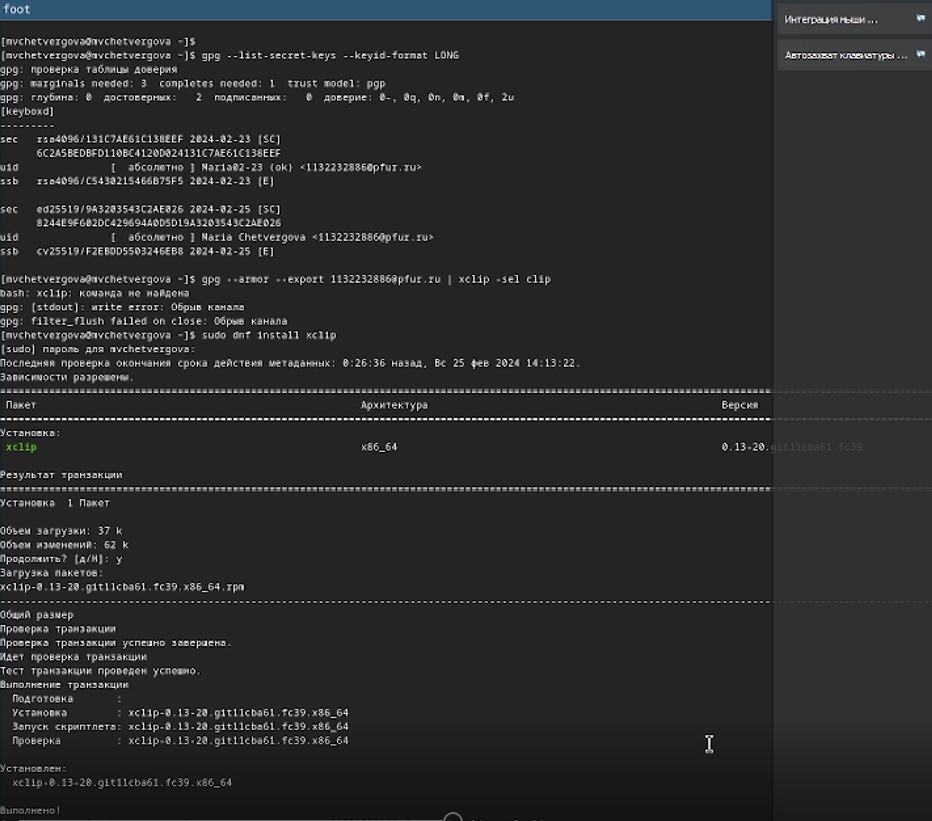
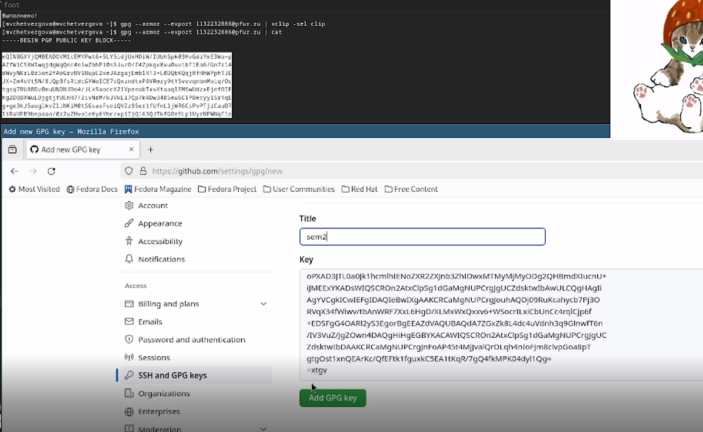
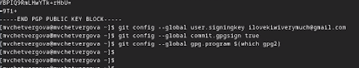
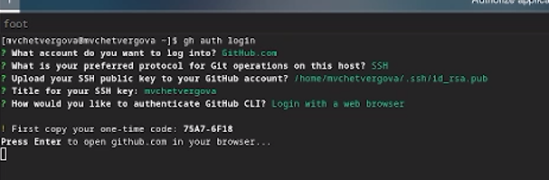
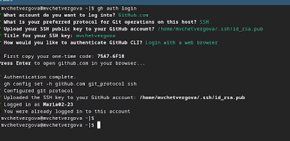
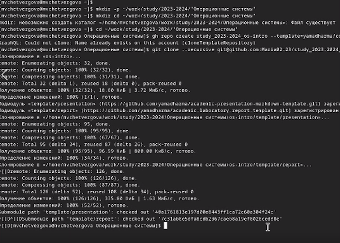
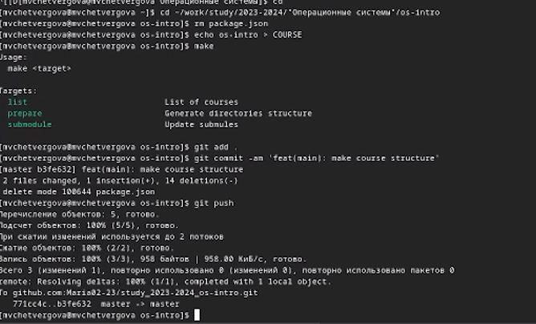

---
## Front matter
title: "Лабороторная работа № 2"
subtitle: "Операционные системы"
author: "Четвергова Мария Викторовна"

## Generic otions
lang: ru-RU
toc-title: "Содержание"

## Bibliography
bibliography: bib/cite.bib
csl: pandoc/csl/gost-r-7-0-5-2008-numeric.csl

## Pdf output format
toc: true # Table of contents
toc-depth: 2
lof: true # List of figures
lot: true # List of tables
fontsize: 12pt
linestretch: 1.5
papersize: a4
documentclass: scrreprt
## I18n polyglossia
polyglossia-lang:
  name: russian
  options:
	- spelling=modern
	- babelshorthands=true
polyglossia-otherlangs:
  name: english
## I18n babel
babel-lang: russian
babel-otherlangs: english
## Fonts
mainfont: PT Serif
romanfont: PT Serif
sansfont: PT Sans
monofont: PT Mono
mainfontoptions: Ligatures=TeX
romanfontoptions: Ligatures=TeX
sansfontoptions: Ligatures=TeX,Scale=MatchLowercase
monofontoptions: Scale=MatchLowercase,Scale=0.9
## Biblatex
biblatex: true
biblio-style: "gost-numeric"
biblatexoptions:
  - parentracker=true
  - backend=biber
  - hyperref=auto
  - language=auto
  - autolang=other*
  - citestyle=gost-numeric
## Pandoc-crossref LaTeX customization
figureTitle: "Рис."
tableTitle: "Таблица"
listingTitle: "Листинг"
lofTitle: "Список иллюстраций"
lotTitle: "Список таблиц"
lolTitle: "Листинги"
## Misc options
indent: true
header-includes:
  - \usepackage{indentfirst}
  - \usepackage{float} # keep figures where there are in the text
  - \floatplacement{figure}{H} # keep figures where there are in the text
---

# Цель работы

Целью данной работы является изучение идеологии и применение средств контроля версий, освоение умения по работе с git

# Задание

В ходе выполнения лпбораторной работы №2 необходимо выполнить следующие задания:
- создать базовую конфигурацию для работы с git
- создать ключ SSH
- Создать ключ PGP
- Настроить подписи git
- Зарегистрироваться на GitHub
- Создать локальный каталог для выполнения заданий по предмету

# Выполнение лабораторной работы
## Установка программного обеспечения 

1. Установка Git
Установим git с помощью команды, вбиваемой в терминал:

*git install git*

2. Установка gh
Установим gh с помощью вбиваемов в терминал команды:

*git install gh*

{#fig:001 width=70%}

## Базовая настройка Git

Проведём базовую настройку git:
для этого необходимо задать имя владельза, емейл владельца, а также настроить utf-8 в выводе сообщений git. При работе с этими задачами поспользуемся командами типа *git config --global ...*

*git config --global user.name "Maria02-23*
*git config --global user.email "my_email.com*

Необходимо и настроить верификацию и подписание коммитов git, а также задать имя начальной ветки(master). Настроим параметры autocrlf и safecrlf. 
осуществить эти действия возможно с помощью команд командной строки:

{#fig:002 width=70%}

## Создание ключа SSH

В инструкции к лабороторной работе указаны два способа создания SSН. Воспользуемся обоими.

1. по алгоритму rsa с ключём размером 4096 бит:

*ssh-keygen -t rsa -b 4096*

2. По алгоритму ed25519:

*ssh-keygen -t ed25519*

{#fig:003 width=70%}

## Создание ключа PGP
1. Генерируем ключ с помощью команды в терминале:

*gpg --full-generate-key*

2. На мониторе появится несколько вариантов ответов. Для того, чтобы успешно создать ключ, необходимо выбрать следующие варианты:
- тип RSA 
- размер 4096
- срок действия - бессрочный (0)
(далее gpg запрашивает личную информацию: сперва вводим своё полное имя, а затем - емейл, привязанный к аккаунту на GitHub. В конце можно ввести комментарий, но это уже неважно - можно вводить что угодно)

После заполнения информации на экране всплывает окошко с требованием заполнить пароль-фразу. Пропускаем этот этап, выбрав "защита не нужна"

{#fig:004 width=70%}

## Настройка GitHub
 
 В инструкции к лабороторной работе сказано, что необходимо создать учётную запись на сайте GitHub и заполнит основные данные. В первом семестре мы уже имели дело с системой git, поэтому аккаунт на GitHub  у меня уже есть:
 
{#fig:005 width=70%}

## Добавление PGP ключа в GitHub

Для добавления PGP ключа в GitHub необходимо выполнить следующие действия:

- выведем список ключей и скопируем отпечаток приватного ключа с помощью команды в терминале:

*gpg --list-secret-keys --keyid-format LONG*

- Далее нужно скопировать сгенерированный PGP ключ в буфер обмена командой

 *gpg --armor --export <PGP FingerPrint> | xclip -sel clip*
 
 
{#fig:006 width=70%}

В случае, если предыдущая команда не сработала, можно вывести содержимое ключа командой 

*gpg --armor --export <PGP FingerPrinr> | cat*

и скопировать вручную :-)

- переходим в настройки GitHub  и вставляем ключ в нужное поле

{#fig:007 width=70%}

## Настройка автоматических подписей коммитов

Используя введёный емейл, укажем Git  применять его при подписи коммитов. Это можно сделать при помощи следующих команд:

*git config --global user.sighingkey <PGP fingerprint>*
*git config --global commit.gpgsign true*
*git config --global gpg.program $(which gpg2)*

{#fig:008 width=70%}

## Настройка gh

- Для начала необходимо авторизоваться, ответив на несколько вопросов после вбивания этой программы:

*gh auth login*

Авторизация происходит через браузер. Важно выбрать SSH  в одном из вопросов :-)

{#fig:009 width=70%}

- Улита задаст несколько наводящих вопросов, после чего можно авторизоваться через браузер

{#fig:010 width=70%}

## Шаблон для рабочего пространства

1. Создание репозитория курса на основе шаблона
Создадим шаблон рабочего пространства для 2023-2024 годов обучения. Для этого введём в терминал следующие команды:

{#fig:011 width=70%}

2. Настройка каталога курса

Перейдём в каталог курса и удалим лишние файлы с помощью команды *rm package.json*. Затем создадим необходимые файлы, которые помогут с работой. В конце необходимо отправить файлы на сервер

{#fig:012 width=70%}

# Выводы

в ходе выполнения лабораторной работы мы изучили идеологию и применение средств контроля версий и  освоили умения по работе с системой git.

# Список литературы{.unnumbered}

::: {#refs}
:::
