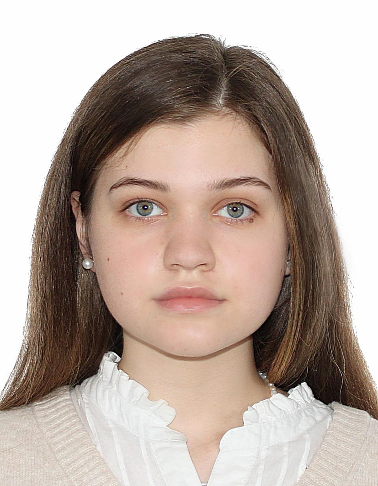
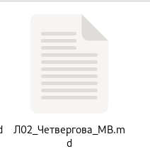
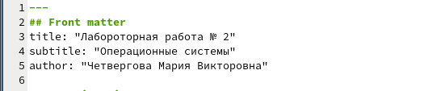
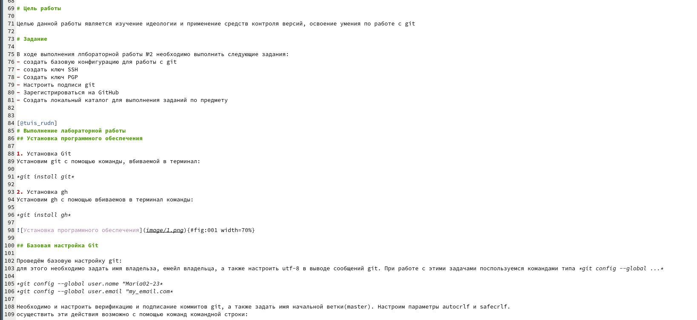
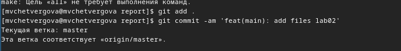

---
## Front matter
lang: ru-RU
title: Презентация к третьей лабораторной работе
subtitle: выполнение отчёта с помощью легковесного языка разметки markdown
author:
  - Четвергова М.В.
institute:
  - Российский университет дружбы народов, Москва, Россия
date: 1 марта 2024

## i18n babel
babel-lang: russian
babel-otherlangs: english

## Formatting pdf
toc: false
toc-title: Содержание
slide_level: 2
aspectratio: 169
section-titles: true
theme: metropolis
header-includes:
 - \metroset{progressbar=frametitle,sectionpage=progressbar,numbering=fraction}
 - '\makeatletter'
 - '\beamer@ignorenonframefalse'
 - '\makeatother'

## Fonts
mainfont: PT Serif
romanfont: PT Serif
sansfont: PT Sans
monofont: PT Mono
mainfontoptions: Ligatures=TeX
romanfontoptions: Ligatures=TeX
sansfontoptions: Ligatures=TeX,Scale=MatchLowercase
monofontoptions: Scale=MatchLowercase,Scale=0.9
---

# Информация

## Докладчик

:::::::::::::: {.columns align=center}
::: {.column width="70%"}

  * Четвергова Мария Викторовна
  * Студентка 1 курса НПИбд-02-23
  * Российский университет дружбы народов
  * 1132232886@pfur.ru

:::
::: {.column width="30%"}

:::
::::::::::::::

# Вводная часть

## Цели и задачи

Цель: научиться оформлять отчёты с помощью легковесного языка разметки Markdown.

Задачи:
- Сделать отчёт по предыдущей лабороторной работе(ЛР2) в формате Markdown.
- в качестве отчёта предоставить отчёты в 3 форматах: pdf, docx и md (в архиве, т.к. он должен содержать скриншоты, Makefile  и др.)

## Ход выполнения лабораторной работы №3

1. Для оформления отчёта по лабороторной работе №2 необходимо сначала создать файл md.

{#fig:001 width=50%}

## Ход выполнения лабораторной работы №3

2. Оформление титульного листа, заголовка

В шаблоне отчёта титульный лист был заполнен иначе, поэтому заполним его в соответствии с требованиями:

{#fig:002 width=70%}

## Ход выполнения лабораторной работы №3

3. Заполнение основной части отчёта

Заполним основную часть отчёта. В основную часть входят нужные комментарии, скриншоты выполнения разных этапов лабораторной работы и ответы на вопросы в конце отчёта. Заполним отчёт согласно этим требованиям: 

{#fig:003width=70%}

## Ход выполнения лабораторной работы №3

4. В конце необходимо сохранить изменения и отформатировать файл командой *make* и отправить в репозиторий.

{#fig:004 width=70%}

# Выводы

В ходе выполнения лабораторной работы №3 мы научились создавать отчёт с помощью легковесного языка разметки Markdown.

