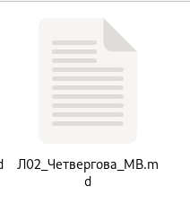
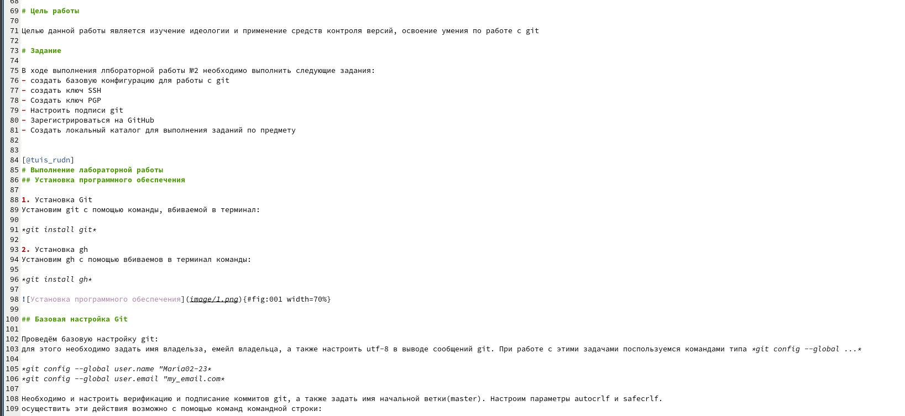
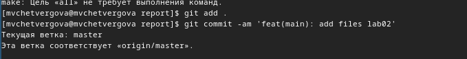

---
## Front matter
title: "отчёт к лабораторной работе №3"
subtitle: "Сооздание отчётов в  MarkDown"
author: "Четвергова Мария Викторовна"

## Generic otions
lang: ru-RU
toc-title: "Содержание"

## Bibliography
bibliography: bib/cite.bib
csl: pandoc/csl/gost-r-7-0-5-2008-numeric.csl

## Pdf output format
toc: true # Table of contents
toc-depth: 2
lof: true # List of figures
lot: true # List of tables
fontsize: 12pt
linestretch: 1.5
papersize: a4
documentclass: scrreprt
## I18n polyglossia
polyglossia-lang:
  name: russian
  options:
	- spelling=modern
	- babelshorthands=true
polyglossia-otherlangs:
  name: english
## I18n babel
babel-lang: russian
babel-otherlangs: english
## Fonts
mainfont: PT Serif
romanfont: PT Serif
sansfont: PT Sans
monofont: PT Mono
mainfontoptions: Ligatures=TeX
romanfontoptions: Ligatures=TeX
sansfontoptions: Ligatures=TeX,Scale=MatchLowercase
monofontoptions: Scale=MatchLowercase,Scale=0.9
## Biblatex
biblatex: true
biblio-style: "gost-numeric"
biblatexoptions:
  - parentracker=true
  - backend=biber
  - hyperref=auto
  - language=auto
  - autolang=other*
  - citestyle=gost-numeric
## Pandoc-crossref LaTeX customization
figureTitle: "Рис."
tableTitle: "Таблица"
listingTitle: "Листинг"
lofTitle: "Список иллюстраций"
lotTitle: "Список таблиц"
lolTitle: "Листинги"
## Misc options
indent: true
header-includes:
  - \usepackage{indentfirst}
  - \usepackage{float} # keep figures where there are in the text
  - \floatplacement{figure}{H} # keep figures where there are in the text
---

# Цель работы

научиться оформлять отчёты с помощью легковесного языка разметки Markdown.

# Задание

- Сделать отчёт по предыдущей лабороторной работе(ЛР2) в формате Markdown.
- в качестве отчёта предоставить отчёты в 3 форматах: pdf, docx и md (в архиве, т.к. он должен содержать скриншоты, Makefile  и др.)

# Теоретическое введение

Лабораторная работа является небольшой научно-исследовательской работой, которую
и оформлять следует по всем утверждённым требованиям. При подготовке отчета по лабораторной работе вы освоите ряд важных элементов, которые в дальнейшем пригодятся
вам при написании курсовой и дипломной работы.

## Содержание основных элементов отчета
– Титульный лист. Первый лист работы оформляется строго по образцу, который обычно
приводится в методических пособиях по вашему предмету. В нем не просто требуется
указать такие элементы, как название образовательного учреждения, вид работы
и сведения об исполнителе, но и расположить их в строгом соответствии со стандартами.

– Реферат. Реферат фактически является кратким представлением всего вашего отчета
и содержит ряд статистических сведений. В нем нужно указать количество частей,
страниц работы, иллюстраций, приложений, таблиц, использованных литературных
источников и приложений. Здесь же приводится перечень ключевых слов работы
и собственно текст реферата. Последний подразумевает основные элементы работы
от поставленных целей до результатов и рекомендаций по их внедрению. В практике
вузов в отчеты по лабораторным работам реферат обычно не включают.

– Введение. Во введении типовой лабораторной работы обычно прописывают цели
проводимого исследования и задачи, выполнение которых поможет достичь поставленных целей. В то же время существуют работы, в которых студенты становятся
настоящими первооткрывателями. Приходилось ли вам хотя бы однажды испытывать
чувство крайнего любопытства и нетерпения при проведении лабораторной работы?
Ощущать, что буквально через пару минут вы найдете ответ на вопрос, на который
еще никто и никогда не находил ответа? Именно для таких исследований пишется развернутое введение с доказательством актуальности и новизны изучаемой темы. Чтобы
действительно провести исследование в той области, в которой, как говорится, еще не
ступала нога человека, во введении вам понадобится привести оценку современного
состояния рассматриваемой проблемы и обосновать необходимость ее решения.

– Основная часть. Так как в разных вузах и в разных дисциплинах существуют свои
тонкости проведения лабораторных работ, содержание основной части подробно
описывают в соответствующих методичках. Важно, чтобы в этом разделе работы была
отражена ее суть, описана методика и результаты проделанной работы.
В основной части прописывают следующие элементы:
– цели проводимого исследования;
– задачи, выполнение которых поможет достичь поставленных целей;
– ход работы, в котором описываются выполненные действия;
– прочие разделы, предусмотренные методическими материалами по изучаемой
дисциплине.
– Заключение. В этой части работы вам потребуется сделать выводы по полученным в ходе лабораторной работы результатам. Для этого оцените, насколько полно выполнены
поставленные задачи. В сложных работах могут присутствовать и другие элементы,
например, рекомендации для дальнейшего применения результатов проведённой
работы.

# Выполнение лабораторной работы

1. Для оформления отчёта по лабороторной работе №2 необходимо сначала создать файл md.

{#fig:001 width=70%}

2. Оформление титульного листа, заголовка

В шаблоне отчёта титульный лист был заполнен иначе, поэтому заполним его в соответствии с требованиями:

{#fig:002 width=70%}

3. Заполнение основной части отчёта

Заполним основную часть отчёта. В основную часть входят нужные комментарии, скриншоты выполнения разных этапов лабораторной работы и ответы на вопросы в конце отчёта. Заполним отчёт согласно этим требованиям: 

{#fig:003width=70%}

4. В конце необходимо сохранить изменения и отформатировать файл командой *make* и отправить в репозиторий.

{#fig:004 width=70%}

# Выводы

В ходе выполнения лабораторной работы №3 мы научились создавать отчёт с помощью легковесного языка разметки Markdown.

::: {#refs}
:::
