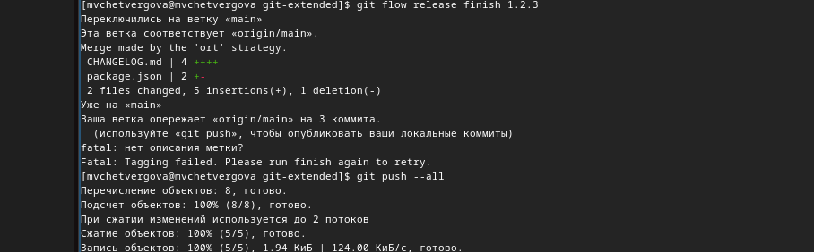

---
## Front matter
lang: ru-RU
title: Презентация к четвёртой лабораторной работе
subtitle: Продвинутое использование git
author:
  - Четвергова Мария викторовна
institute:
  - Российский университет дружбы народов, Москва, Россия
date: 6 марта 2024 г.

## i18n babel
babel-lang: russian
babel-otherlangs: english

## Formatting pdf
toc: false
toc-title: Содержание
slide_level: 2
aspectratio: 169
section-titles: true
theme: metropolis
header-includes:
 - \metroset{progressbar=frametitle,sectionpage=progressbar,numbering=fraction}
 - '\makeatletter'
 - '\beamer@ignorenonframefalse'
 - '\makeatother'

## Fonts
mainfont: PT Serif
romanfont: PT Serif
sansfont: PT Sans
monofont: PT Mono
mainfontoptions: Ligatures=TeX
romanfontoptions: Ligatures=TeX
sansfontoptions: Ligatures=TeX,Scale=MatchLowercase
monofontoptions: Scale=MatchLowercase,Scale=0.9
---

# Информация

## Докладчик

:::::::::::::: {.columns align=center}
::: {.column width="70%"}

  * Четвергова Мария Викторовна 
  * Студентка первого курса
  * Направление "Прикладная информатика"
  * Российский университет дружбы народов
  * 1132232886@pfur.ru

:::
::: {.column width="30%"}

:::
::::::::::::::

# Цель работы

Целью работы является получение навыков правильной работы с репозиториями git.

# Задание

- Выполнить работу для тестового репозитория.
- Преобразовать рабочий репозиторий в репозиторий с git-flow и  convertional commits.

# Выполнение лабораторной работы

## Установка программного обеспечения 
установим git-flow на ОС Linux. Для этого необходимо установим программное обеспечение из коллекции *Copr*

*dnf install nodejs*
*dnf install gitflow*

{#fig:001 width=50%}

# Выполнение лабораторной работы
Далее установим Node.js
Установим пакет nodejs  через командную строки с помощью команд

*dnf install nodejs*
*apt-get install pnpm*

{#fig:002 width=50%}

# Выполнение лабораторной работы
Теперь настроим node.js:
Для работы с Node.js добавим каталог с исполняемыми файлами, устанавливаемыми yarn, в переменную PATH.
Запустим pnpm, перелогинемся и выполним:

{#fig:003 width=50%}

# Выполнение лабораторной работы
## Общепринятые коммиты. 

1. commitizen
- используется для помощи в форматировании коммитов.
- При этом устанавливается скрипт   git-cz, который мы и будем использовать для коммитов.

{#fig:004 width=50%}

# Выполнение лабораторной работы
2. standard-changelog
- используется для помощи в создании логов.

{#fig:005 width=50%}

# Выполнение лабораторной работы
3. Практический сценарий  использования git 

	1. Создание репозитория git
	1. Подключение репозитория  к github
	-Создать репозиторий на гитхаб
	- Делаем первый коммит 

{#fig:006 width=50%} 

# Выполнение лабораторной работы
	2. Конфигурация обзепринятых коммитов
	- конфигурация для пакетов Node.js
	
	*pnpm init*
	
# Выполнение лабораторной работы
	необходимо заполнить несколько параметров пакета.
	--Название пакета
	--Лицензия пакета
	В конечном счёте файл package.json  приобретает следующий вид:

{#fig:007 width=50%} 

# Выполнение лабораторной работы
- Добавим новые файлы, выполним коммит и отправим на гитхаб:

{#fig:008 width=50%} 

# Выполнение лабораторной работы
3. Конфигурация git-flow
- Инициализируем git-flow через команду 

*git flow init*

# Выполнение лабораторной работы
Префикс для ярлыков установим в v.

- Проверим, что мы на ветке develop

- Загрузим весь репозиторий в хранилище  через номанду *git push --all*
- Установим внещнюю ветку как вышестоящую для этой ветки
- Создадим релиз с версией 1.0.0 и создадим журнал изменений
- Зальём релизную ветку в основную ветку, отправим данные на гитхаб и создадим релиз на гитхаб

{#fig:009 width=50%} 

# Выполнение лабораторной работы
2. Работа с репозиторием git
- создадим релиз с версией 1.2.3 и укажем эту новую версию в package.json

{#fig:010 width=50%} 

# Выполнение лабораторной работы
- создадим журнал изменений и добавим его в индекс

{#fig:011 width=50%} 

# Выполнение лабораторной работы
- Зальём релизную ветку в основную ветку и отправим данные на гитхаб

{#fig:012 width=50%} 
# Выполнение лабораторной работы
- В конце создадим релиз на github  с комментариями из журнала изменений	

{#fig:013 width=50%}

# Выводы

В ходе выполнения лабораторной работы №4 Мы приобрали ценные знания и навыки по продвинутому использованию системы git.

