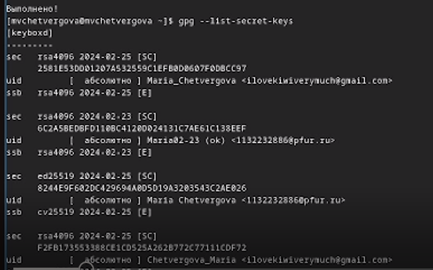

---
## Front matter
lang: ru-RU
title: Презентация к пятой лабораторной работе
subtitle: Менеджер паролей pass
author:
  - Четвергова М.В.
institute:
  - Российский университет дружбы народов, Москва, Россия
date: 14 марта 2024

## i18n babel
babel-lang: russian
babel-otherlangs: english

## Formatting pdf
toc: false
toc-title: Содержание
slide_level: 2
aspectratio: 169
section-titles: true
theme: metropolis
header-includes:
 - \metroset{progressbar=frametitle,sectionpage=progressbar,numbering=fraction}
 - '\makeatletter'
 - '\beamer@ignorenonframefalse'
 - '\makeatother'

## Fonts
mainfont: PT Serif
romanfont: PT Serif
sansfont: PT Sans
monofont: PT Mono
mainfontoptions: Ligatures=TeX
romanfontoptions: Ligatures=TeX
sansfontoptions: Ligatures=TeX,Scale=MatchLowercase
monofontoptions: Scale=MatchLowercase,Scale=0.9
---

# Информация

## Докладчик

:::::::::::::: {.columns align=center}
::: {.column width="70%"}

  * Четвергова Мария Викторовна
  * Студентка 1 курса НПИбд-02-23
  * Российский университет дружбы народов
  * 1132232886@pfur.ru

:::
::: {.column width="30%"}

:::
::::::::::::::

# Цель работы
Целью лаборатоной работы №5 является освоение навыков работы с менеджером паролей pass и изучение операционной системы  Linux. 

# Задание

- Установить и настроить менеджер паролей pass.
- Изучить управление файлами конфигурации.
- установить и подключить необходимое программное обеспечение.

# Выполнение лабораторной работы
## Менеджер паролей pass
1. Установка
Установим менеджер паролей на ОС Fedora с помощью команд
*sudo dnf install pass pass-otp*
*sudo dnf install gopass*

{#fig:001 width=50%}

# Выполнение лабораторной работы
2. Настройки
	1. Ключи GPG
	Рассмотрим список ключей с помощью команды
	*gpg --list-secret-keys*
	
{#fig:002 width=50%}

# Выполнение лабораторной работы
	2. Инициальзируем хранилище с помощью команды 
	*pass init ilovekiwiverymuch@gmail.com*
	
	{#fig:003 width=50%}

# Выполнение лабораторной работы
	3. Синхронизируем с git	
	- Создадим структуру git
	- зададим адрес репозитория в хостинге 
	- для синхронизации выполним команды
	*pass git pull* , *pass git push*
	
	{#fig:004 width=50%}
	
# Выполнение лабораторной работы
	1. Прямые изменения
	- Заметим, что отслеживаются изменения, сделанные только на pass
	- Если измения сделаны непосредственно на файловой системе,  необходимо вруччную закоммитить и выложить изменения
	- Проверим статус синхронизации командой
	*pass git status*
	
# Выполнение лабораторной работы
	{#fig:005 width=50%}	
	{#fig:006 width=50%}
	
# Выполнение лабораторной работы
3. Настройка интерфейса с браузером
- Для взаимодействия с браузером используем интерфейс native massaging
- Поэтому кроме плагина к браузеру устанавливается программа, обеспичивающая интерфейс native massaging
Установим нужное программное обеспечение на Fedora с помощью команды:
*dnf copr enable maximbaz/browserpass*
*dnf install browserpass*

# Выполнение лабораторной работы
{#fig:007 width=50%}

# Выполнение лабораторной работы
4. Сохранение пароля
- Добавим новый пароль с помощью команды

*pass insert <filename>*

# Выполнение лабораторной работы
- отобразим пароль для указанного имени файла:	

*pass <filename>*

{#fig:008 width=50%}

## Управление файлами конфигурации
## Дополнительное программное обеспечение

- Установим всё дополнительное программное обеспечение  с помощью команд типа 

*sudo dnf -у install <название>*

{#fig:009 width=50%}

# Выполнение лабораторной работы
- Установим все необходимые шрифты:

{#fig:010 width=50%}

# Выполнение лабораторной работы
1. Установка 
- Установим бинарный файл. Скрипт определяет архитектуру процессора и ОС и скачивает необходимый файл:

с помощью *wget*

{#fig:011 width=50%}

# Выполнение лабораторной работы
2. Создание собственного репозитория

- Для создания репозитория используем улиты командной строки для работы с github
- Создадим свой репозиторий для конфигурационных файлов на основе курса шаблона:

{#fig:012 width=50%}

# Выполнение лабораторной работы
3. Подключение репозитория к новой системе

- Инициализируем chezmoi с репозиторием dotfiles или через ssh

- Далее проверим, какие изменения внесёт chezmoi  в домашний каталог, запустив его через команду 

* chezmoi diff*

- Изменения устраивают меня, поэтому запустим его через команду

*chezmoi apply -v*

# Выполнение лабораторной работы
{#fig:013 width=50%}

# Выполнение лабораторной работы
4. Ежедневные операции с chezmoi

- Извлечём последние изменения из репозитория и применим их с помощью команды
	*chezmoi update* 
	

{#fig:014 width=50%}

# Выполнение лабораторной работы	
- Извлечём последние изменения из репозитория и посмотрим, что изменится, фактически не применяя изменения

{#fig:015 width=50%}

# Выполнение лабораторной работы

- Я довольна изменениями, так что применяю их все с помощью команды

*chezmoi apply*

{#fig:016 width=50%}

# Выполнение лабораторной работы
- В файле chezmoi.toml изменим пару строк, чтобы включить функцию автоматического фиксирования и отправки изменений в репозиторий:

{#fig:017 width=50%}

# Выводы
В ходе выполнения лабораторной работы №5 мы приобрели ценные знания о работе с такими системами как chezmoi и pass, а также применили полученные знания на практике

