---
## Front matter
lang: ru-RU
title: Презентация к шестой лабораторной работе 
subtitle: Операционные системы
author:
  - Четвергова М.В.
institute:
  - Российский университет дружбы народов, Москва, Россия
date: 15 марта 2024 г.

## i18n babel
babel-lang: russian
babel-otherlangs: english

## Formatting pdf
toc: false
toc-title: Содержание
slide_level: 2
aspectratio: 169
section-titles: true
theme: metropolis
header-includes:
 - \metroset{progressbar=frametitle,sectionpage=progressbar,numbering=fraction}
 - '\makeatletter'
 - '\beamer@ignorenonframefalse'
 - '\makeatother'

## Fonts
mainfont: PT Serif
romanfont: PT Serif
sansfont: PT Sans
monofont: PT Mono
mainfontoptions: Ligatures=TeX
romanfontoptions: Ligatures=TeX
sansfontoptions: Ligatures=TeX,Scale=MatchLowercase
monofontoptions: Scale=MatchLowercase,Scale=0.9
---

# Информация

## Докладчик

:::::::::::::: {.columns align=center}
::: {.column width="70%"}

  * Четвергова Мария Викторовна
  * Студентка 1 курса НПИбд-02-23
  * Российский университет дружбы народов
  * 1132232886@pfur.ru
:::
::: {.column width="30%"}

:::
::::::::::::::

# Цель работы
Приобретение практических навыков взаимодействия с системой посредством командной строки

# Задание
реализовать и прокомментировать ряд команд, направленный на приобретение практических навыков взаимодействия с системой посредством командной строки

# Выполнение лабораторной работы
1. Определим полное имя домашнего каталога. Для этого воспользуемся командой 

	*pwd*
Полное имя моего домашнего каталога - "mvchetvergova"

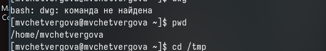{#fig:001 width=50%}

# Выполнение лабораторной работы
2. Выполним следующие действия:
- Перейдём в каталог */tmp*
- Выведем на экран содержимое каталога /tmp. Для этого используем команду *ls* с различными опциями.

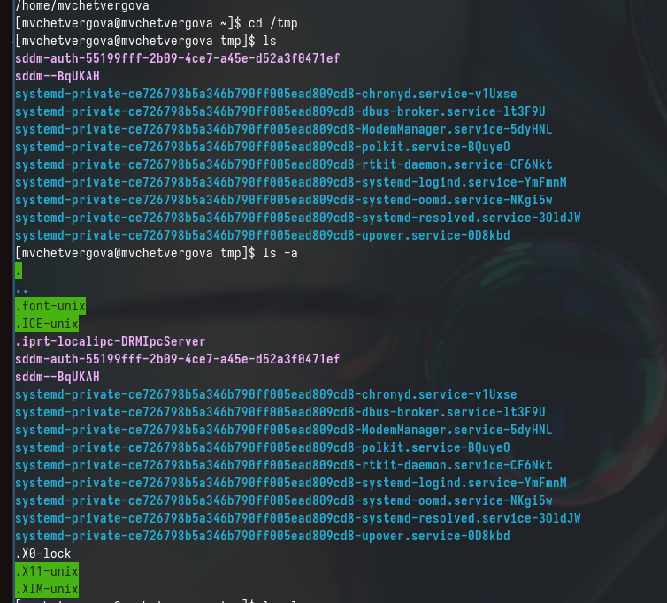{#fig:002 width=50%}

# Выполнение лабораторной работы
Используем команды: 
ls = Вывод файлов, содержащихся в данном каталоге
ls -a = больше информации ою этих файлах: указан сервер и адрес в памяти

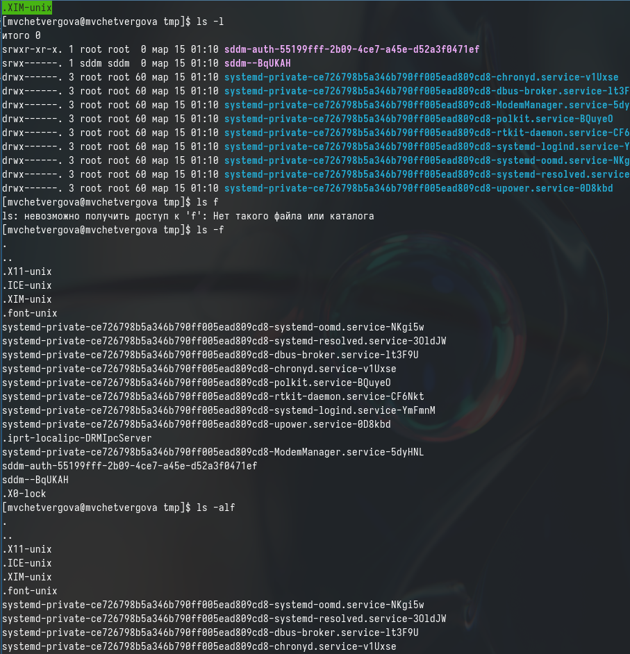{#fig:003 width=50%}

# Выполнение лабораторной работы
- Определим, есть ли в каталоге /var/spool подкаталог с именем cron. Для этого воспользуемся командой ls, а после  ls  напишем путь к файлу.

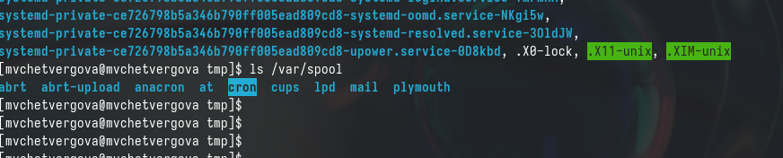{#fig:004 width=50%}

# Выполнение лабораторной работы
Узнаём, что в каталоге var действительно есть подкаталог spool
- Перейдём в дом. каталог и выведем на экран его содержимое. Владельцем файлов являюсь я - mvchetvergova

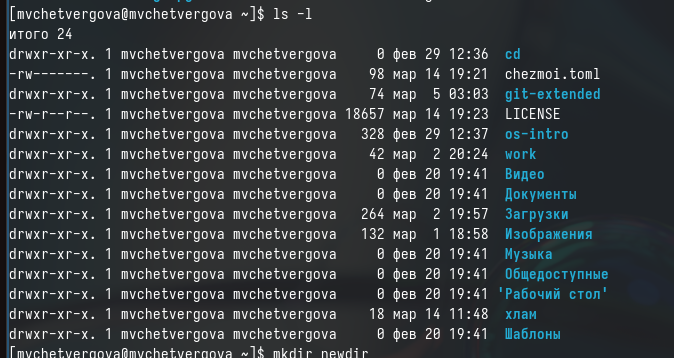{#fig:005 width=50%}

# Выполнение лабораторной работы
3. Выполним следующие действия:
- В домашнем каталоге создадим каталог с именем newdir

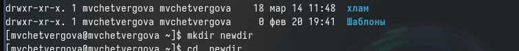{#fig:006 width=50%}

# Выполнение лабораторной работы
- в домашнем каталоге создадим каталог с именем *morefun*

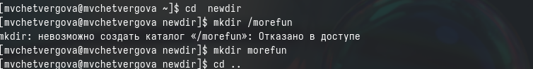{#fig:007 width=50%}

# Выполнение лабораторной работы
- В домашнем каталоге создадим одной командой три новых каталога.Затем удалим их.

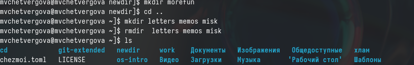{#fig:008 width=50%}

# Выполнение лабораторной работы
- Удалим каталог newdir/morefun из домашнего каталога. Проверим, действительно ли удалён файл.

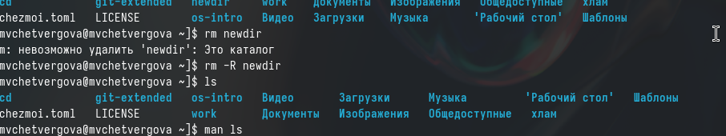{#fig:009 width=50%}

# Выполнение лабораторной работы
4. С помощью команды man  опредеоим, какую опцию команды ls нужно использовать для просмотра содержимого  не только  указанного каталога, но и подкаталогов, входящих в него. 
	Для вывода всех элементов каталога и входящих в них подкаталогов используем команду 
	ls -a
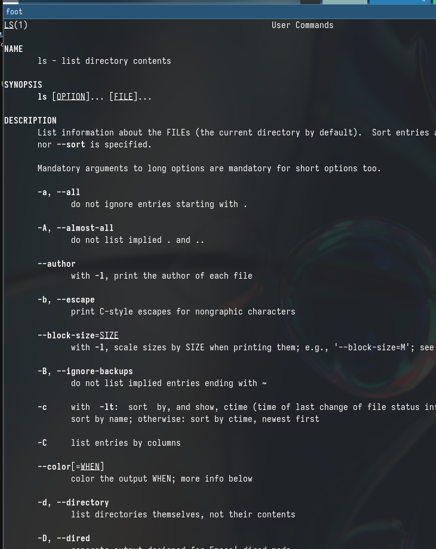{#fig:010 width=50%}

# Выполнение лабораторной работы
5. С помощью команды man определим набор опций команды ls, позволяющих отсортировать по времени последнего изменения выводимый список содержимого каталога с развёрнутым описанием файла.
	Для такого вывода необходима команда 
	ls -t
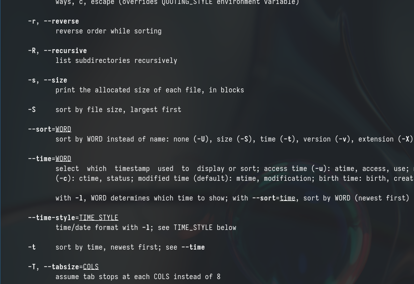{#fig:011 width=50%}

# Выполнение лабораторной работы
6. С помощью команды *man* рассмотрим возможности других команд:

cd:
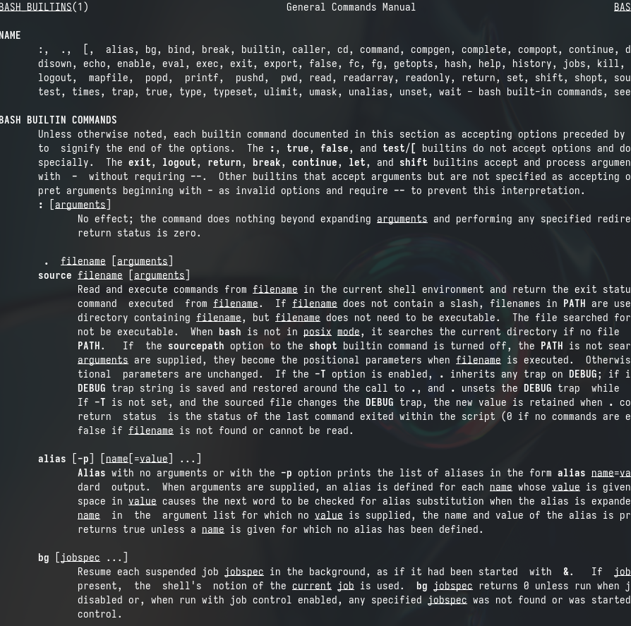{#fig:012 width=50%}

# Выполнение лабораторной работы
pwd:
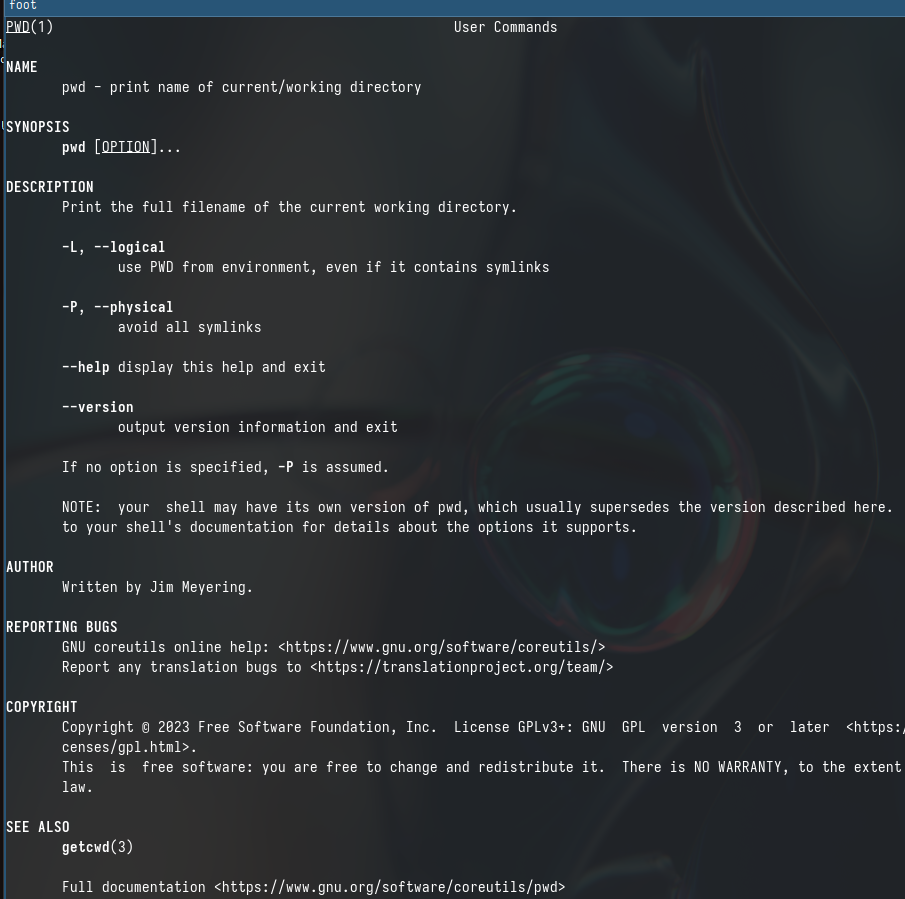{#fig:013 width=50%}

# Выполнение лабораторной работы
mkdir:

{#fig:014 width=50%}

# Выполнение лабораторной работы
rmdir:

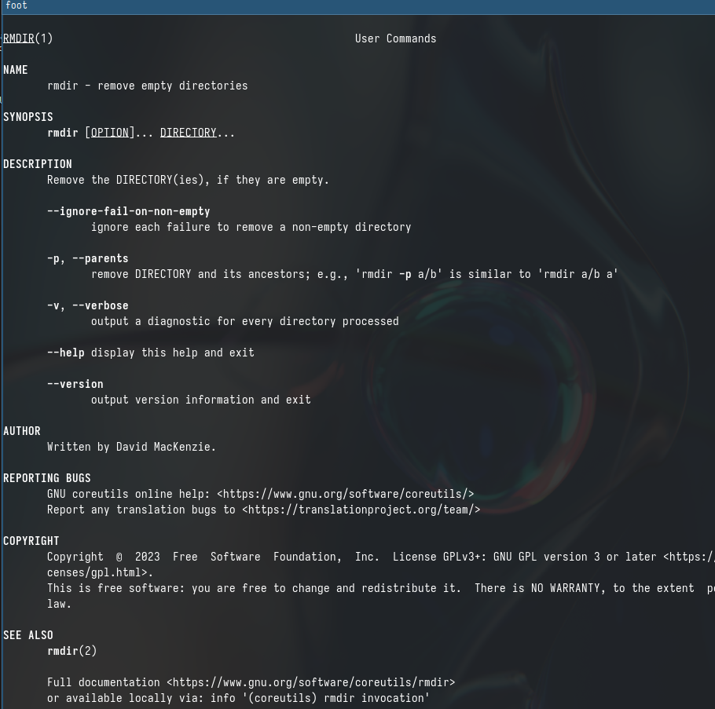{#fig:015 width=50%}

# Выполнение лабораторной работы
rm:

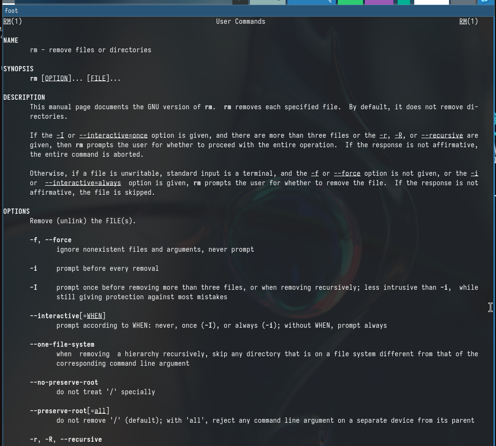{#fig:016 width=50%}

# Выполнение лабораторной работы
7. Используя информацию, полученную при помощи команды *history* , выполним модификацию и исполнение нескольких команд из буфера обмена

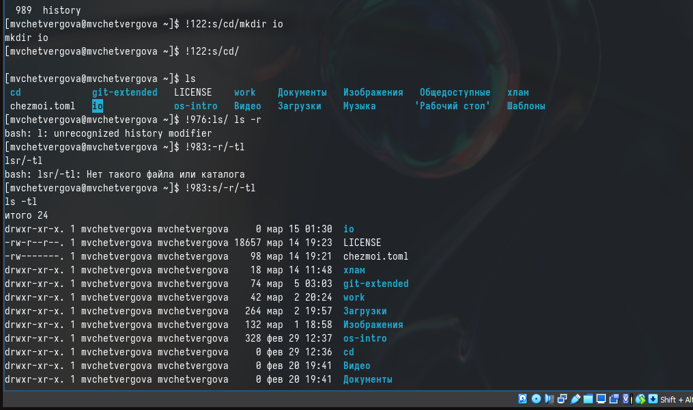{#fig:017 width=50%}

# Выводы

В ходе выполнения лабораторной работы №5 мы реализовали и прокомментировали ряд команд, направленный на приобретение практических навыков взаимодействия с системой посредством командной строки

::: {#refs}
:::
