---
## Front matter
title: "Лабораторная раота №5"
subtitle: "Операционные системы"
author: "Четвергова Мария Викторовна"

## Generic otions
lang: ru-RU
toc-title: "Содержание"

## Bibliography
bibliography: bib/cite.bib
csl: pandoc/csl/gost-r-7-0-5-2008-numeric.csl

## Pdf output format
toc: true # Table of contents
toc-depth: 2
lof: true # List of figures
lot: true # List of tables
fontsize: 12pt
linestretch: 1.5
papersize: a4
documentclass: scrreprt
## I18n polyglossia
polyglossia-lang:
  name: russian
  options:
	- spelling=modern
	- babelshorthands=true
polyglossia-otherlangs:
  name: english
## I18n babel
babel-lang: russian
babel-otherlangs: english
## Fonts
mainfont: PT Serif
romanfont: PT Serif
sansfont: PT Sans
monofont: PT Mono
mainfontoptions: Ligatures=TeX
romanfontoptions: Ligatures=TeX
sansfontoptions: Ligatures=TeX,Scale=MatchLowercase
monofontoptions: Scale=MatchLowercase,Scale=0.9
## Biblatex
biblatex: true
biblio-style: "gost-numeric"
biblatexoptions:
  - parentracker=true
  - backend=biber
  - hyperref=auto
  - language=auto
  - autolang=other*
  - citestyle=gost-numeric
## Pandoc-crossref LaTeX customization
figureTitle: "Рис."
tableTitle: "Таблица"
listingTitle: "Листинг"
lofTitle: "Список иллюстраций"
lotTitle: "Список таблиц"
lolTitle: "Листинги"
## Misc options
indent: true
header-includes:
  - \usepackage{indentfirst}
  - \usepackage{float} # keep figures where there are in the text
  - \floatplacement{figure}{H} # keep figures where there are in the text
---

# Цель работы
Приобретение практических навыков взаимодействия с системой посредством командной строки

# Задание
реализовать и прокомментировать ряд команд, направленный на приобретение практических навыков взаимодействия с системой посредством командной строки

# Выполнение лабораторной работы

1. Определим полное имя домашнего каталога. Для этого воспользуемся командой 

*pwd*
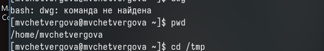{#fig:001 width=50%}

Полное имя моего домашнего каталога - "mvchetvergova"

2. Выполним следующие действия:

- Перейдём в каталог */tmp*
- Выведем на экран содержимое каталога /tmp. Для этого используем команду *ls* с различными опциями.

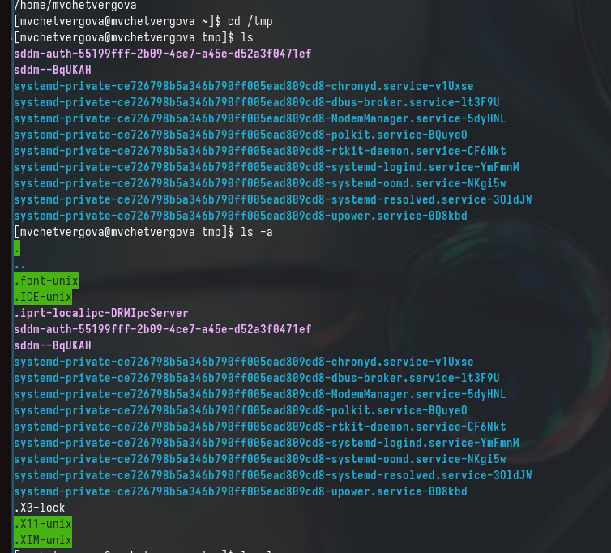{#fig:002 width=50%}

Используем клманды: 
ls = Вывод файлов, содержащихся в данном каталоге
ls -a = больше информации ою этих файлах: указан сервер и адрес в памяти

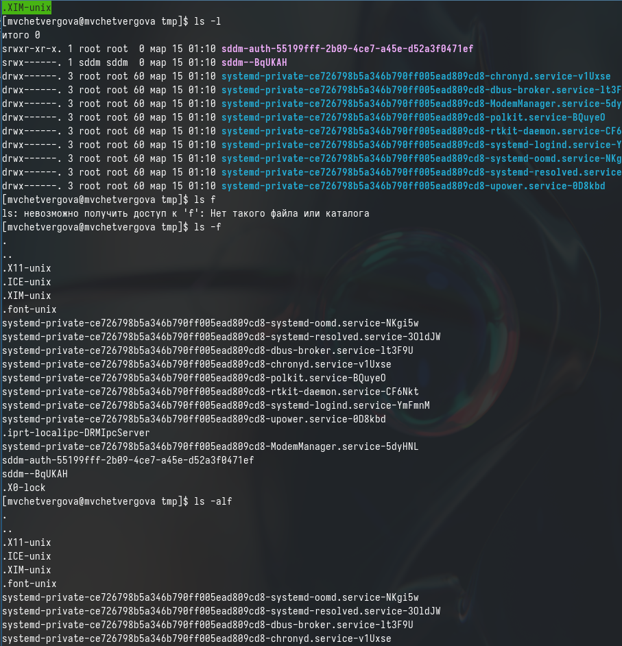{#fig:003 width=50%}

- Определим, есть ли в каталоге /var/spool подкаталог с именем cron. Для этого воспользуемся командой ls, а после  ls  напишем путь к файлу.

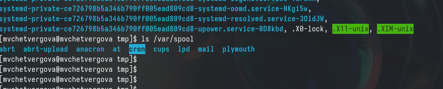{#fig:004 width=50%}

Узнаём, что в каталоге var действительно есть подкаталог spool
- Перейдём в дом. каталог и выведем на экран его содержимое. Владельцем файлов являюсь я - mvchetvergova

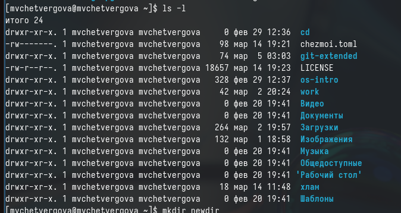{#fig:005 width=50%}

3. Выполним следующие действия:

- В домашнем каталоге создадим каталог с именем newdir

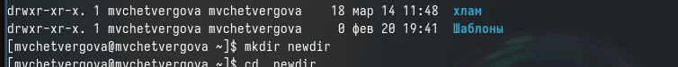{#fig:006 width=50%}

- в домашнем каталоге создадим каталог с именем *morefun*

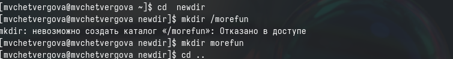{#fig:007 width=50%}

- В домашнем каталоге создадим одной командой три новых каталога.Затем удалим их.

{#fig:008 width=50%}

- Удалим каталог newdir/morefun из домашнего каталога. Проверим, действительно ли удалён файл.

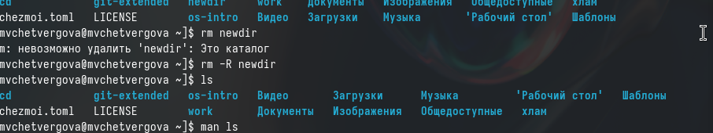{#fig:009 width=50%}

4. С помощью команды man  опредеоим, какую опцию команды ls нужно использовать для просмотра содержимого  не только  указанного каталога, но и подкаталогов, входящих в него. 

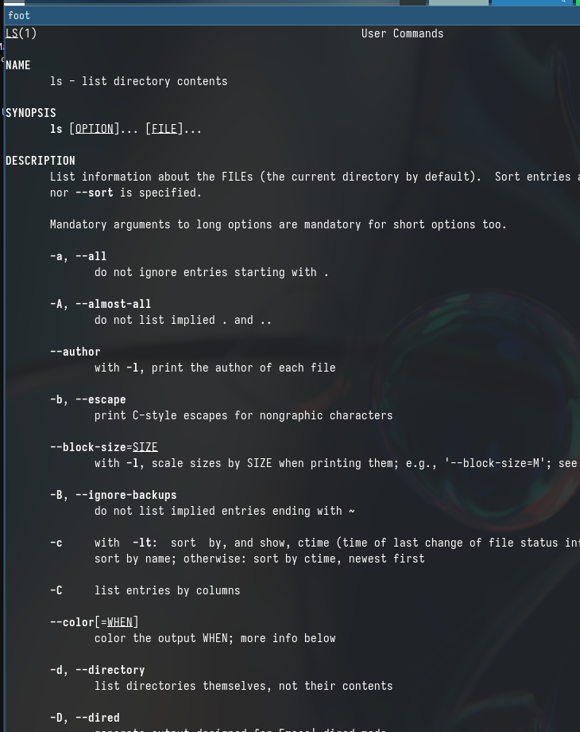{#fig:010 width=50%}

Для вывода всех элементов каталога и входящих в них подкаталогов используем команду 
ls -a

5. С помощью команды man определим набор опций команды ls, позволяющих отсортировать по времени последнего изменения выводимый список содержимого каталога с развёрнутым описанием файла.
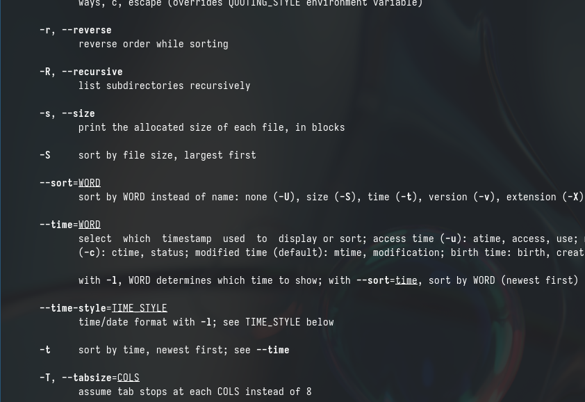{#fig:011 width=50%}

Для такого вывода необходима команда 
ls -t

6. С помощью команды *man* рассмотрим возможности других команд:

cd:
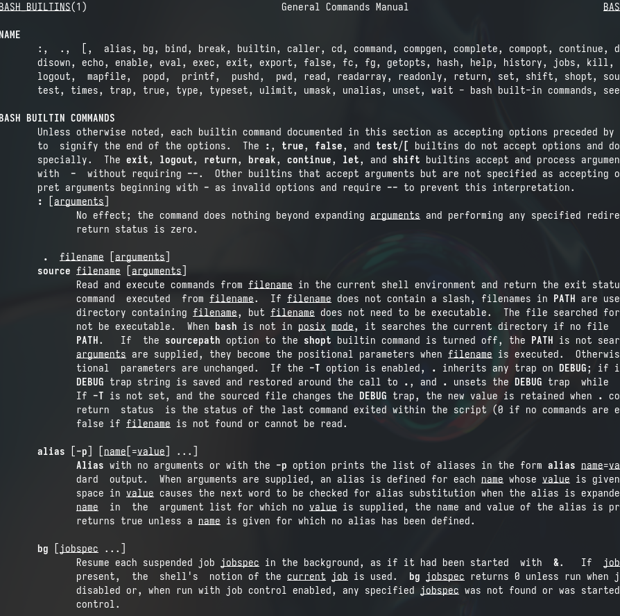{#fig:012 width=50%}

pwd:
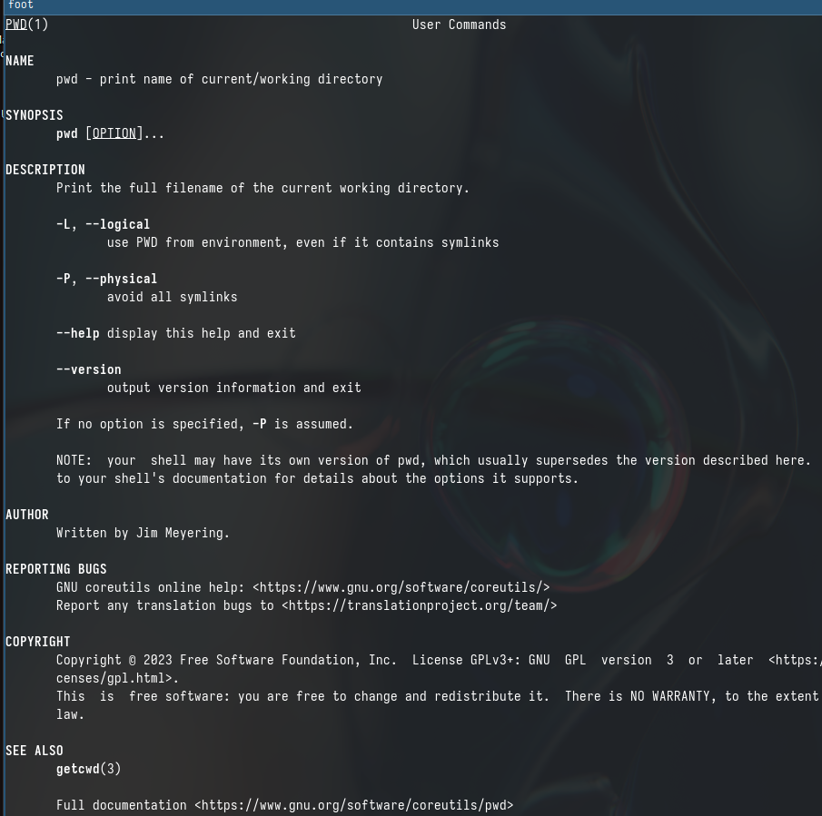{#fig:013 width=50%}

mkdir:

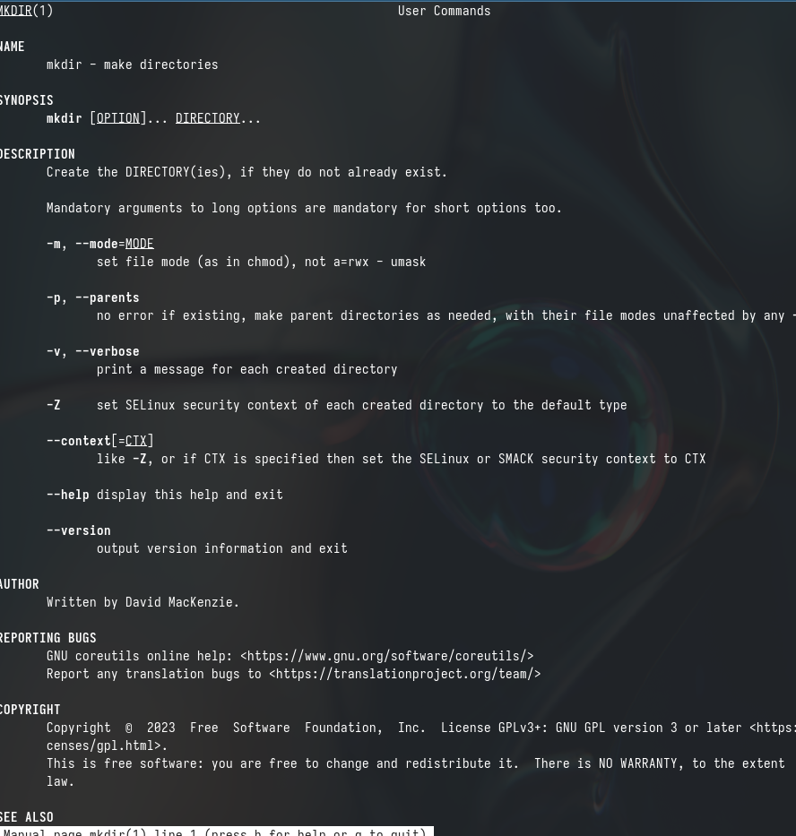{#fig:014 width=50%}

rmdir:

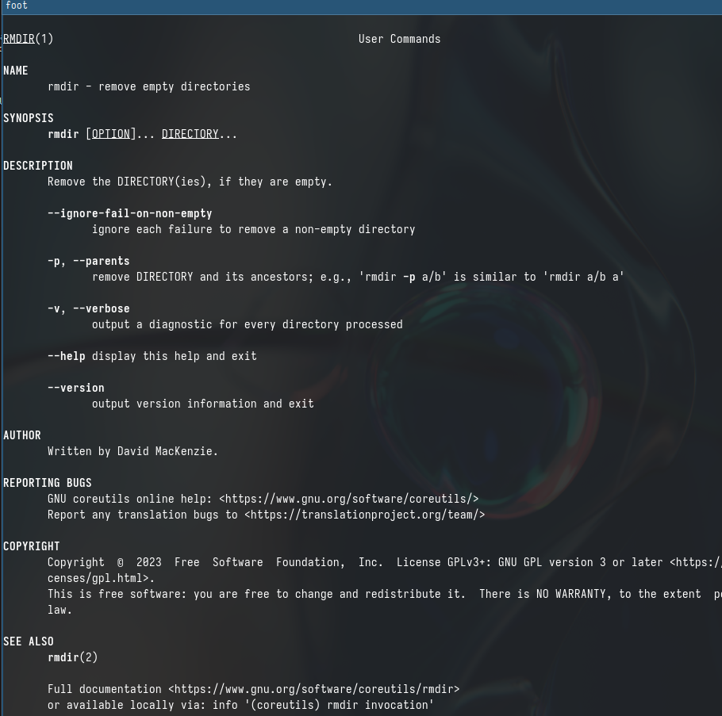{#fig:015 width=50%}

rm:

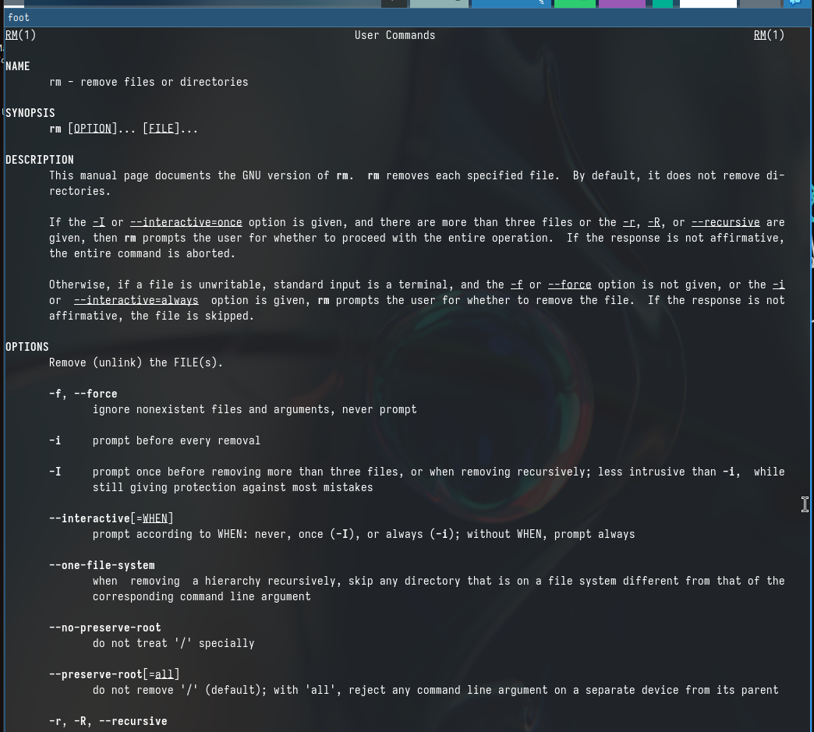{#fig:016 width=50%}

7. Используя информацию, полученную при помощи команды *history* , выполним модификацию и исполнение нескольких команд из буфера обмена

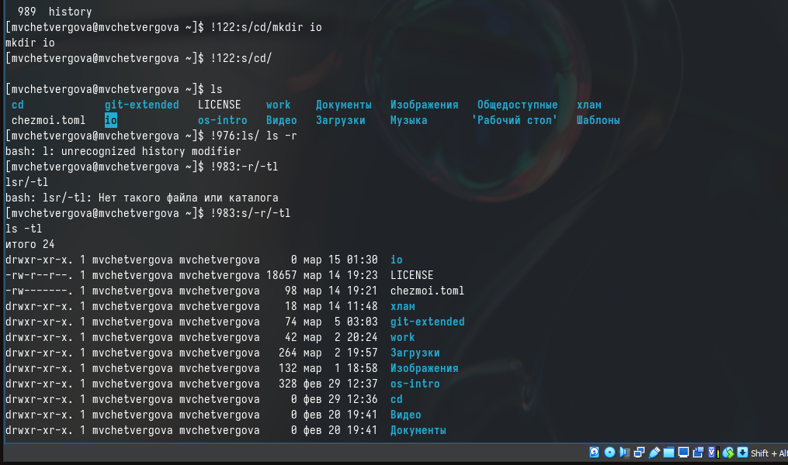{#fig:017 width=50%}

# Выводы

В ходе выполнения лабораторной работы №5 мы реализовали и прокомментировали ряд команд, направленный на приобретение практических навыков взаимодействия с системой посредством командной строки

::: {#refs}
:::
