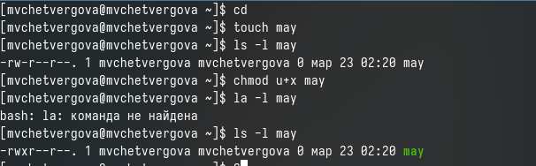

---
## Front matter
lang: ru-RU
title: Презентация к седьмой лабораторной работе
subtitle: Операционные системы
author:
  - Четвергова Мария Викторовна
institute:
  - Российский университет дружбы народов, Москва, Россия
date: 23 марта 2024 г.
## i18n babel
babel-lang: russian
babel-otherlangs: english

## Formatting pdf
toc: false
toc-title: Содержание
slide_level: 2
aspectratio: 169
section-titles: true
theme: metropolis
header-includes:
 - \metroset{progressbar=frametitle,sectionpage=progressbar,numbering=fraction}
 - '\makeatletter'
 - '\beamer@ignorenonframefalse'
 - '\makeatother'

## Fonts
mainfont: PT Serif
romanfont: PT Serif
sansfont: PT Sans
monofont: PT Mono
mainfontoptions: Ligatures=TeX
romanfontoptions: Ligatures=TeX
sansfontoptions: Ligatures=TeX,Scale=MatchLowercase
monofontoptions: Scale=MatchLowercase,Scale=0.9
---

# Информация

## Докладчик

:::::::::::::: {.columns align=center}
::: {.column width="70%"}

  * Четвергова Мария Викторовна
  * студент НПИбд-02-23
  * Российский университет дружбы народов
  * 1132232886@pfur.ru

:::
::: {.column width="30%"}

:::
::::::::::::::

# Цель и задачи работы работы

Ознакомление с файловой системой Linux, её структурой, именами и содержанием
каталогов. Приобретение практических навыков по применению команд для работы
с файлами и каталогами, по управлению процессами (и работами), по проверке использования диска и обслуживанию файловой системы.

# Выполнение лабораторной работы

1. Выполните все примеры, приведённые в первой части описания лабораторной работы.

1.1. 1. Копирование файла в текущем каталоге. Скопировать файл ~/abc1 в файл april
и в файл may:
 *cd*
* touch abc1*
* cp abc1 april*
* cp abc1 may*

{#fig:001 width=50%}

## 1.1.2. Копирование нескольких файлов в каталог. Скопировать файлы april и may в каталог
monthly:
* mkdir monthly*
* cp april may monthly*

{#fig:002 width=50%}

1.1.3. Копирование файлов в произвольном каталоге.Скопировать файл monthly/may в файл
с именем june:
*cp monthly/may monthly/june*
* ls monthly*
Опция i в команде cp выведет на экран запрос подтверждения о перезаписи файла.
Для рекурсивного копирования каталогов, содержащих файлы, используется команда
cp с опцией r.

{#fig:003 width=50%}

1.2.1 . Копирование каталогов в текущем каталоге. Скопировать каталог monthly в каталог
monthly.00:
* mkdir monthly.00*
* cp -r monthly monthly.00*

{#fig:004 width=50%}

1.2.2. Копирование каталогов в произвольном каталоге. Скопировать каталог monthly.00
в каталог /tmp
*cp -r monthly.00 /tmp*

{#fig:005 width=50%}

1.3.1. Переименование файлов в текущем каталоге. Изменить название файла april на
july в домашнем каталоге:
* cd*
* mv april july*

{#fig:006 width=50%}

1.3.2. Перемещение файлов в другой каталог. Переместить файл july в каталог monthly.00:
* mv july monthly.00*
* ls monthly.00*

{#fig:007 width=50%}

Если необходим запрос подтверждения о перезаписи файла, то нужно использовать
опцию i.
1.3.3. Переименование каталогов в текущем каталоге. Переименовать каталог monthly.00
в monthly.01
* mv monthly.00 monthly.01*

{#fig:008 width=50%}

## 1.3.4. Перемещение каталога в другой каталог. Переместить каталог monthly.01в каталог
reports:
* mkdir reports*
* mv monthly.01 reports*

{#fig:009 width=50%}

## 1.3.5. Переименование каталога, не являющегося текущим. Переименовать каталог
reports/monthly.01 в reports/monthly:
* mv reports/monthly.01 reports/monthly*

{#fig:010 width=50%}

## 1.4.1. Требуется создать файл ~/may с правом выполнения для владельца:
* cd*
* touch may*
* ls -l may*
* chmod u+x may*
* ls -l may*

{#fig:011 width=50%}

1.4.2. Требуется лишить владельца файла ~/may права на выполнение:
* chmod u-x may*
* ls -l may*

{#fig:012 width=50%}

1.4.3. Требуется создать каталог monthly с запретом на чтение для членов группы и всех
остальных пользователей:
* cd*
* mkdir monthly*
* chmod g-r, o-r monthly*

{#fig:013 width=50%}

1.4.4. Требуется создать файл ~/abc1 с правом записи для членов группы:
* cd*
* touch abc1*
* chmod g+w abc1*

{#fig:014 width=50%}

2. Выполните следующие действия, зафиксировав в отчёте по лабораторной работе
используемые при этом команды и результаты их выполнения:

2.1. Скопируйте файл /usr/include/sys/io.h в домашний каталог и назовите его
equipment. 

{#fig:015 width=50%}

2.2. В домашнем каталоге создайте директорию ~/ski.plases.

{#fig:016 width=50%}

2.3. Переместите файл equipment в каталог ~/ski.plases.

{#fig:017 width=50%}

2.4. Переименуйте файл ~/ski.plases/equipment в ~/ski.plases/equiplist.

{#fig:018 width=50%}

2.5. Создайте в домашнем каталоге файл abc1 и скопируйте его в каталог
~/ski.plases, назовите его equiplist2.

{#fig:019 width=50%}

2.6. Создайте каталог с именем equipment в каталоге ~/ski.plases.

{#fig:020 width=50%}

2.7. Переместите файлы ~/ski.plases/equiplist и equiplist2 в каталог
~/ski.plases/equipment.

{#fig:021 width=50%}

2.8. Создайте и переместите каталог ~/newdir в каталог ~/ski.plases и назовите его plans.

{#fig:022 width=50%}

3. Определите опции команды chmod, необходимые для того, чтобы присвоить перечисленным ниже файлам выделенные права доступа, считая, что в начале таких прав
нет:
3.1. drwxr--r-- ... australia
3.2. drwx--x--x ... play
3.3. -r-xr--r-- ... my_os
3.4. -rw-rw-r-- ... feathers

{#fig:023 width=50%}

4. Проделайте приведённые ниже упражнения, записывая в отчёт по лабораторной
работе используемые при этом команды:
4.1. Просмотрите содержимое файла /etc/password.

{#fig:024 width=50%}

4.2. Скопируйте файл ~/feathers в файл ~/file.old.

{#fig:025 width=50%}

4.3. Переместите файл ~/file.old в каталог ~/play.

{#fig:026 width=50%}

4.4. Скопируйте каталог ~/play в каталог ~/fun.

{#fig:027 width=50%}

4.5. Переместите каталог ~/fun в каталог ~/play и назовите его games.

{#fig:028 width=50%}

4.6. Лишите владельца файла ~/feathers права на чтение.

{#fig:029 width=50%}

4.7. Что произойдёт, если вы попытаетесь просмотреть файл ~/feathers командой cat?
 ответ: Ничего не выйдет, тк у нас нет соответствующих прав

{#fig:030 width=50%}

4.8. Что произойдёт, если вы попытаетесь скопировать файл ~/feathers?
 ответ: Ничего не выйдет, тк у нас нет соответствующих прав

{#fig:031 width=50%}

4.9. Дайте владельцу файла ~/feathers право на чтение.

{#fig:032 width=50%}

4.10. Лишите владельца каталога ~/play права на выполнение.

{#fig:033 width=50%}

4.11. Перейдите в каталог ~/play. Что произошло?
 ответ: Ничего не выйдет, тк у нас нет соответствующих прав

{#fig:034 width=50%}

4.12. Дайте владельцу каталога ~/play право на выполнение.

{#fig:035 width=50%}

5. Прочитайте man по командам mount, fsck, mkfs, kill и кратко их охарактеризуйте, приведя примеры.

{#fig:036 width=50%}

{#fig:037 width=50%}

{#fig:038 width=50%}

{#fig:039 width=50%}

# Выводы

В ходе выполнения лабораторной работы №7 я ознакомлась с файловой системой Linux, её структурой, именами и содержанием каталогов. Приобрела практических навыков по применению команд для работы
с файлами и каталогами, по управлению процессами (и работами), по проверке использования диска и обслуживанию файловой системы.

