---
## Front matter
title: "Отчёт к лабораторной работе №7"
subtitle: "Анализ файловой системы Линукс. Команды для работы с файлами и каталогами"
author: "Четвергова Мария Викторовна"

## Generic otions
lang: ru-RU
toc-title: "Содержание"

## Bibliography
bibliography: bib/cite.bib
csl: pandoc/csl/gost-r-7-0-5-2008-numeric.csl

## Pdf output format
toc: true # Table of contents
toc-depth: 2
lof: true # List of figures
lot: true # List of tables
fontsize: 12pt
linestretch: 1.5
papersize: a4
documentclass: scrreprt
## I18n polyglossia
polyglossia-lang:
  name: russian
  options:
	- spelling=modern
	- babelshorthands=true
polyglossia-otherlangs:
  name: english
## I18n babel
babel-lang: russian
babel-otherlangs: english
## Fonts
mainfont: PT Serif
romanfont: PT Serif
sansfont: PT Sans
monofont: PT Mono
mainfontoptions: Ligatures=TeX
romanfontoptions: Ligatures=TeX
sansfontoptions: Ligatures=TeX,Scale=MatchLowercase
monofontoptions: Scale=MatchLowercase,Scale=0.9
## Biblatex
biblatex: true
biblio-style: "gost-numeric"
biblatexoptions:
  - parentracker=true
  - backend=biber
  - hyperref=auto
  - language=auto
  - autolang=other*
  - citestyle=gost-numeric
## Pandoc-crossref LaTeX customization
figureTitle: "Рис."
tableTitle: "Таблица"
listingTitle: "Листинг"
lofTitle: "Список иллюстраций"
lotTitle: "Список таблиц"
lolTitle: "Листинги"
## Misc options
indent: true
header-includes:
  - \usepackage{indentfirst}
  - \usepackage{float} # keep figures where there are in the text
  - \floatplacement{figure}{H} # keep figures where there are in the text
---

# Цель и задачи работы работы

Ознакомление с файловой системой Linux, её структурой, именами и содержанием
каталогов. Приобретение практических навыков по применению команд для работы
с файлами и каталогами, по управлению процессами (и работами), по проверке использования диска и обслуживанию файловой системы.

# Выполнение лабораторной работы

1. Выполните все примеры, приведённые в первой части описания лабораторной работы.

1.1. 1. Копирование файла в текущем каталоге. Скопировать файл ~/abc1 в файл april
и в файл may:
 *cd*
* touch abc1*
* cp abc1 april*
* cp abc1 may*

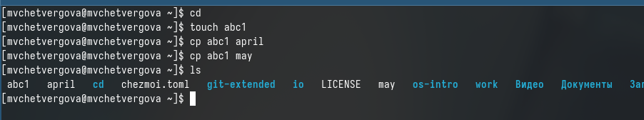{#fig:001 width=50%}

1.1.2. Копирование нескольких файлов в каталог. Скопировать файлы april и may в каталог
monthly:
* mkdir monthly*
* cp april may monthly*

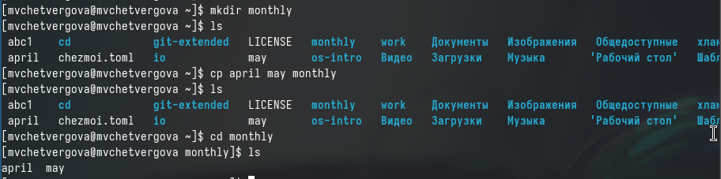{#fig:002 width=50%}

1.1.3. Копирование файлов в произвольном каталоге.Скопировать файл monthly/may в файл
с именем june:
*cp monthly/may monthly/june*
* ls monthly*
Опция i в команде cp выведет на экран запрос подтверждения о перезаписи файла.
Для рекурсивного копирования каталогов, содержащих файлы, используется команда
cp с опцией r.

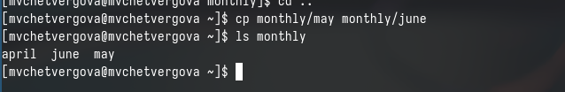{#fig:003 width=50%}

1.2.1 . Копирование каталогов в текущем каталоге. Скопировать каталог monthly в каталог
monthly.00:
* mkdir monthly.00*
* cp -r monthly monthly.00*

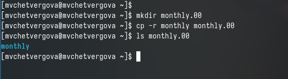{#fig:004 width=50%}

1.2.2. Копирование каталогов в произвольном каталоге. Скопировать каталог monthly.00
в каталог /tmp
*cp -r monthly.00 /tmp*

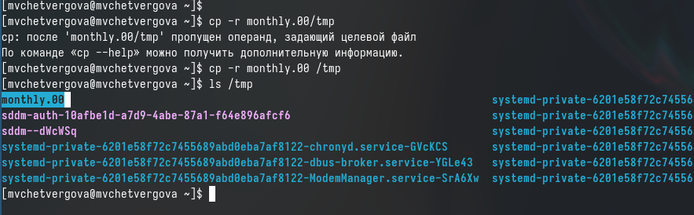{#fig:005 width=50%}

1.3.1. Переименование файлов в текущем каталоге. Изменить название файла april на
july в домашнем каталоге:
* cd*
* mv april july*

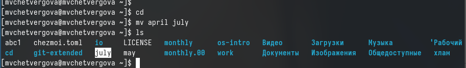{#fig:006 width=50%}

1.3.2. Перемещение файлов в другой каталог. Переместить файл july в каталог monthly.00:
* mv july monthly.00*
* ls monthly.00*

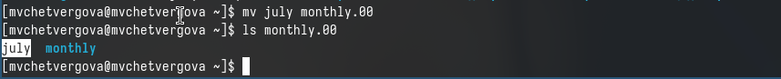{#fig:007 width=50%}

Если необходим запрос подтверждения о перезаписи файла, то нужно использовать
опцию i.
1.3.3. Переименование каталогов в текущем каталоге. Переименовать каталог monthly.00
в monthly.01
* mv monthly.00 monthly.01*

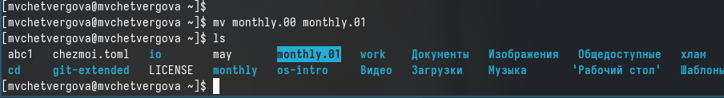{#fig:008 width=50%}

1.3.4. Перемещение каталога в другой каталог. Переместить каталог monthly.01в каталог
reports:
* mkdir reports*
* mv monthly.01 reports*

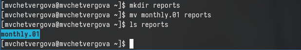{#fig:009 width=50%}

1.3.5. Переименование каталога, не являющегося текущим. Переименовать каталог
reports/monthly.01 в reports/monthly:
* mv reports/monthly.01 reports/monthly*

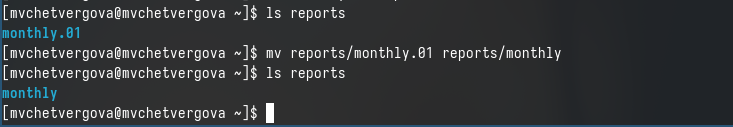{#fig:010 width=50%}

1.4.1. Требуется создать файл ~/may с правом выполнения для владельца:
* cd*
* touch may*
* ls -l may*
* chmod u+x may*
* ls -l may*

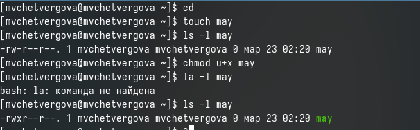{#fig:011 width=50%}

1.4.2. Требуется лишить владельца файла ~/may права на выполнение:
* chmod u-x may*
* ls -l may*

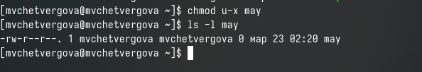{#fig:012 width=50%}

1.4.3. Требуется создать каталог monthly с запретом на чтение для членов группы и всех
остальных пользователей:
* cd*
* mkdir monthly*
* chmod g-r, o-r monthly*

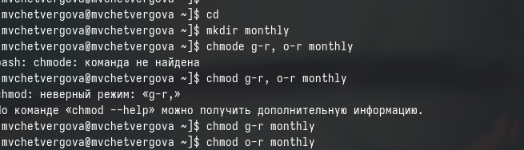{#fig:013 width=50%}

1.4.4. Требуется создать файл ~/abc1 с правом записи для членов группы:
* cd*
* touch abc1*
* chmod g+w abc1*

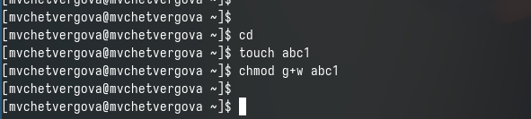{#fig:014 width=50%}

2. Выполните следующие действия, зафиксировав в отчёте по лабораторной работе
используемые при этом команды и результаты их выполнения:

2.1. Скопируйте файл /usr/include/sys/io.h в домашний каталог и назовите его
equipment. 

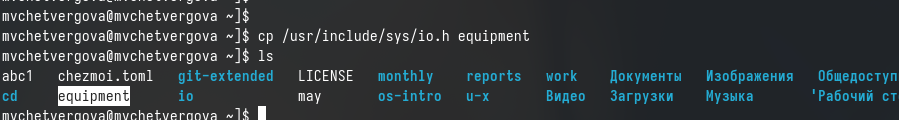{#fig:015 width=50%}

2.2. В домашнем каталоге создайте директорию ~/ski.plases.

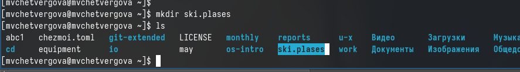{#fig:016 width=50%}

2.3. Переместите файл equipment в каталог ~/ski.plases.

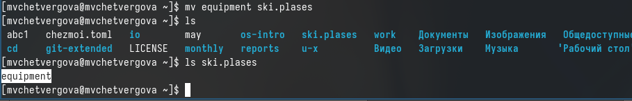{#fig:017 width=50%}

2.4. Переименуйте файл ~/ski.plases/equipment в ~/ski.plases/equiplist.

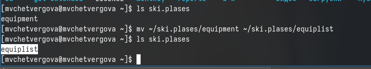{#fig:018 width=50%}

2.5. Создайте в домашнем каталоге файл abc1 и скопируйте его в каталог
~/ski.plases, назовите его equiplist2.

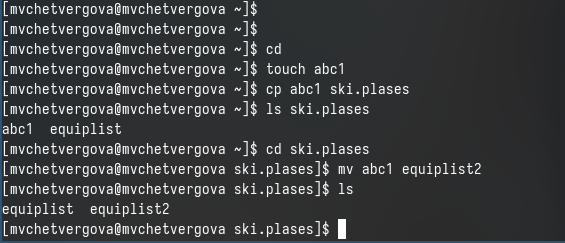{#fig:019 width=50%}

2.6. Создайте каталог с именем equipment в каталоге ~/ski.plases.

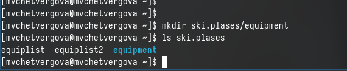{#fig:020 width=50%}

2.7. Переместите файлы ~/ski.plases/equiplist и equiplist2 в каталог
~/ski.plases/equipment.

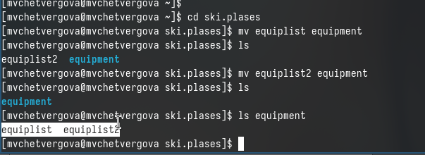{#fig:021 width=50%}

2.8. Создайте и переместите каталог ~/newdir в каталог ~/ski.plases и назовите его plans.

{#fig:022 width=50%}

3. Определите опции команды chmod, необходимые для того, чтобы присвоить перечисленным ниже файлам выделенные права доступа, считая, что в начале таких прав
нет:
3.1. drwxr--r-- ... australia
3.2. drwx--x--x ... play
3.3. -r-xr--r-- ... my_os
3.4. -rw-rw-r-- ... feathers

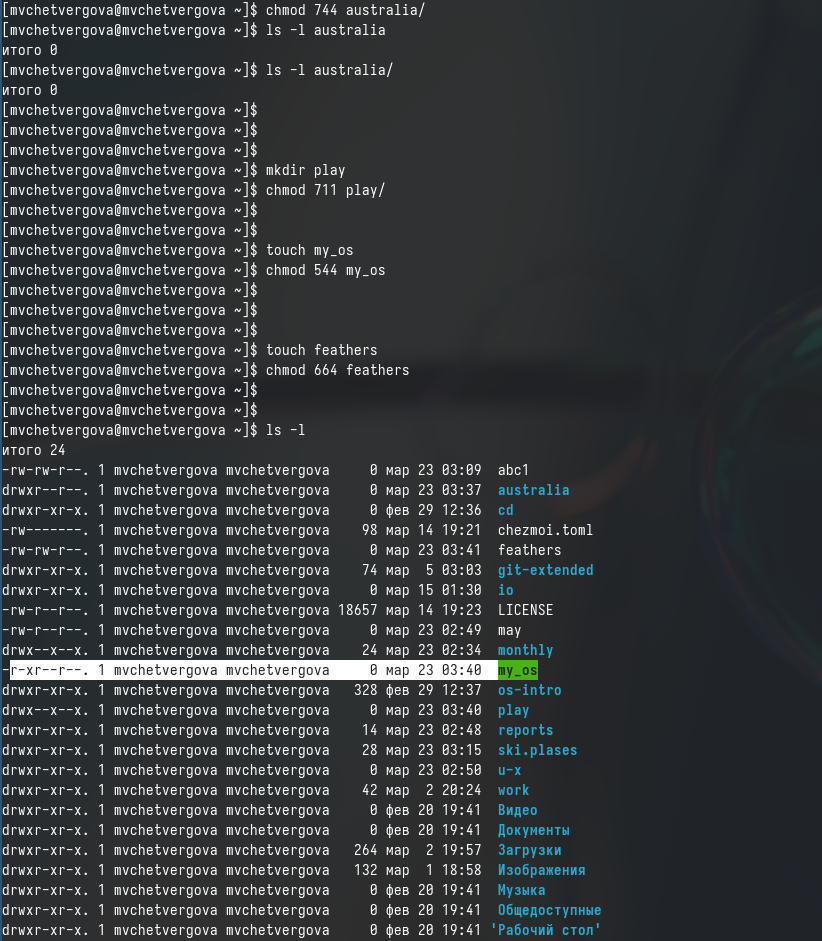{#fig:023 width=50%}

4. Проделайте приведённые ниже упражнения, записывая в отчёт по лабораторной
работе используемые при этом команды:
4.1. Просмотрите содержимое файла /etc/password.

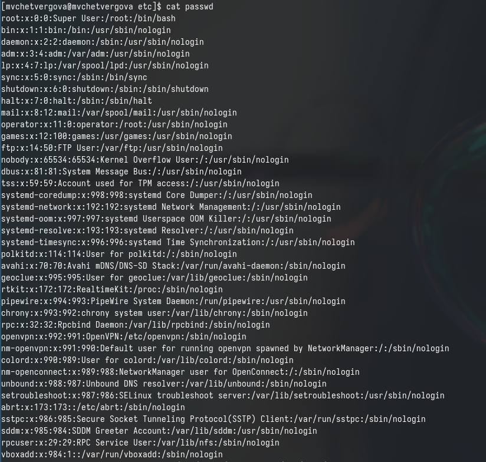{#fig:024 width=50%}

4.2. Скопируйте файл ~/feathers в файл ~/file.old.

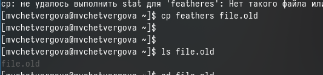{#fig:025 width=50%}

4.3. Переместите файл ~/file.old в каталог ~/play.

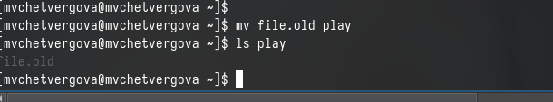{#fig:026 width=50%}

4.4. Скопируйте каталог ~/play в каталог ~/fun.

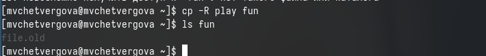{#fig:027 width=50%}

4.5. Переместите каталог ~/fun в каталог ~/play и назовите его games.

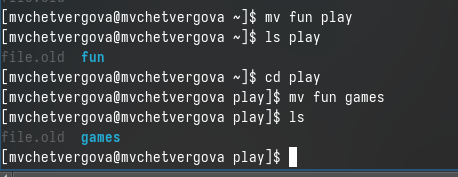{#fig:028 width=50%}

4.6. Лишите владельца файла ~/feathers права на чтение.

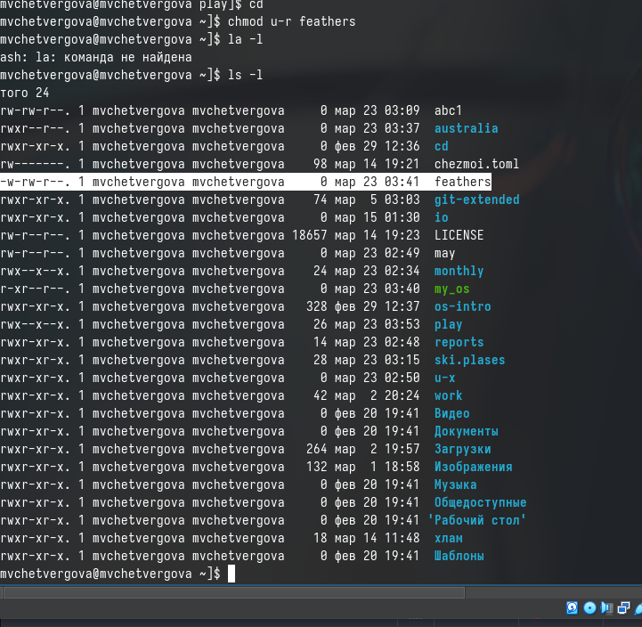{#fig:029 width=50%}

4.7. Что произойдёт, если вы попытаетесь просмотреть файл ~/feathers командой cat?
 ответ: Ничего не выйдет, тк у нас нет соответствующих прав

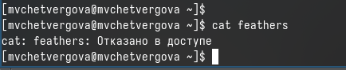{#fig:030 width=50%}

4.8. Что произойдёт, если вы попытаетесь скопировать файл ~/feathers?
 ответ: Ничего не выйдет, тк у нас нет соответствующих прав

{#fig:031 width=50%}

4.9. Дайте владельцу файла ~/feathers право на чтение.

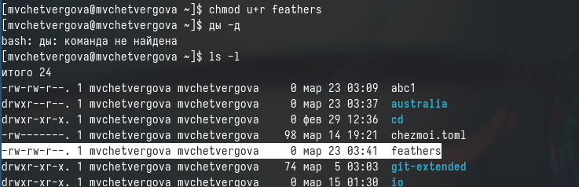{#fig:032 width=50%}

4.10. Лишите владельца каталога ~/play права на выполнение.

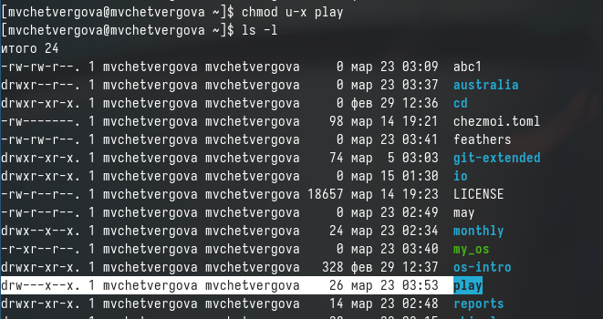{#fig:033 width=50%}

4.11. Перейдите в каталог ~/play. Что произошло?
 ответ: Ничего не выйдет, тк у нас нет соответствующих прав

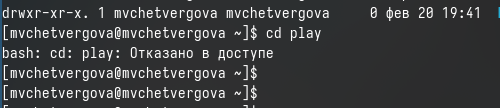{#fig:034 width=50%}

4.12. Дайте владельцу каталога ~/play право на выполнение.

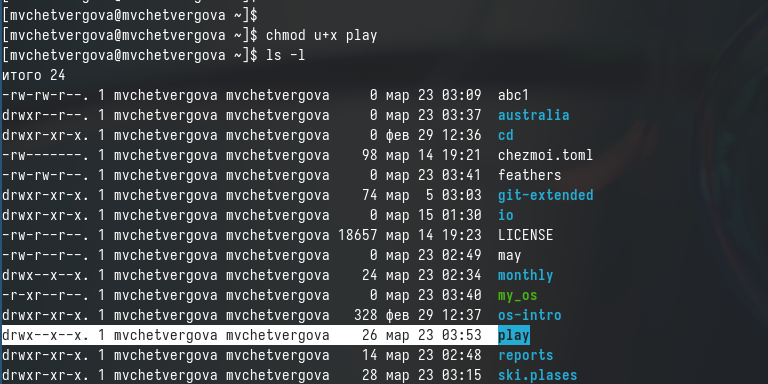{#fig:035 width=50%}

5. Прочитайте man по командам mount, fsck, mkfs, kill и кратко их охарактеризуйте, приведя примеры.

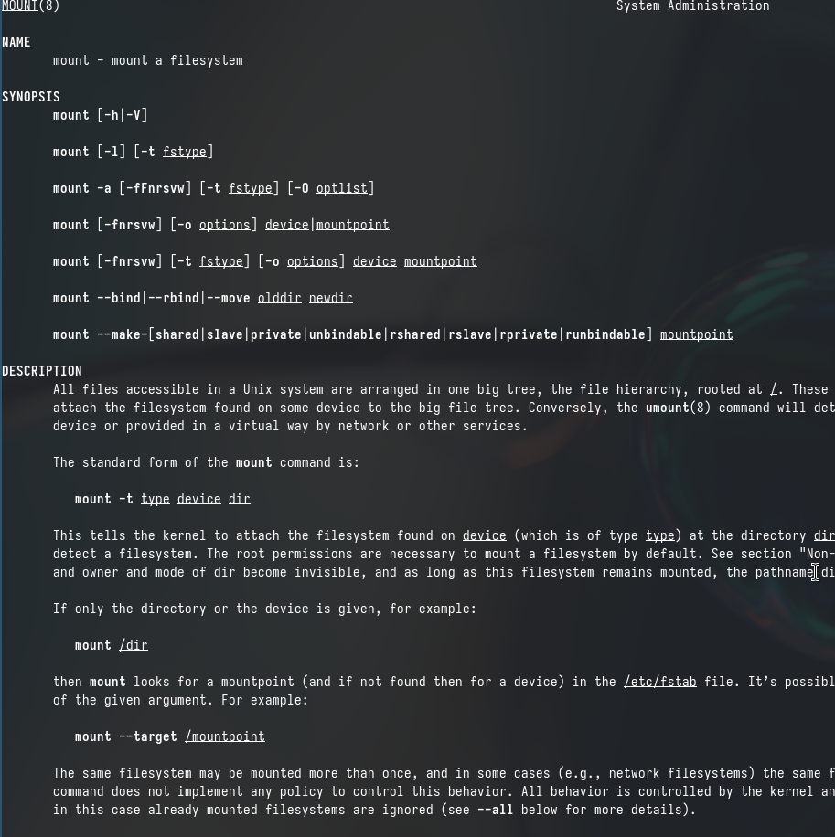{#fig:036 width=50%}

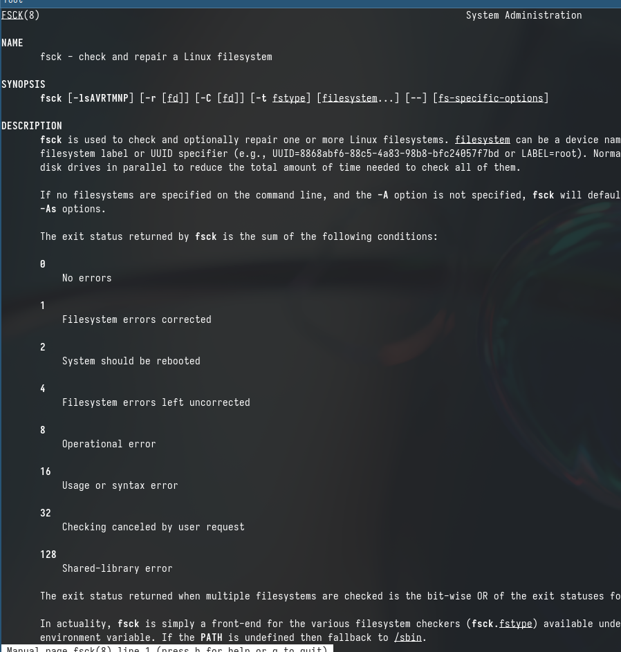{#fig:037 width=50%}

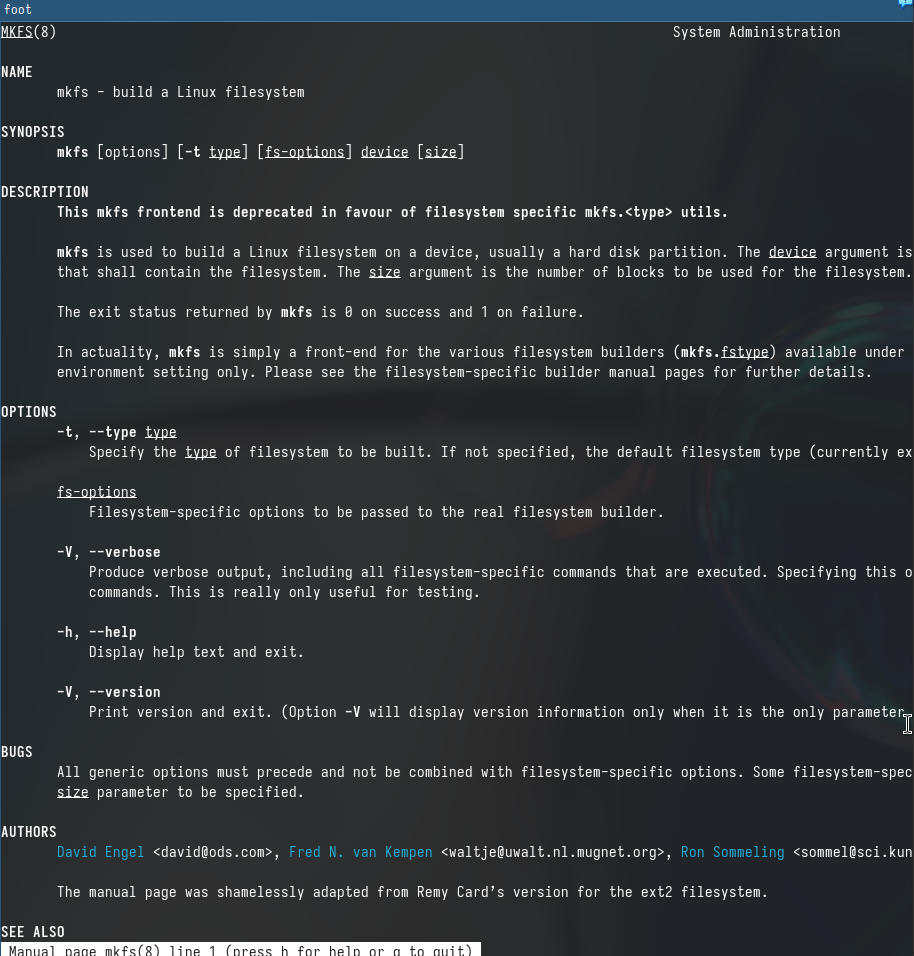{#fig:038 width=50%}

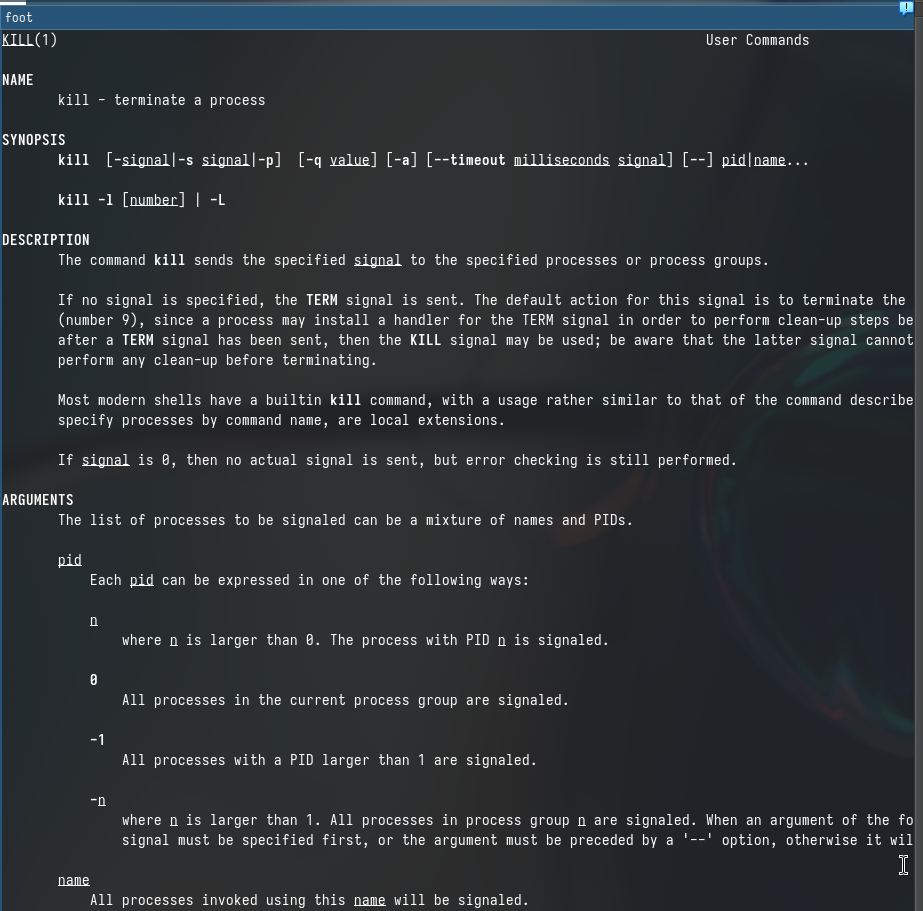{#fig:039 width=50%}

# Выводы

В ходе выполнения лабораторной работы №7 я ознакомлась с файловой системой Linux, её структурой, именами и содержанием каталогов. Приобрела практических навыков по применению команд для работы
с файлами и каталогами, по управлению процессами (и работами), по проверке использования диска и обслуживанию файловой системы.

# Ответы на контрольные вопросы

1. Дайте характеристику каждой файловой системе, существующей на жёстком диске компьютера, на котором вы выполняли лабораторную работу.
Ext2, Ext3, Ext4 или Extended Filesystem - это стандартная файловая система
для Linux. Она была разработана еще для Minix. Она самая стабильная из
всех существующих, кодовая база изменяется очень редко и эта файловая система содержит больше всего функций. Версия ext2 была разработана уже именно для Linux и получила много улучшений. В 2001 году вышла ext3, которая добавила еще больше стабильности благодаря использованию журналирования. В 2006 была выпущена версия ext4, которая используется во всех дистрибутивах Linux до сегодняшнего дня. В ней было внесено много улучшений, в том числе увеличен максимальный размер раздела до одного экзабайта. Btrfs или B-Tree File System - это совершенно новая файловая система, которая сосредоточена на отказоустойчивости, легкости администрирования и восстановления данных. Файловая система объединяет в себе очень много новых интересных возможностей, таких как размещение на нескольких разделах, поддержка подтомов, изменение размера не лету, создание мгновенных снимков, а также высокая производительность. Но многими пользователями файловая система Btrfs считается нестабильной. Тем не менее, она уже используется как файловая система по умолчанию в OpenSUSE и SUSE Linux.

2. Приведите общую структуру файловой системы и дайте характеристику каждой директории первого уровня этой структуры.

/ — root каталог. Содержит в себе всю иерархию системы;
/bin — здесь находятся двоичные исполняемые файлы. Основные общие команды, хранящиеся отдельно от других программ в системе (прим.: pwd, ls, cat,
ps);
/boot — тут расположены файлы, используемые для загрузки системы (образ
initrd, ядро vmlinuz);
/dev — в данной директории располагаются файлы устройств (драйверов). С помощью этих файлов можно взаимодействовать с устройствами. К примеру, если
это жесткий диск, можно подключить его к файловой системе. В файл принтера
же можно написать напрямую и отправить задание на печать;
/etc— в этой директории находятся файлы конфигураций программ. Эти файлы
позволяют настраивать системы, сервисы, скрипты системных демонов;
/home — каталог, аналогичный каталогу Users в Windows. Содержит домашние
каталоги учетных записей пользователей (кроме root). При создании нового
пользователя здесь создается одноименный каталог с аналогичным именем и
хранит личные файлы этого пользователя;
/lib — содержит системные библиотеки, с которыми работают программы и
модули ядра;
/lost+found — содержит файлы, восстановленные после сбоя работы системы.
Система проведет проверку после сбоя и найденные файлы можно будет посмотреть в данном каталоге;
/media — точка монтирования внешних носителей. Например, когда вы вставляете диск в дисковод, он будет автоматически смонтирован в директорию
/media/cdrom;
/mnt — точка временного монтирования. Файловые системы подключаемых
устройств обычно монтируются в этот каталог для временного использования;
/opt — тут расположены дополнительные (необязательные) приложения. Такие
программы обычно не подчиняются принятой иерархии и хранят свои файлы в
одном подкаталоге (бинарные, библиотеки, конфигурации);
/proc — содержит файлы, хранящие информацию о запущенных процессах и о
состоянии ядра ОС;
/root — директория, которая содержит файлы и личные настройки суперпользователя;
/run — содержит файлы состояния приложений. Например, PID-файлы или
UNIX-сокеты;
/sbin — аналогично /bin содержит бинарные файлы. Утилиты нужны для настройки и администрирования системы суперпользователем;
/srv — содержит файлы сервисов, предоставляемых сервером (прим. FTP или
Apache HTTP);
/sys — содержит данные непосредственно о системе. Тут можно узнать информацию о ядре, драйверах и устройствах;
/tmp — содержит временные файлы. Данные файлы доступны всем пользователям на чтение и запись. Стоит отметить, что данный каталог очищается при
перезагрузке;
/usr — содержит пользовательские приложения и утилиты второго уровня,
используемые пользователями, а
не системой. Содержимое доступно только для чтения (кроме root). Каталог
имеет вторичную иерархию и похож на корневой;
/var — содержит переменные файлы. Имеет подкаталоги, отвечающие за отдельные переменные. Например, логи будут храниться в /var/log, кэш в /var/cache,
очереди заданий в /var/spool/ и так далее.

3. Какая операция должна быть выполнена, чтобы содержимое некоторой
файловой системы было доступно операционной системе?
 Монтирование тома.

4. Назовите основные причины нарушения целостности файловой системы.
Как устранить повреждения файловой системы? 
Отсутствие синхронизации между образом файловой системы в памяти и ее данными на диске в случае
аварийного останова может привести к появлению следующих ошибок:
Один блок адресуется несколькими mode (принадлежит нескольким файлам).
Блок помечен как свободный, но в то же время занят (на него ссылается onode).
Блок помечен как занятый, но в то же время свободен (ни один inode на него не
ссылается). Неправильное число ссылок в inode (недостаток или избыток ссылающихся записей в каталогах). Несовпадение между размером файла и суммарным
размером адресуемых inode блоков. Недопустимые адресуемые блоки (например, расположенные за пределами файловой системы). “Потерянные” файлы
(правильные inode, на которые не ссылаются записи каталогов). Недопустимые
или неразмещенные номера inode в записях каталогов.

5. Как создаётся файловая система? mkfs - позволяет создать файловую систему Linux.

6. Дайте характеристику командам для просмотра текстовых файлов. Cat -
выводит содержимое файла на стандартное устройство вывода. Выполнение
команды head выведет первые 10 строк текстового файла. Выполнение
команды tail выведет последние 10 строк текстового файла. Команда tac -
это тоже самое, что и cat, только отображает строки в обратном порядке. Для
того, чтобы просмотреть огромный текстовый файл применяются команды
для постраничного просмотра. Такие как more и less.

7. Приведите основные возможности команды cp в Linux. Cp – копирует или
перемещает директорию, файлы.

8. Приведите основные возможности команды mv в Linux. Mv - переименовать
или переместить файл или директорию

9. Что такое права доступа? Как они могут быть изменены? 
Права доступа к файлу или каталогу можно изменить, воспользовавшись командой chmod.
Сделать это может владелец файла (или каталога) или пользователь с правами администратора

::: {#refs}
:::
