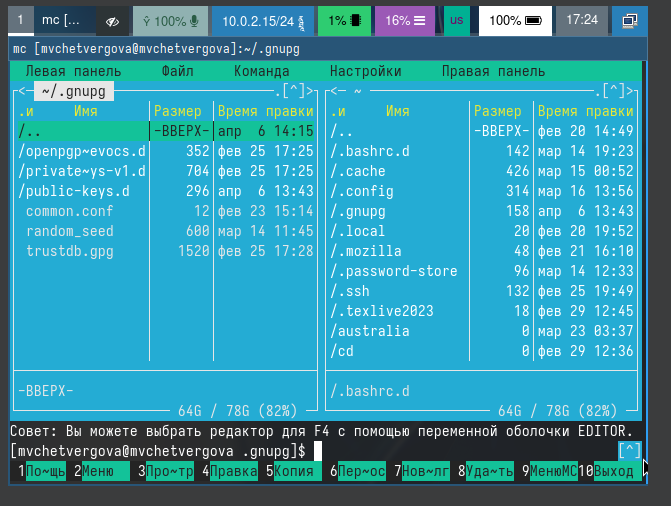
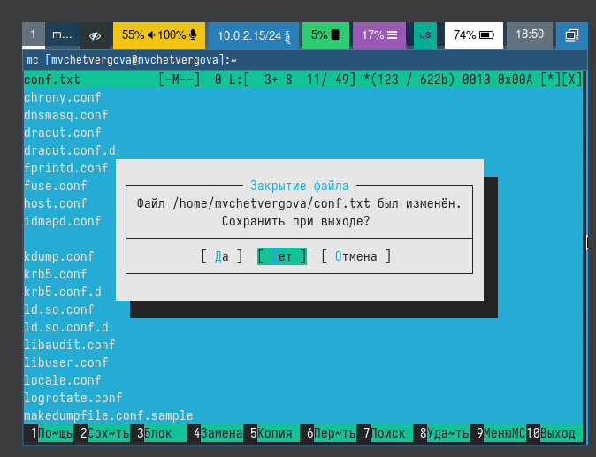
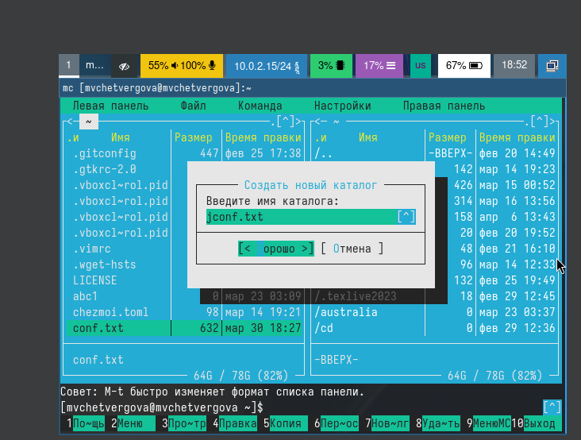
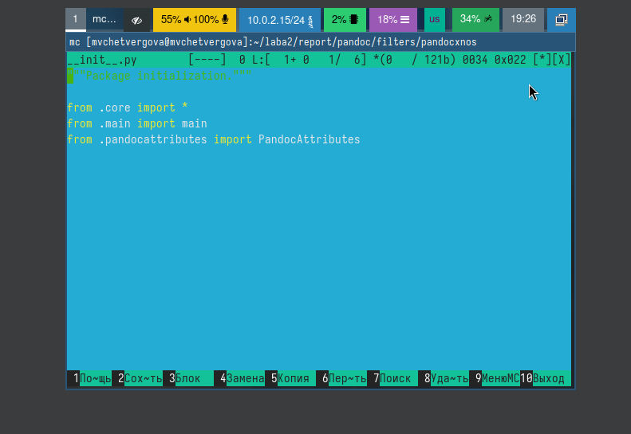

---
## Front matter
lang: ru-RU
title: Презентация к девятой лабораторной работе
subtitle: Операционные системы
author:
  - Четвергова Мария Викторовна
institute:
  - Российский университет дружбы народов, Москва, Россия
date: 6 апреля 2024 г.

## i18n babel
babel-lang: russian
babel-otherlangs: english

## Formatting pdf
toc: false
toc-title: Содержание
slide_level: 2
aspectratio: 169
section-titles: true
theme: metropolis
header-includes:
 - \metroset{progressbar=frametitle,sectionpage=progressbar,numbering=fraction}
 - '\makeatletter'
 - '\beamer@ignorenonframefalse'
 - '\makeatother'

## Fonts
mainfont: PT Serif
romanfont: PT Serif
sansfont: PT Sans
monofont: PT Mono
mainfontoptions: Ligatures=TeX
romanfontoptions: Ligatures=TeX
sansfontoptions: Ligatures=TeX,Scale=MatchLowercase
monofontoptions: Scale=MatchLowercase,Scale=0.9
---
# Информация

## Докладчик

:::::::::::::: {.columns align=center}
::: {.column width="70%"}

  * Четвергова Мария Викторовна
  * студент НПИбд-02-23
  * Российский университет дружбы народов
  * 1132232886@pfur.ru

:::
::: {.column width="30%"}

:::
::::::::::::::

#Цель работы
Цель данной лабораторной работы - освоение основных возможностей командной оболочки Midnight Commander, приобретение навыков практической работы по просмотру каталогов и файлов; манипуляций с ними

#Выполнение 

##
1. Изучите информацию о mc, вызвав в командной строке man mc.

{#fig:001 width=60%}

##
2. Запустите из командной строки mc, изучите его структуру и меню.

{#fig:002 width=60%}

##
3. Выполните несколько операций в mc, используя управляющие клавиши 

{#fig:003 width=60%}

##
4. Выполните основные команды меню левой (или правой) панели. Оцените степень подробности вывода информации о файлах.

{#fig:004 width=60%}

##

5. Используя возможности подменю Файл , выполните:
– просмотр содержимого текстового файла;

{#fig:005 width=60%}

##
– редактирование содержимого текстового файла (без сохранения результатов
редактирования);

{#fig:006 width=60%}

##
– создание каталога;

{#fig:007 width=60%}

##
– копирование в файлов в созданный каталог.

{#fig:008 width=60%}

##
6. С помощью соответствующих средств подменю Команда осуществите:
– поиск в файловой системе файла с заданными условиями (например, файла
с расширением .c или .cpp, содержащего строку main);

{#fig:009 width=60%}

##
– выбор и повторение одной из предыдущих команд;

{#fig:010 width=60%}

##
– переход в домашний каталог;

{#fig:011 width=60%}

##
– анализ файла меню и файла расширений.

{#fig:012 width=60%}

##
7. Вызовите подменю Настройки . Освойте операции, определяющие структуру экрана mc
(Full screen, Double Width, Show Hidden Files и т.д.)

{#fig:013 width=60%}

##
8. Создайте текстовой файл text.txt.

{#fig:014 width=60%}

##
9. Откройте этот файл с помощью встроенного в mc редактора.

{#fig:015 width=60%}

##
10. Вставьте в открытый файл небольшой фрагмент текста, скопированный из любого
другого файла или Интернета.

{#fig:016 width=60%}

## 11. Проделайте с текстом следующие манипуляции, используя горячие клавиши:
* 11.1. Удалите строку текста.

{#fig:017 width=60%}

##
* 11.2. Выделите фрагмент текста и скопируйте его на новую строку.

{#fig:018 width=60%}

##
* 11.3. Выделите фрагмент текста и перенесите его на новую строку.

{#fig:019 width=60%}

##
* 11.4. Сохраните файл.

{#fig:020 width=60%}

##
* 11.5. Отмените последнее действие.

{#fig:021 width=60%}

##
* 11.6. Перейдите в конец файла (нажав комбинацию клавиш) и напишите некоторый текст.

{#fig:022 width=60%}

##
* 11.7. Перейдите в начало файла (нажав комбинацию клавиш) и напишите некоторый текст.

{#fig:023 width=60%}

##
* 11.8. Сохраните и закройте файл.

{#fig:024 width=60%}

##
12. Откройте файл с исходным текстом на некотором языке программирования 

{#fig:025 width=60%}

##
13. Используя меню редактора, включите подсветку синтаксиса, если она не включена, или выключите, если она включена.

{#fig:026 width=60%}

# Выводы

В ходе выполнения лабораторной работы №9 мы научились работась с системой mc и совершать некоторые действия с файлами и каталогами при помощи интерфейса mc и горячих клавиш.

