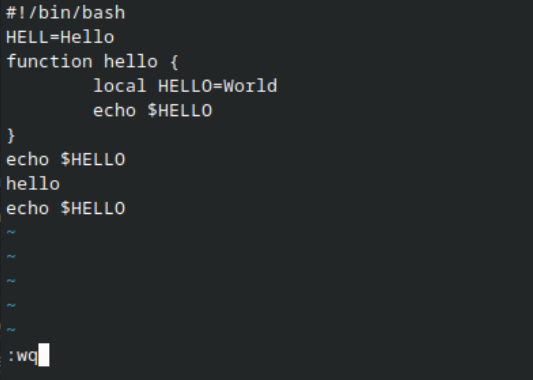

---
## Front matter
lang: ru-RU
title: Презентация к десятой лабораторной работе
subtitle: Операционные системы
author:
  - Четвергова Мария Викторовна
institute:
  - Российский университет дружбы народов, Москва, Россия
date: 12 апреля 2024 г.
## i18n babel
babel-lang: russian
babel-otherlangs: english

## Formatting pdf
toc: false
toc-title: Содержание
slide_level: 2
aspectratio: 169
section-titles: true
theme: metropolis
header-includes:
 - \metroset{progressbar=frametitle,sectionpage=progressbar,numbering=fraction}
 - '\makeatletter'
 - '\beamer@ignorenonframefalse'
 - '\makeatother'

## Fonts
mainfont: PT Serif
romanfont: PT Serif
sansfont: PT Sans
monofont: PT Mono
mainfontoptions: Ligatures=TeX
romanfontoptions: Ligatures=TeX
sansfontoptions: Ligatures=TeX,Scale=MatchLowercase
monofontoptions: Scale=MatchLowercase,Scale=0.9
---

# Информация

## Докладчик

:::::::::::::: {.columns align=center}
::: {.column width="70%"}

  * Четвергова Мария Викторовна
  * студент НПИбд-02-23
  * Российский университет дружбы народов
  * 1132232886@pfur.ru

:::
::: {.column width="30%"}

:::
::::::::::::::

#Цель работы
Познакомиться с операционной системой Linux. Получить практические навыки работы с редактором vi, установленным по умолчанию практически во всех дистрибутивах

# Последовательность выполнения работы
## Задание 1. Создание нового файла с использованием vi
1. Создайте каталог с именем 

{#fig:001 width=60%}

## Задание 1. Создание нового файла с использованием vi
2. Перейдите во вновь созданный каталог.

{#fig:002 width=60%}

## Задание 1. Создание нового файла с использованием vi
3. Вызовите vi и создайте файл hello.sh

{#fig:003 width=60%}

## Задание 1. Создание нового файла с использованием vi
4. Нажмите клавишу i и вводите следующий текст

{#fig:004 width=60%}

## Задание 1. Создание нового файла с использованием vi
5. Нажмите клавишу Esc для перехода в командный режим после завершения ввода текста

6. Нажмите : для перехода в режим последней строки и внизу вашего экрана появится
приглашение в виде двоеточия.

{#fig:005 width=60%}

## Задание 1. Создание нового файла с использованием vi
7. Нажмите w (записать) и q (выйти), а затем нажмите клавишу Enter для сохранения
вашего текста и завершения работы.

{#fig:006 width=60%}

## Задание 1. Создание нового файла с использованием vi
8. Сделайте файл исполняемым

{#fig:007 width=60%}

##Задание 2. Редактирование существующего файла
1. Вызовите vi на редактирование файла

{#fig:008 width=60%}

##Задание 2. Редактирование существующего файла
2. Установите курсор в конец слова HELL второй строки.

{#fig:009 width=60%}

##Задание 2. Редактирование существующего файла
3. Перейдите в режим вставки и замените на HELLO. Нажмите Esc для возврата в командный режим.

{#fig:010 width=60%}

##Задание 2. Редактирование существующего файла
4. Установите курсор на четвертую строку и сотрите слово LOCAL.

{#fig:011 width=60%}

##Задание 2. Редактирование существующего файла
5. Перейдите в режим вставки и наберите следующий текст: local, нажмите Esc для возврата в командный режим.

{#fig:012 width=60%}

##Задание 2. Редактирование существующего файла
6. Установите курсор на последней строке файла. Вставьте после неё строку, содержащую следующий текст:

{#fig:013 width=60%}

##Задание 2. Редактирование существующего файла
7. Нажмите Esc для перехода в командный режим.

{#fig:014 width=60%}

##Задание 2. Редактирование существующего файла
8. Удалите последнюю строку.

{#fig:015 width=60%}

##Задание 2. Редактирование существующего файла
9. Введите команду отмены изменений u для отмены последней команды.

{#fig:016 width=60%}

##Задание 2. Редактирование существующего файла
10. Введите символ : для перехода в режим последней строки. Запишите произведённые изменения и выйдите из vi.

{#fig:017 width=60%}

# Выводы

В ходе выполнения лабораторной работы №10 были приобретены ценные знания и навыки по работе с операционными системами.

::: {#refs}
:::
