---
## Front matter
title: "Отчёт по 10 лабораторной работе"
subtitle: "Операционные"
author: "Четвергова Мария Викторовна"

## Generic otions
lang: ru-RU
toc-title: "Содержание"

## Bibliography
bibliography: bib/cite.bib
csl: pandoc/csl/gost-r-7-0-5-2008-numeric.csl

## Pdf output format
toc: true # Table of contents
toc-depth: 2
lof: true # List of figures
lot: true # List of tables
fontsize: 12pt
linestretch: 1.5
papersize: a4
documentclass: scrreprt
## I18n polyglossia
polyglossia-lang:
  name: russian
  options:
	- spelling=modern
	- babelshorthands=true
polyglossia-otherlangs:
  name: english
## I18n babel
babel-lang: russian
babel-otherlangs: english
## Fonts
mainfont: PT Serif
romanfont: PT Serif
sansfont: PT Sans
monofont: PT Mono
mainfontoptions: Ligatures=TeX
romanfontoptions: Ligatures=TeX
sansfontoptions: Ligatures=TeX,Scale=MatchLowercase
monofontoptions: Scale=MatchLowercase,Scale=0.9
## Biblatex
biblatex: true
biblio-style: "gost-numeric"
biblatexoptions:
  - parentracker=true
  - backend=biber
  - hyperref=auto
  - language=auto
  - autolang=other*
  - citestyle=gost-numeric
## Pandoc-crossref LaTeX customization
figureTitle: "Рис."
tableTitle: "Таблица"
listingTitle: "Листинг"
lofTitle: "Список иллюстраций"
lotTitle: "Список таблиц"
lolTitle: "Листинги"
## Misc options
indent: true
header-includes:
  - \usepackage{indentfirst}
  - \usepackage{float} # keep figures where there are in the text
  - \floatplacement{figure}{H} # keep figures where there are in the text
---

#Цель работы
Познакомиться с операционной системой Linux. Получить практические навыки работы с редактором vi, установленным по умолчанию практически во всех дистрибутивах

# Последовательность выполнения работы
## Задание 1. Создание нового файла с использованием vi
1. Создайте каталог с именем 

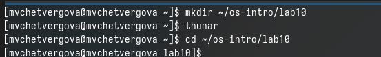{#fig:001 width=60%}

2. Перейдите во вновь созданный каталог.

{#fig:002 width=60%}

3. Вызовите vi и создайте файл hello.sh

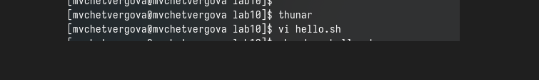{#fig:003 width=60%}

4. Нажмите клавишу i и вводите следующий текст

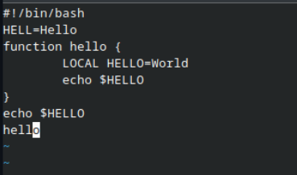{#fig:004 width=60%}

5. Нажмите клавишу Esc для перехода в командный режим после завершения ввода текста

6. Нажмите : для перехода в режим последней строки и внизу вашего экрана появится
приглашение в виде двоеточия.

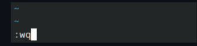{#fig:005 width=60%}

7. Нажмите w (записать) и q (выйти), а затем нажмите клавишу Enter для сохранения
вашего текста и завершения работы.

{#fig:006 width=60%}

8. Сделайте файл исполняемым

{#fig:007 width=60%}

##Задание 2. Редактирование существующего файла
1. Вызовите vi на редактирование файла

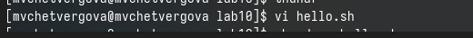{#fig:008 width=60%}

2. Установите курсор в конец слова HELL второй строки.

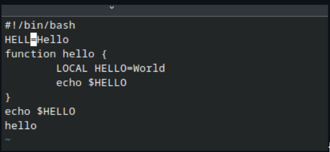{#fig:009 width=60%}

3. Перейдите в режим вставки и замените на HELLO. Нажмите Esc для возврата в командный режим.

{#fig:010 width=60%}

4. Установите курсор на четвертую строку и сотрите слово LOCAL.

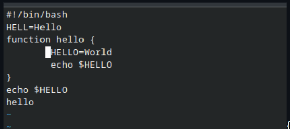{#fig:011 width=60%}

5. Перейдите в режим вставки и наберите следующий текст: local, нажмите Esc для возврата в командный режим.

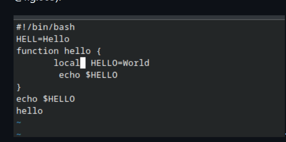{#fig:012 width=60%}

6. Установите курсор на последней строке файла. Вставьте после неё строку, содержащую следующий текст:

{#fig:013 width=60%}

7. Нажмите Esc для перехода в командный режим.

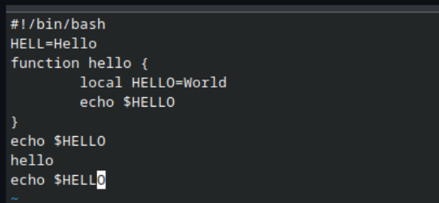{#fig:014 width=60%}

8. Удалите последнюю строку.

{#fig:015 width=60%}

9. Введите команду отмены изменений u для отмены последней команды.

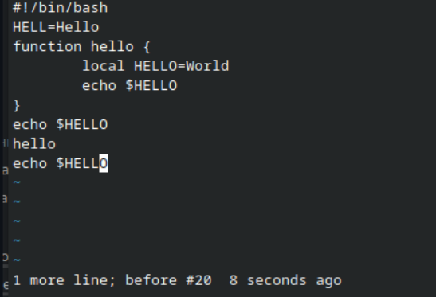{#fig:016 width=60%}

10. Введите символ : для перехода в режим последней строки. Запишите произведённые изменения и выйдите из vi.

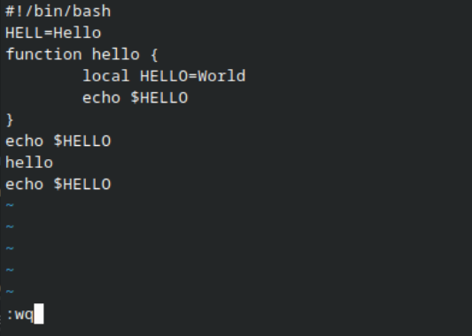{#fig:017 width=60%}

#Ответы на контрольные вопросы

1. Дайте краткую характеристику режимам работы редактора vi.
командный режим — предназначен для ввода команд редактирования и навигации по редактируемому файлу;
режим вставки — предназначен для ввода содержания редактируемого файла;
режим последней (или командной) строки — используется для записи изменений в файл и выхода из редактора.
Как выйти из редактора, не сохраняя произведённые изменения?
Можно нажимать символ q (или q!), если требуется выйти из редактора без сохранения.

2. Назовите и дайте краткую характеристику командам позиционирования.
0 (ноль) — переход в начало строки;
$ — переход в конец строки;
G — переход в конец файла;
n G — переход на строку с номером n.
Что для редактора vi является словом?
Редактор vi предполагает, что слово - это строка символов, которая может включать в себя буквы, цифры и символы подчеркивания.

Каким образом из любого места редактируемого файла перейти в начало (конец) файла?
С помощью G — переход в конец файла

3. Назовите и дайте краткую характеристику основным группам команд редактирования.
Вставка текста – а — вставить текст после курсора; – А — вставить текст в конец строки; – i — вставить текст перед курсором; – n i — вставить текст n раз; – I — вставить текст в начало строки.
Вставка строки – о — вставить строку под курсором; – О — вставить строку над курсором.
Удаление текста – x — удалить один символ в буфер; – d w — удалить одно слово в буфер; – d $ — удалить в буфер текст от курсора до конца строки; – d 0 — удалить в буфер текст от начала строки до позиции курсора; – d d — удалить в буфер одну строку; – n d d — удалить в буфер n строк.
Отмена и повтор произведённых изменений – u — отменить последнее изменение; – . — повторить последнее изменение.
Копирование текста в буфер – Y — скопировать строку в буфер; – n Y — скопировать n строк в буфер; – y w — скопировать слово в буфер.
Вставка текста из буфера – p — вставить текст из буфера после курсора; – P — вставить текст из буфера перед курсором.
Замена текста – c w — заменить слово; – n c w — заменить n слов; – c $ — заменить текст от курсора до конца строки; – r — заменить слово; – R — заменить текст.
Поиск текста – / текст — произвести поиск вперёд по тексту указанной строки символов текст; – ? текст — произвести поиск назад по тексту указанной строки символов текст.
Необходимо заполнить строку символами $. Каковы ваши действия?
Перейти в режим вставки.

4. Как отменить некорректное действие, связанное с процессом редактирования?
С помощью u — отменить последнее изменение

5. Назовите и дайте характеристику основным группам команд режима последней строки.
Режим последней строки — используется для записи изменений в файл и выхода из редактора.

6. Как определить, не перемещая курсора, позицию, в которой заканчивается строка?
$ — переход в конец строки

7. Выполните анализ опций редактора vi (сколько их, как узнать их назначение и т.д.).
Опции редактора vi позволяют настроить рабочую среду. Для задания опций используется команда set (в режиме последней строки): – : set all — вывести полный список опций; – : set nu — вывести номера строк; – : set list — вывести невидимые символы; – : set ic — не учитывать при поиске, является ли символ прописным или строчным.

8. Как определить режим работы редактора vi?
В редакторе vi есть два основных режима: командный режим и режим вставки. По умолчанию работа начинается в командном режиме. В режиме вставки клавиатура используется для набора текста. Для выхода в командный режим используется клавиша Esc или комбинация Ctrl + c.

# Выводы

В ходе выполнения лабораторной работы №10 были приобретены ценные знания и навыки по работе с операционными системами.

::: {#refs}
:::
