---
## Front matter
lang: ru-RU
title: Презентация к восьмой лабораторной работе 
subtitle: Операционные системы
author:
  - Четвергова М.В.
institute:
  - Российский университет дружбы народов, Москва, Россия
date: 30 марта 2024 г.

## i18n babel
babel-lang: russian
babel-otherlangs: english

## Formatting pdf
toc: false
toc-title: Содержание
slide_level: 2
aspectratio: 169
section-titles: true
theme: metropolis
header-includes:
 - \metroset{progressbar=frametitle,sectionpage=progressbar,numbering=fraction}
 - '\makeatletter'
 - '\beamer@ignorenonframefalse'
 - '\makeatother'

## Fonts
mainfont: PT Serif
romanfont: PT Serif
sansfont: PT Sans
monofont: PT Mono
mainfontoptions: Ligatures=TeX
romanfontoptions: Ligatures=TeX
sansfontoptions: Ligatures=TeX,Scale=MatchLowercase
monofontoptions: Scale=MatchLowercase,Scale=0.9
---

# Информация

## Докладчик

:::::::::::::: {.columns align=center}
::: {.column width="70%"}

  
  * Четвергова Мария Викторовна
  * Студентка 1 курса НПИбд-02-23
  * Российский университет дружбы народов
  * 1132232886@pfur.ru

:::
::: {.column width="30%"}

:::
::::::::::::::

#Цель работы

Познакомиться с операционной системой Linux. Получить практические навыки работы с редактором Emacs

# Последовательность выполнения работы

## 1. Открыть emacs.

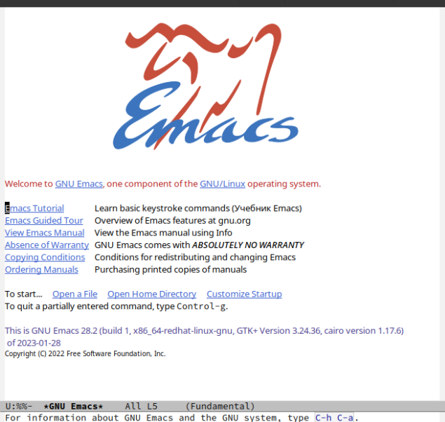{#fig:001 width=70%}

## 2. Создать файл lab07.sh с помощью комбинации Ctrl-x Ctrl-f (C-x C-f). 

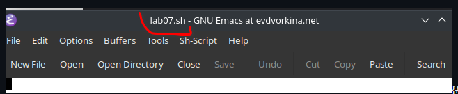{#fig:002 width=70%}

## 3. Наберите текст:

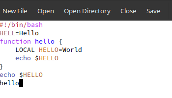{#fig:003 width=70%}

## 4. Сохранить файл с помощью комбинации Ctrl-x Ctrl-s (C-x C-s).

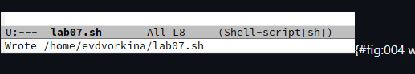{#fig:004 width=70%}

## 5. Проделать с текстом стандартные процедуры редактирования, каждое действие должно осуществляться комбинацией клавиш.

5.1. Вырезать одной командой целую строку (С-k).

{#fig:005 width=70%}

5.2. Вставить эту строку в конец файла (C-y).

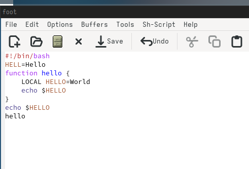{#fig:006 width=70%}

5.3. Выделить область текста (C-space).

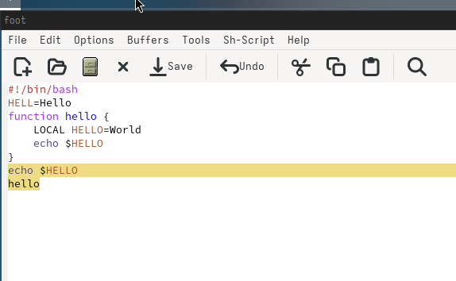{#fig:007 width=70%}

5.4. Скопировать область в буфер обмена (M-w).

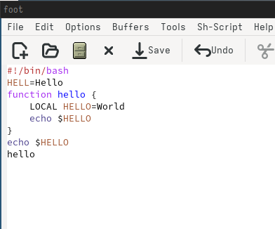{#fig:008 width=70%}

5.5. Вставить область в конец файла.

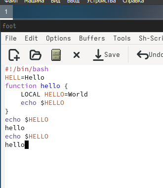{#fig:009 width=70%}

5.6. Вновь выделить эту область и на этот раз вырезать её (C-w).

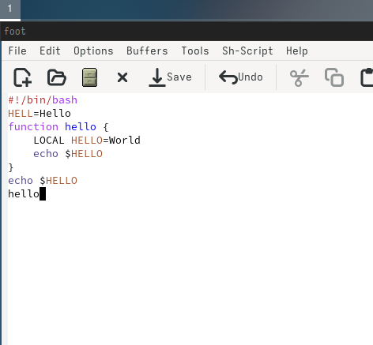{#fig:010 width=70%}

5.7. Отмените последнее действие (C-/).

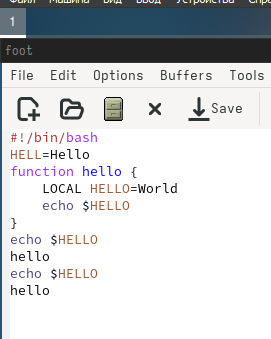{#fig:011 width=70%}

##6. Научитесь использовать команды по перемещению курсора.

6.1. Переместите курсор в начало строки (C-a).

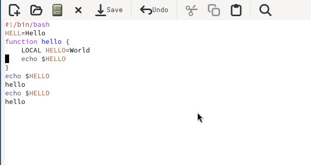{#fig:012 width=70%}

6.2. Переместите курсор в конец строки (C-e).

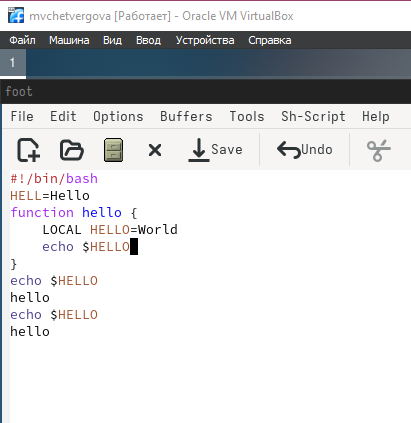{#fig:013 width=70%}

6.3. Переместите курсор в начало буфера (M-<).

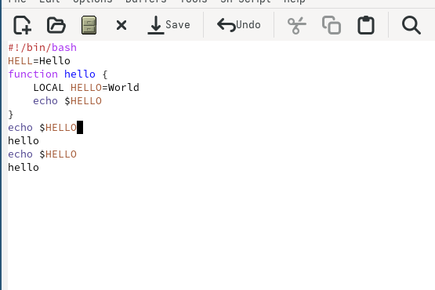{#fig:014 width=70%}

6.4. Переместите курсор в конец буфера (M->).

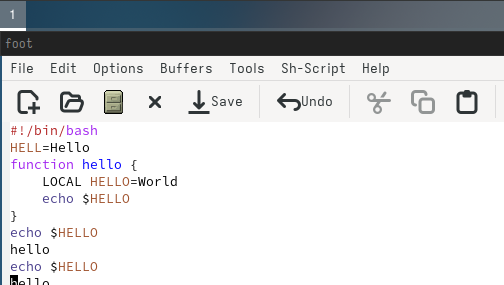{#fig:015 width=70%}

## 7. Управление буферами.

7.1. Вывести список активных буферов на экран (C-x C-b).

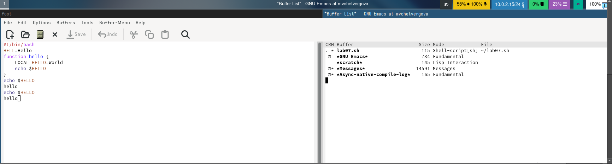{#fig:016 width=70%}

7.2. Переместитесь во вновь открытое окно (C-x) o со списком открытых буферов и переключитесь на другой буфер.

{#fig:017 width=70%}

7.3. Закройте это окно (C-x 0).

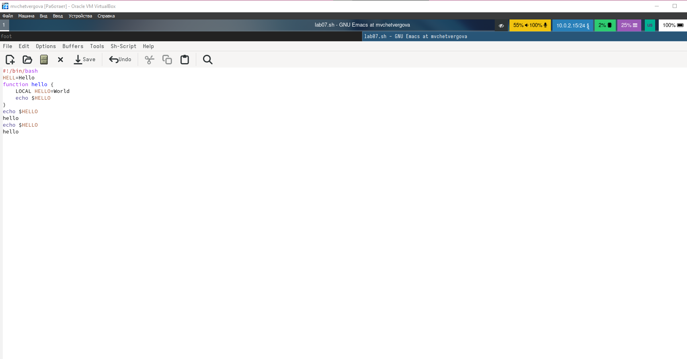{#fig:018 width=70%}

7.4. Теперь вновь переключайтесь между буферами, но уже без вывода их списка на экран (C-x b).

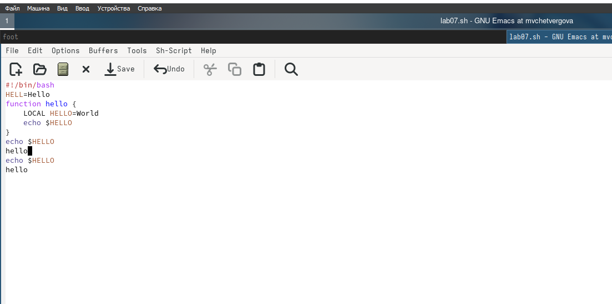{#fig:019 width=70%}

## 8. Управление окнами.
8.1. Поделите фрейм на 4 части: разделите фрейм на два окна по вертикали (C-x 3), а затем каждое из этих окон на две части по горизонтали (C-x 2) 

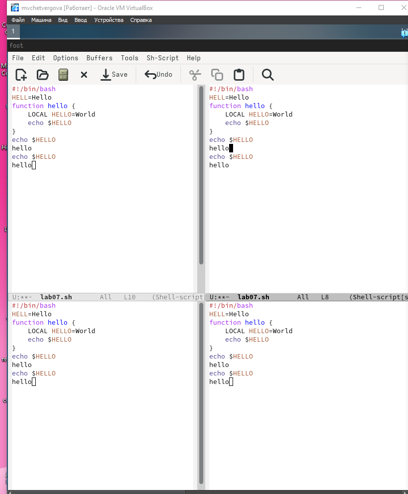{#fig:020 width=70%}

8.2. В каждом из четырёх созданных окон откройте новый буфер (файл) и введите
несколько строк текста.

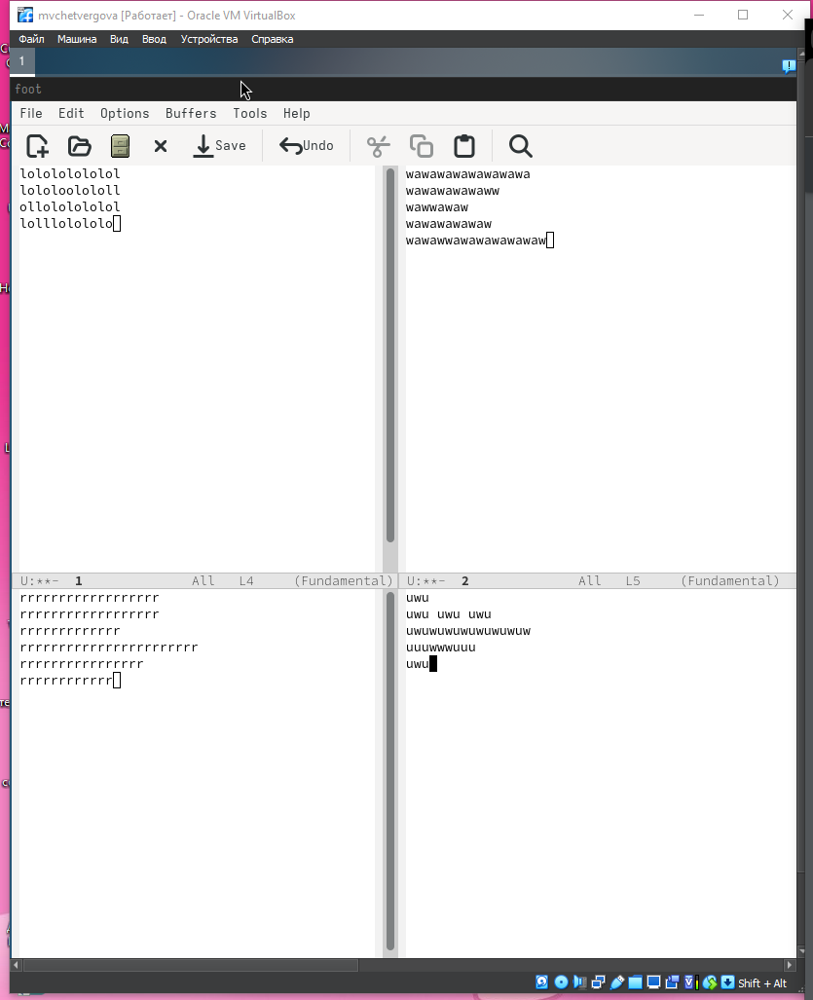{#fig:021 width=70%}

## 9. Режим поиска
9.1. Переключитесь в режим поиска (C-s) и найдите несколько слов, присутствующих
в тексте.

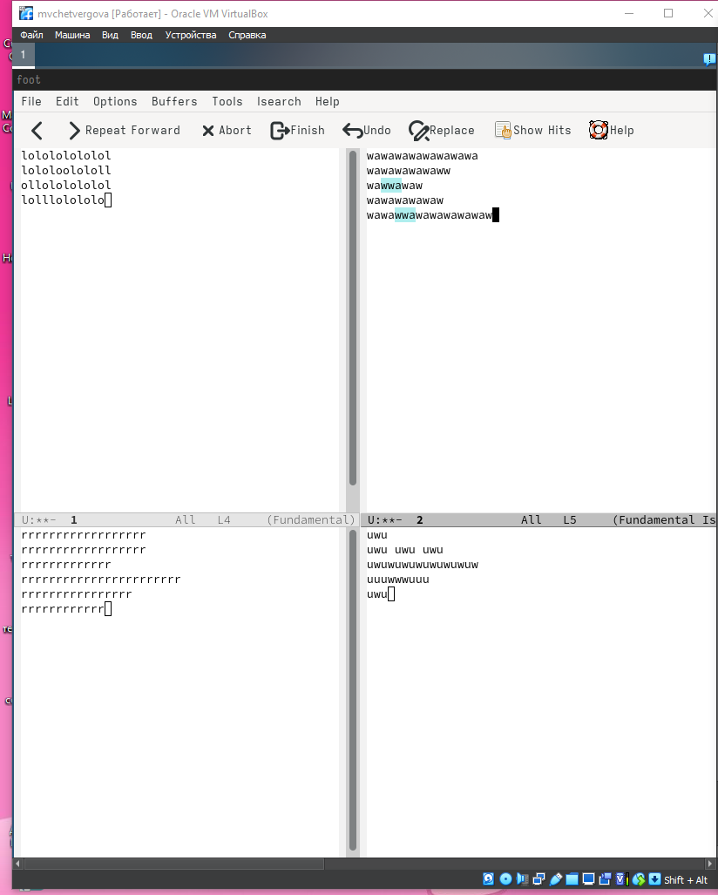{#fig:022 width=70%}

9.2. Переключайтесь между результатами поиска, нажимая C-s.

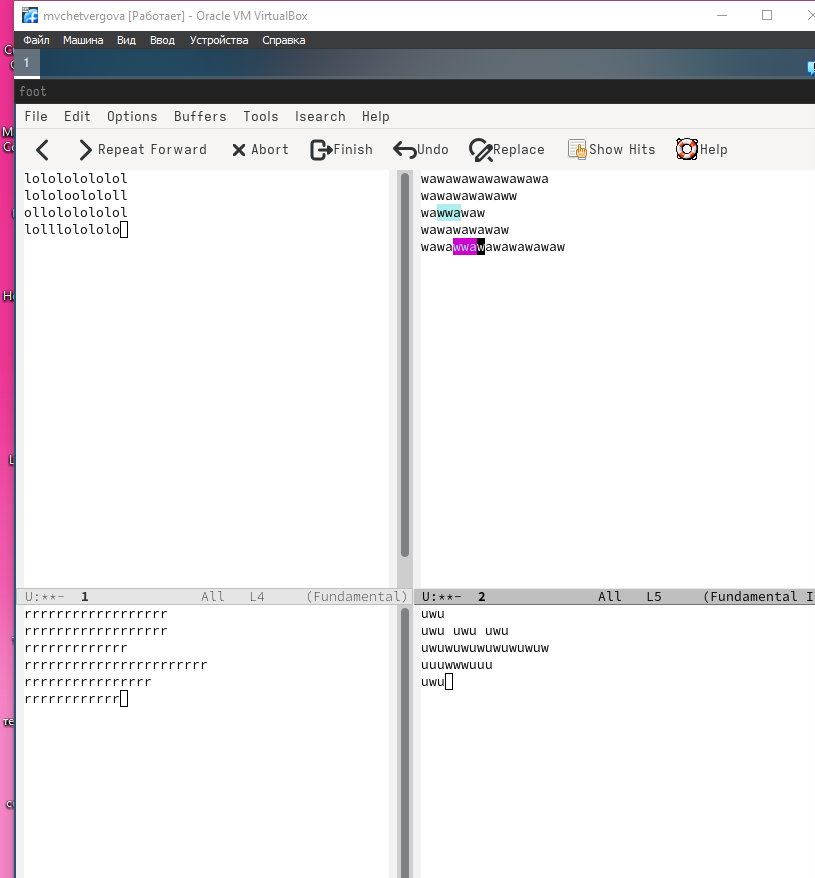{#fig:023 width=70%}

9.3. Выйдите из режима поиска, нажав C-g.

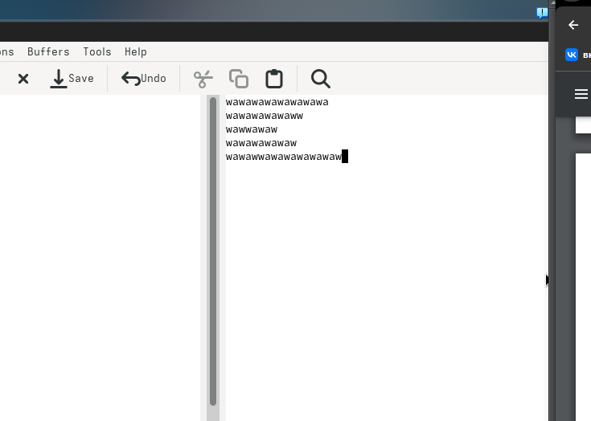{#fig:024 width=70%}

# Выводы

В ходе выполнения лабораторной работы мы приобрели ценные навыки и знан ия по работе с операционными системами

