---
## Front matter
title: "Отчёт к лабораторной работе №11"
subtitle: "Операционные системы"
author: "Четвергова Мария"

## Generic otions
lang: ru-RU
toc-title: "Содержание"

## Bibliography
bibliography: bib/cite.bib
csl: pandoc/csl/gost-r-7-0-5-2008-numeric.csl

## Pdf output format
toc: true # Table of contents
toc-depth: 2
lof: true # List of figures
lot: true # List of tables
fontsize: 12pt
linestretch: 1.5
papersize: a4
documentclass: scrreprt
## I18n polyglossia
polyglossia-lang:
  name: russian
  options:
	- spelling=modern
	- babelshorthands=true
polyglossia-otherlangs:
  name: english
## I18n babel
babel-lang: russian
babel-otherlangs: english
## Fonts
mainfont: PT Serif
romanfont: PT Serif
sansfont: PT Sans
monofont: PT Mono
mainfontoptions: Ligatures=TeX
romanfontoptions: Ligatures=TeX
sansfontoptions: Ligatures=TeX,Scale=MatchLowercase
monofontoptions: Scale=MatchLowercase,Scale=0.9
## Biblatex
biblatex: true
biblio-style: "gost-numeric"
biblatexoptions:
  - parentracker=true
  - backend=biber
  - hyperref=auto
  - language=auto
  - autolang=other*
  - citestyle=gost-numeric
## Pandoc-crossref LaTeX customization
figureTitle: "Рис."
tableTitle: "Таблица"
listingTitle: "Листинг"
lofTitle: "Список иллюстраций"
lotTitle: "Список таблиц"
lolTitle: "Листинги"
## Misc options
indent: true
header-includes:
  - \usepackage{indentfirst}
  - \usepackage{float} # keep figures where there are in the text
  - \floatplacement{figure}{H} # keep figures where there are in the text
---

#Цель работы

Познакомиться с операционной системой Linux. Получить практические навыки работы с редактором Emacs

# Последовательность выполнения работы

1. Открыть emacs.

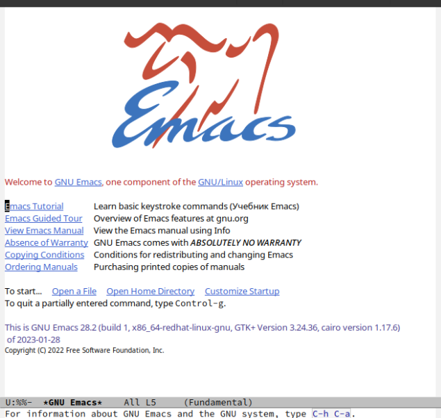{#fig:001 width=70%}

2. Создать файл lab07.sh с помощью комбинации Ctrl-x Ctrl-f (C-x C-f). 

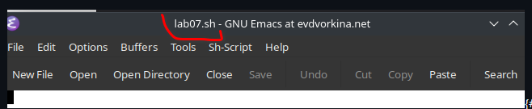{#fig:002 width=70%}

3. Наберите текст:

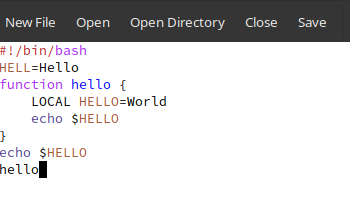{#fig:003 width=70%}

4. Сохранить файл с помощью комбинации Ctrl-x Ctrl-s (C-x C-s).

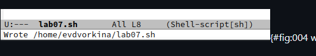{#fig:004 width=70%}

5. Проделать с текстом стандартные процедуры редактирования, каждое действие должно осуществляться комбинацией клавиш.

5.1. Вырезать одной командой целую строку (С-k).

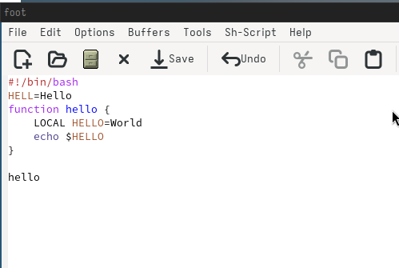{#fig:005 width=70%}

5.2. Вставить эту строку в конец файла (C-y).

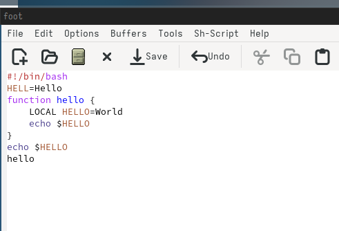{#fig:006 width=70%}

5.3. Выделить область текста (C-space).

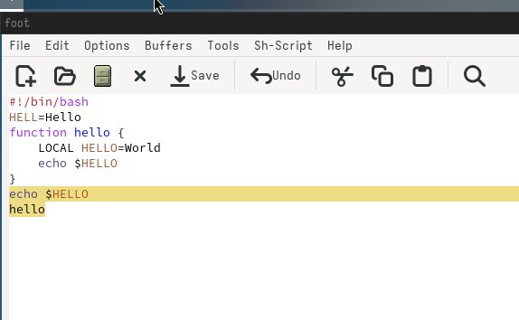{#fig:007 width=70%}

5.4. Скопировать область в буфер обмена (M-w).

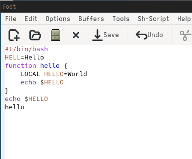{#fig:008 width=70%}

5.5. Вставить область в конец файла.

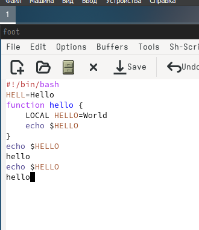{#fig:009 width=70%}

5.6. Вновь выделить эту область и на этот раз вырезать её (C-w).

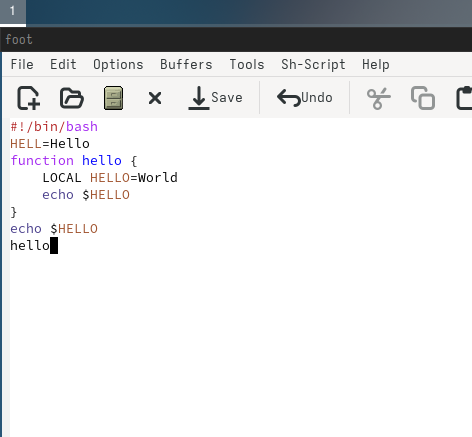{#fig:010 width=70%}

5.7. Отмените последнее действие (C-/).

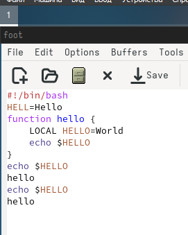{#fig:011 width=70%}

6. Научитесь использовать команды по перемещению курсора.

6.1. Переместите курсор в начало строки (C-a).

{#fig:012 width=70%}

6.2. Переместите курсор в конец строки (C-e).

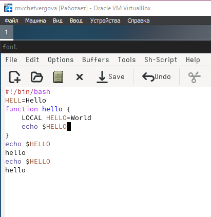{#fig:013 width=70%}

6.3. Переместите курсор в начало буфера (M-<).

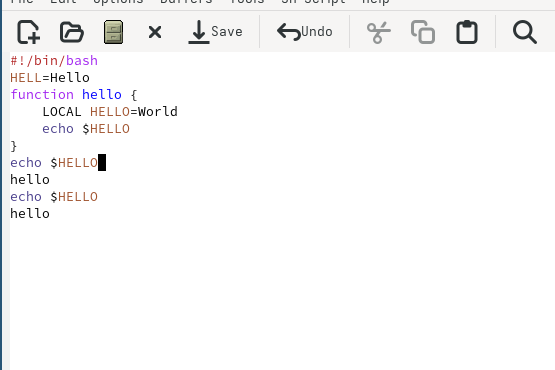{#fig:014 width=70%}

6.4. Переместите курсор в конец буфера (M->).

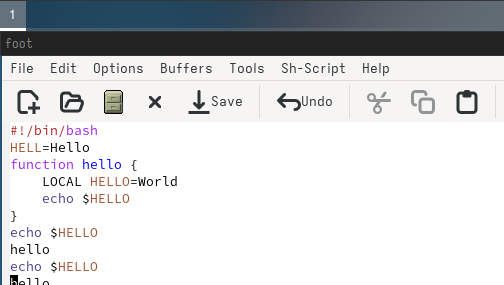{#fig:015 width=70%}

7. Управление буферами.

7.1. Вывести список активных буферов на экран (C-x C-b).

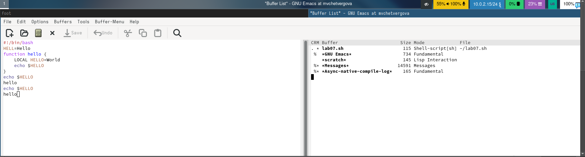{#fig:016 width=70%}

7.2. Переместитесь во вновь открытое окно (C-x) o со списком открытых буферов и переключитесь на другой буфер.

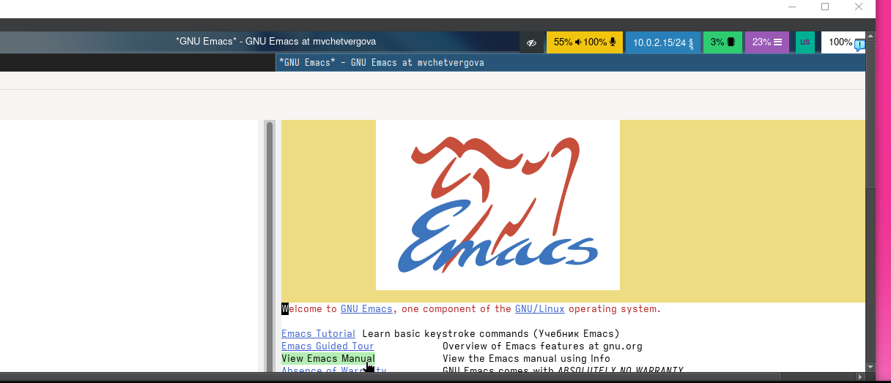{#fig:017 width=70%}

7.3. Закройте это окно (C-x 0).

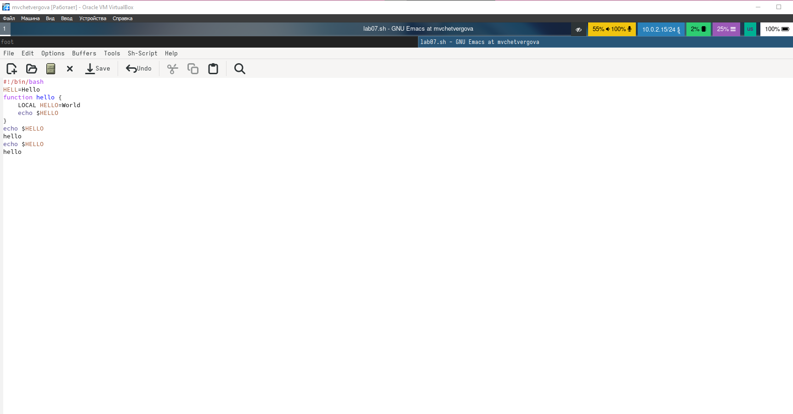{#fig:018 width=70%}

7.4. Теперь вновь переключайтесь между буферами, но уже без вывода их списка на экран (C-x b).

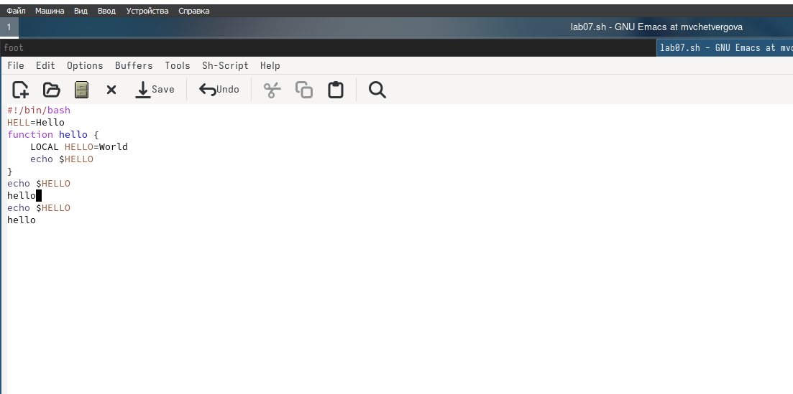{#fig:019 width=70%}

8. Управление окнами.
8.1. Поделите фрейм на 4 части: разделите фрейм на два окна по вертикали (C-x 3), а затем каждое из этих окон на две части по горизонтали (C-x 2) 

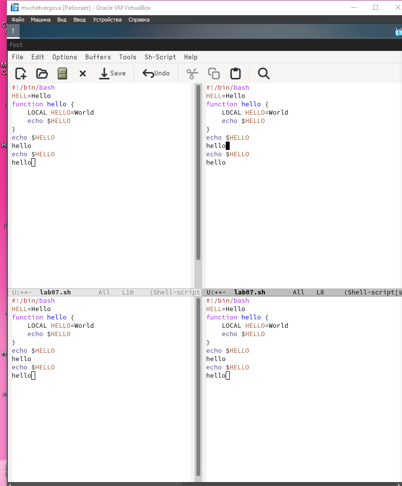{#fig:020 width=70%}

8.2. В каждом из четырёх созданных окон откройте новый буфер (файл) и введите
несколько строк текста.

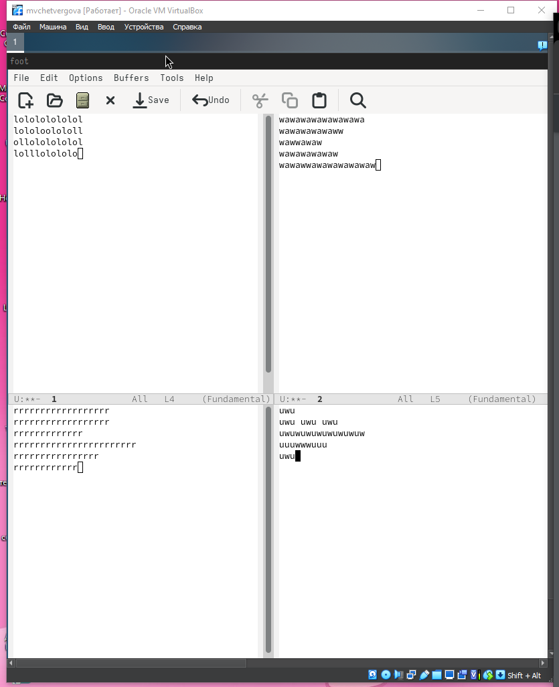{#fig:021 width=70%}

9. Режим поиска
9.1. Переключитесь в режим поиска (C-s) и найдите несколько слов, присутствующих
в тексте.

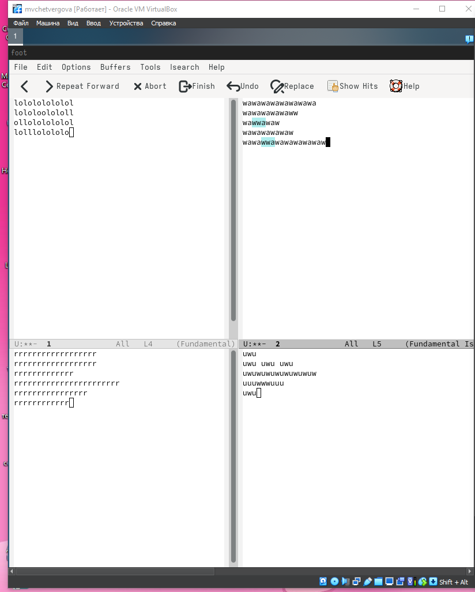{#fig:022 width=70%}

9.2. Переключайтесь между результатами поиска, нажимая C-s.

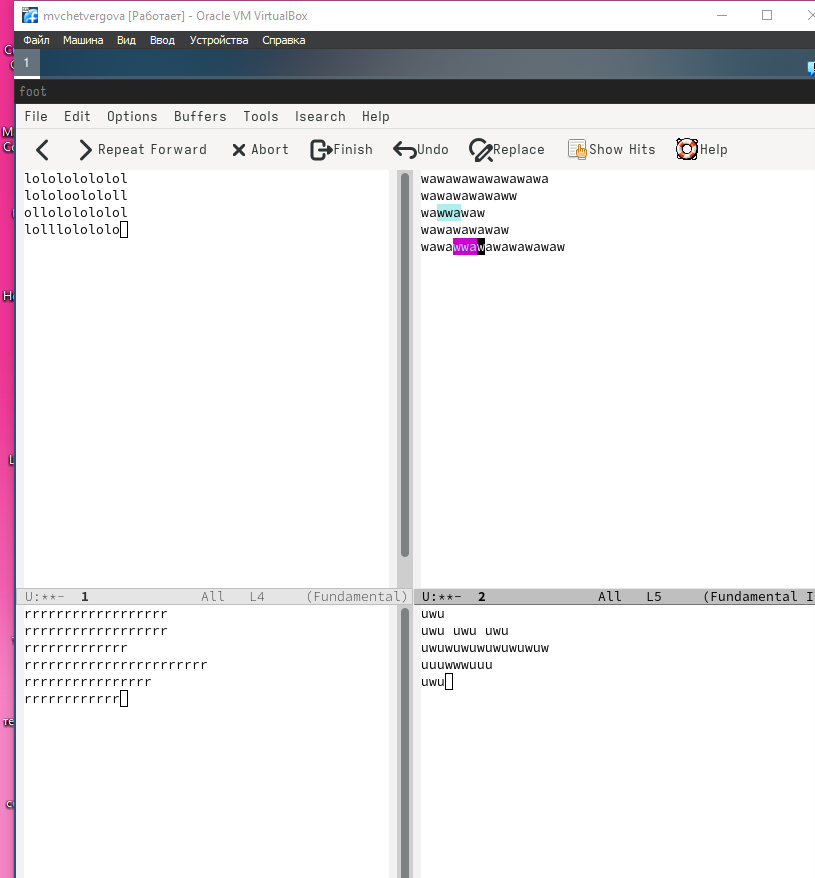{#fig:023 width=70%}

9.3. Выйдите из режима поиска, нажав C-g.

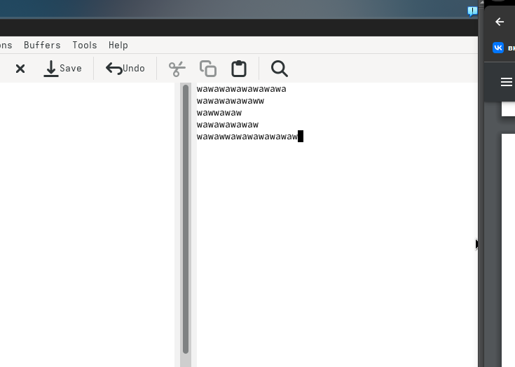{#fig:024 width=70%}

#Ответы на контрольные вопросы

Кратко охарактеризуйте редактор emacs.
Emacs — один из наиболее мощных и широко распространённых редакторов, используемых в мире UNIX. Написан на языке высокого уровня Lisp.

Какие особенности данного редактора могут сделать его сложным для освоения новичком?
Большое разнообразие сложных комбинаций клавиш, которые необходимы для редактирования файла и в принципе для работа с Emacs.

Своими словами опишите, что такое буфер и окно в терминологии emacs’а.
Буфер - это объект в виде текста. Окно - это прямоугольная область, в которой отображен буфер.

Можно ли открыть больше 10 буферов в одном окне?
Да, можно.

Какие буферы создаются по умолчанию при запуске emacs?
Emacs использует буферы с именами, начинающимися с пробела, для внутренних целей. Отчасти он обращается с буферами с такими именами особенным образом — например, по умолчанию в них не записывается информация для отмены изменений.

Какие клавиши вы нажмёте, чтобы ввести следующую комбинацию C-c | и C-c C-|?
Ctrl + c, а потом | и Ctrl + c Ctrl + |

Как поделить текущее окно на две части?
С помощью команды Ctrl + x 3 (по вертикали) и Ctrl + x 2 (по горизонтали).

В каком файле хранятся настройки редактора emacs?
Настройки emacs хранятся в файле . emacs, который хранится в домашней дирректории пользователя. Кроме этого файла есть ещё папка . emacs.

Какую функцию выполняет клавиша и можно ли её переназначить?
Выполняет функцию стереть, думаю можно переназначить.

Какой редактор вам показался удобнее в работе vi или emacs? Поясните почему.
Для меня удобнее был редактор Emacs, так как у него есть командая оболочка. А vi открывается в терминале, и выглядит своеобразно.

# Выводы

В ходе выполнения лабораторной работы мы приобрели ценные навыки и знан ия по работе с операционными системами

::: {#refs}
:::
