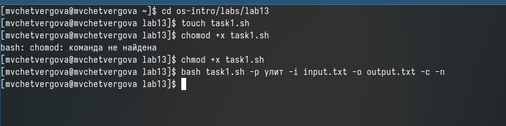
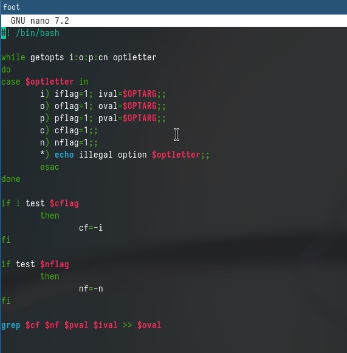
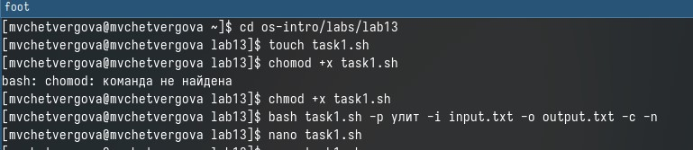
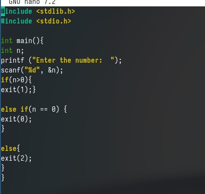
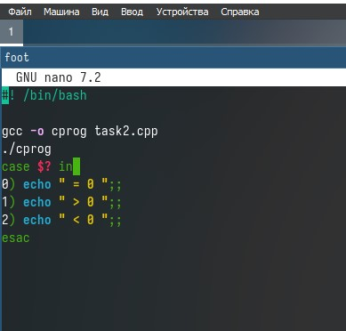
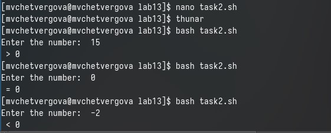
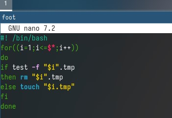
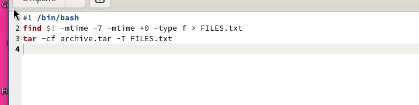
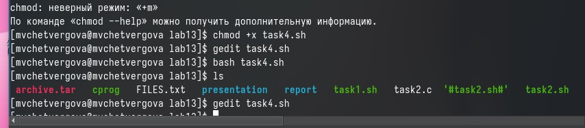

---
## Front matter
lang: ru-RU
title: Презентация к 13 лабораторной работе
subtitle: Операционные системы
author:
  - Четвергова Мария Викторовна
institute:
  - Российский университет дружбы народов, Москва, Россия
date: 4 05 2024 г.

## i18n babel
babel-lang: russian
babel-otherlangs: english

## Formatting pdf
toc: false
toc-title: Содержание
slide_level: 2
aspectratio: 169
section-titles: true
theme: metropolis
header-includes:
 - \metroset{progressbar=frametitle,sectionpage=progressbar,numbering=fraction}
 - '\makeatletter'
 - '\beamer@ignorenonframefalse'
 - '\makeatother'

## Fonts
mainfont: PT Serif
romanfont: PT Serif
sansfont: PT Sans
monofont: PT Mono
mainfontoptions: Ligatures=TeX
romanfontoptions: Ligatures=TeX
sansfontoptions: Ligatures=TeX,Scale=MatchLowercase
monofontoptions: Scale=MatchLowercase,Scale=0.9
---
# Информация

## Докладчик

  * Четвергова Мария Викторовна
  * Студентка 1 курса НПИбд-02-23
  * Российский университет дружбы народов
  * 1132232886@pfur.ru

# Цель работы

Изучить основы программирования в оболочке ОС Юникс. Научиться писать более сложные
командные файлы с использованием логических управляющих конструкций и циклов

# Задание

Написать несколько командных файлов для выполнения заданных целей. Освоить программирование более сложных командныхх файлов.

# Выполнение лабораторной работы

## 1. Используя команды getopts grep, написать командный файл, который анализирует
командную строку с ключами:
– -iinputfile — прочитать данные из указанного файла;
– -ooutputfile — вывести данные в указанный файл;
– -pшаблон — указать шаблон для поиска;
– -C — различать большие и малые буквы;
– -n — выдавать номера строк.
а затем ищет в указанном файле нужные строки, определяемые ключом -p.

{#fig:001 width=70%}

{#fig:002 width=70%}

{#fig:003 width=70%}

Вывод №1: Все условия программы выполнены и она работает исправно. Программа ищет в указанном 
файле нужные строки и выводит их. Определяет она эти строки ключом -р.

## 2. Написать на языке Си программу, которая вводит число и определяет, является ли оно
больше нуля, меньше нуля или равно нулю. Затем программа завершается с помощью
функции exit(n), передавая информацию в о коде завершения в оболочку. Командный файл должен вызывать эту программу и, проанализировав с помощью команды
$?, выдать сообщение о том, какое число было введено.

{#fig:004 width=70%}

{#fig:005 width=70%}

{#fig:006 width=70%}

Вывод №2: Для выполнения этого задания необходимо было создать два файла рвзного формата: bash и c. 
Причём во аремя выполнения файла bash  работает программа, написанная в файле формата Си.
Всё работает исправно и число воспринимается программой верно.

## 3. Написать командный файл, создающий указанное число файлов, пронумерованных
последовательно от 1 до 𝑁 (например 1.tmp, 2.tmp, 3.tmp,4.tmp и т.д.). Число файлов,
которые необходимо создать, передаётся в аргументы командной строки. Этот же командный файл должен уметь удалять все созданные им файлы (если они существуют).

{#fig:007 width=70%}

Вывод №3: В ходее выполнения третьего задания мы обращаемся сразу к трём случаям и просчитываем алгоритм действий во время наступления каждого.
Программа работает исправно и верно.

## 4. Написать командный файл, который с помощью команды tar запаковывает в архив
все файлы в указанной директории. Модифицировать его так, чтобы запаковывались
только те файлы, которые были изменены менее недели тому назад (использовать
команду find).

{#fig:008 width=70%}

{#fig:009 width=70%}

Вывод №4: Во время выполнения третьего задания мы создаём файл формата "*.txt", 
а затем архифируем его. Программа работает исправно и выполняет свои функции

# Выводы

В ходе выполнения лабораторной работы №13 были приобретены ценные теоретические знания и навыки по работе с 
командными файлами. Выполнены все задачи лабораторной работы и поставленные цели.
