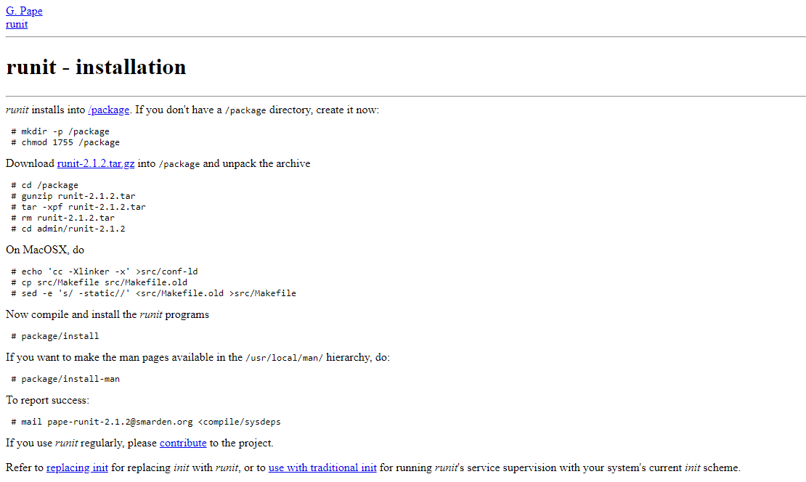

---
## Front matter
lang: ru-RU
title: Презентация к докладу на тему
subtitle: Система инициализации RUNIT
author:
  - Четвергова Мария Викторовна
institute:
  - Российский университет дружбы народов, Москва, Россия
date: 2 мая 2024 г.

## i18n babel
babel-lang: russian
babel-otherlangs: english

## Formatting pdf
toc: false
toc-title: Содержание
slide_level: 2
aspectratio: 169
section-titles: true
theme: metropolis
header-includes:
 - \metroset{progressbar=frametitle,sectionpage=progressbar,numbering=fraction}
 - '\makeatletter'
 - '\beamer@ignorenonframefalse'
 - '\makeatother'

## Fonts
mainfont: PT Serif
romanfont: PT Serif
sansfont: PT Sans
monofont: PT Mono
mainfontoptions: Ligatures=TeX
romanfontoptions: Ligatures=TeX
sansfontoptions: Ligatures=TeX,Scale=MatchLowercase
monofontoptions: Scale=MatchLowercase,Scale=0.9
---

# Информация

## Докладчик

:::::::::::::: {.columns align=center}
::: {.column width="70%"}

  * Четвергова Мария Викторовна 
  * Студентка первого курса
  * Направление "Прикладная информатика"
  * Российский университет дружбы народов
  * 1132232886@pfur.ru

:::
::: {.column width="30%"}

:::
::::::::::::::

## Актуальность

Система инициализации является ключевым компонентом любой операционной системы: она обеспечивает запуск необходимых 
сервисов и приложений при старте компьютера. Одной из инновационных систем инициализации является Runit. 
Runit – это легковесная и надежная система инициализации, которая активно используется в различных дистрибутивах Linux. 
В рамках доклада мы рассмотрим основные принципы работы, преимущества и способы настройки и управления этой системой. 
Давайте погрузимся в мир Runit и узнаем, как она помогает сделать процесс загрузки операционной системы более эффективным и слаженным.

## Цели и задачи

Целью доклада является выявление сильных сторон системы инициализации RUNIT и преведение аргументов в её пользу.

1. Вступление
2. Основная часть
3. Что такое СИ Runit
4. Основные принципы работы
5. Преимущества 
6. Способы настройки
7. Примеры применения Runit
8. Заключение
9. Библиография

## 1. Что такое СИ Runit?

{#fig:001 width=50%}

Runit - это кроссплатформенная система инициализации, которая может работать в Linux, Solaris и MacOS. 
Это отличная альтернатива для SystemV с поддержкой мониторинга состояния служб.

## 2. Основные принципы работы СИ Runit

Запускать, останавливать, перезапускать сервисы можно с помощью команды 
		sv(__)
Кроме того, при запуске сервиса появится каталог, в котором будут расположены очень полезные файлы и потоки:
 
•	pid — идентификатор процесса Unix;
•	stat — описание состояния сервиса на понятном простому пользователю языке
•	status — описание состояние процесса на языке, понятном машине
•	control — поток управления
•	и дp.

## 3. Преимущества перед другими СИ

У Runit есть некоторые особенности, которые выделяют её на фоне остальных систем инициализации:

1.	Быстрая система загрузки и выключения
2.	Компактность
3.	Небольшое количество кода системы инициализации
4.	Легкое создание файлов конфигурации служб
5.	Полный контроль сервисов
6.	Надежное средство журналирования и ротации логов
7.	И др

## Способы настройки СИ RUNIT

Установка и настройка системы

## 1 шаг
	Для большинства Операционных Систем Runit ставится из стандартного менеджера пакетов (get install runit). 
	Если в Вашем менеджере нужного пакета нет, можно скачать исходники для сборки с официальной страницы
	
	{#fig:002 width=50%}
 

## 2 шаг	
	Каждому сервису в runit соответствует директория в /etc/sv. В этой директории создаём файл запуска run. Введём команду:

		mkdir /etc/sv/testservice
		vim /etc/sv/testservice/run

## 3 шаг	
	Затем в файле под названием «run» записываем строку для запуска скрипта, с перенаправлениями ввода-вывода, без демонизации , но с exec:

		exec node /etc/mysite/server.js 1>>/var/log/mysite/output2>>/var/log/mysite/error 

## 4 шаг
	Установим данному файлу разрешение на выполнение с помощью команды 

		chmod +x run
		
## 5 шаг
 	И теперь, чтобы запустить сервис надо передать runit команду и имя директории внутри /etc/sv
   
		sv start testservice

## Примеры применения

Места, где можно использовать систему инициализации runit, включают в себя:
1.	Сервера и рабочие станции на базе Linux для управления сервисами и процессами.
2.	Системы виртуализации, такие как Docker, для управления контейнерами и их запуска.
3.	Embedded системы и устройства IoT, где требуется надежная и легковесная система инициализации.
4.	Стенды разработки и тестирования для упрощения процесса запуска и остановки приложений.
	Runit является мощным инструментом для организации процессов и повышения стабильности работы системы. 
	Его гибкость и простота позволяют использовать его в различных окружениях и облегчают администрирование и обслуживание системы.

## Заключение

В заключение, система инициализации Runit представляет собой надежное и эффективное решение для запуска сервисов 
и приложений при старте операционной системы. Благодаря своей легковесной архитектуре и отличной стабильности, 
Runit становится все более популярным выбором среди пользователей Linux. Вместе с Runit мы можем делать загрузку 
компьютера более эффективной и безотказной.

## Ресурсы, использованные при создании доклада

1.	Cтатьи сайта-форума Habr
a.	«Использование runit для своих сервисов»
b.	«Web-интерфейс для runit»
2.	Статья «[Basics] Инициализация системы» на сайте «Мишка на севере» 12.09.2021
3.	Статья «Использование runit вместо Init и вывод логов в файл» на сайте «Механический мир: Прибежище техножреца» 04.04.2011
4. и другие источники

