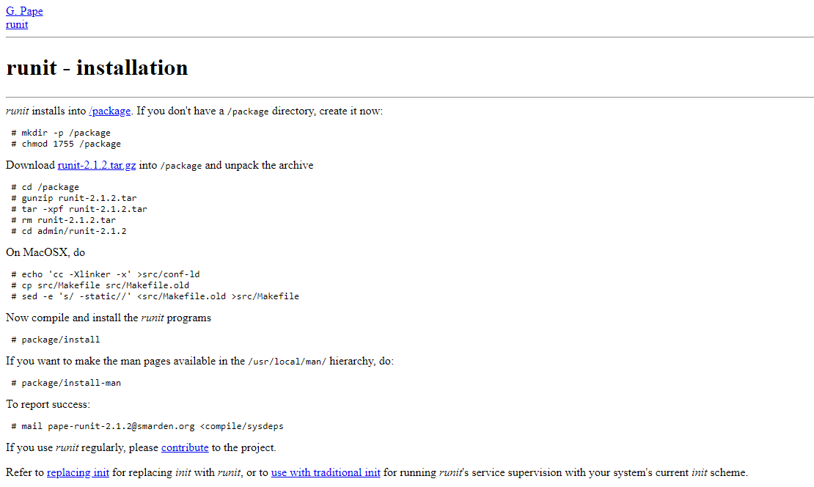

---
## Front matter
title: "Доклад на тему"
subtitle: "Runit - система инициализации"
author: "Четвергова Мария Викторовна"

## Generic otions
lang: ru-RU
toc-title: "Содержание"

## Bibliography
bibliography: bib/cite.bib
csl: pandoc/csl/gost-r-7-0-5-2008-numeric.csl

## Pdf output format
toc: true # Table of contents
toc-depth: 2
lof: true # List of figures
lot: true # List of tables
fontsize: 12pt
linestretch: 1.5
papersize: a4
documentclass: scrreprt
## I18n polyglossia
polyglossia-lang:
  name: russian
  options:
	- spelling=modern
	- babelshorthands=true
polyglossia-otherlangs:
  name: english
## I18n babel
babel-lang: russian
babel-otherlangs: english
## Fonts
mainfont: PT Serif
romanfont: PT Serif
sansfont: PT Sans
monofont: PT Mono
mainfontoptions: Ligatures=TeX
romanfontoptions: Ligatures=TeX
sansfontoptions: Ligatures=TeX,Scale=MatchLowercase
monofontoptions: Scale=MatchLowercase,Scale=0.9
## Biblatex
biblatex: true
biblio-style: "gost-numeric"
biblatexoptions:
  - parentracker=true
  - backend=biber
  - hyperref=auto
  - language=auto
  - autolang=other*
  - citestyle=gost-numeric
## Pandoc-crossref LaTeX customization
figureTitle: "Рис."
tableTitle: "Таблица"
listingTitle: "Листинг"
lofTitle: "Список иллюстраций"
lotTitle: "Список таблиц"
lolTitle: "Листинги"
## Misc options
indent: true
header-includes:
  - \usepackage{indentfirst}
  - \usepackage{float} # keep figures where there are in the text
  - \floatplacement{figure}{H} # keep figures where there are in the text
---

# Цель доклада

Целью доклада является выявление сильных сторон системы инициализации RUNIT и преведение аргументов в её пользу.

# План доклада

1. Вступление
2. Основная часть
2.1. Что такое СИ Runit
2.2. Основные принципы работы
2.3. Преимущества 
2.4. Способы настройки
2.5. Примеры применения Runit
3. Заключение
4. Библиография

# Вступление

Система инициализации является ключевым компонентом любой операционной системы: она обеспечивает запуск необходимых 
сервисов и приложений при старте компьютера. Одной из инновационных систем инициализации является Runit. 
Runit – это легковесная и надежная система инициализации, которая активно используется в различных дистрибутивах Linux. 
В рамках доклада мы рассмотрим основные принципы работы, преимущества и способы настройки и управления этой системой. 
Давайте погрузимся в мир Runit и узнаем, как она помогает сделать процесс загрузки операционной системы более эффективным и слаженным.

# Основная часть 

## 1. Что такое СИ Runit?

Runit - это кроссплатформенная система инициализации, которая может работать в Linux, Solaris и MacOS. 
Это отличная альтернатива для SystemV с поддержкой мониторинга состояния служб.
Можно сказать, что это система в Linux, которая подготавливает к работе операционную систему. Система инициализации 
запускается ядром как первый процесс в операционной системе. И уже затем, этот первый процесс, запускает все остальные процессы

## 2. Основные принципы работы СИ Runit

Разберём конкретнее управление Runit.
Управление этой системой несложное и простое для понимания. 
Запускать, останавливать, перезапускать сервисы можно с помощью команды 
sv (start|stop|restart...) <название сервиса>
Кроме того, при запуске сервиса появится каталог 
/etc/service/<название сервиса>/supervise
 в котором будут расположены очень полезные файлы и потоки:
 
•	pid — идентификатор процесса Unix;
•	stat — описание состояния сервиса на понятном простому пользователю языке
•	status — описание состояние процесса на языке, понятном машине
•	control — поток управления
•	и другие 

При этом для того, чтобы остановить или запустить процесс достаточно открыть поток control на запись, 
и отправить туда символ d = down или u = up соответственно. Это не только позволяет быстро и удобно управлять 
состоянием процесса, но и указывает на несложную систему использования.
Словом, система инициализации Runit обладает не только простыми для понимания принципами работы, но и 
полезными файлами в потоке, позволяющими углубиться в описание состояния сервиса или узнать информацию о том, как этот процесс устроен.

## 3. Преимущества перед другими СИ

У Runit есть некоторые особенности, которые выделяют её на фоне остальных систем инициализации:

*	Быстрая система загрузки и выключения
*	Компактность
*	Небольшое количество кода системы инициализации
*	Легкое создание файлов конфигурации служб
*	Полный контроль сервисов
*	Надежное средство журналирования и ротации логов
*	И др

Эти преимущества позволяют выбрать Runit среди других подобных систем, таких как System V, OpenRC, 
Systemd или Upstart. Благодаря таким принципом Runit выглядит удобнее и проще для пользователей. Благодаря этому многие выбирают именно эту систему инициализации.

Система инициализации RUNIT обладает скоростной системой загрузки и выключения - это не только 
экономит время пользователя, но и позволяет понять, что система работает исправно и хорошо выполняет свои базовые функции.
Небольшое количество кода - важный "плюс", позволяющий пользователю с лёгкостью разобраться в строении данной 
системы инициализации. Благодаря этому многие пользователи могут разобраться в работе программы без предварительной подготовки.

Создание файлов в конфигурации слубж представленно легко и просто для скорейшего освоения. Благодаря этому в любой момент можно настроить нужный файл.

Полный контроль сервисов в системе инициализации RUNIT  помогает держать под контролем состояние сервисов и изменять их по своему усмотрению.
В руках пользователя оказывается полный контроль над ситуацией и он может действовать на своё усмотрение.

## 4. Способы настройки СИ RUNIT

Установка и настройка системы

1.	Для большинства Операционных Систем Runit ставится из стандартного менеджера пакетов (get install runit). 
	Если в Вашем менеджере нужного пакета нет, можно скачать исходники для сборки с официальной страницы: https://smarden.org/runit/
	
	
 

2.	Каждому сервису в runit соответствует директория в /etc/sv. В этой директории создаём файл запуска run. Введём команду:

		mkdir /etc/sv/testservice
		vim /etc/sv/testservice/run

3.	Затем в файле под названием «run» записываем строку для запуска скрипта, с перенаправлениями ввода-вывода, без демонизации , но с exec:

		exec node /etc/mysite/server.js 1>>/var/log/mysite/output2>>/var/log/mysite/error 

4.	Установим данному файлу разрешение на выполнение с помощью команды 

		chmod +x run
		
5.	И теперь, чтобы запустить сервис надо передать runit команду и имя директории внутри /etc/sv
   
		sv start testservice

## 5. Примеры применения

Система инициализации runit является простой и эффективной системой инициализации, предназначенной для управления 
процессами в Unix-подобных операционных системах. Она представляет собой замену более тяжеловесным и сложным системам инициализации, 
таким как SysVinit или systemd.
	Runit широко используется в среде разработки и администрирования Linux-систем, благодаря своей надежности, простоте 
	использования и минимальному потреблению ресурсов. Его можно применять как на обычных серверах, так и в embedded системах, 
	контейнерах Docker и в других средах.
	С помощью runit можно создавать и управлять службами, автоматизировать запуск приложений, управлять процессами и их 
	зависимостями, контролировать и отслеживать работу сервисов, а также выполнять различные 
	административные задачи, связанные с обслуживанием системы.
	Установка и конфигурирование runit может отличаться в зависимости от дистрибутива Linux, но обычно процесс 
	включает в себя создание директорий для служб, написание скриптов инициализации (создание файлов run и log/run), 
	настройку параметров запуска и мониторинга процессов.
	
Места, где можно использовать систему инициализации runit, включают в себя:

1.	Сервера и рабочие станции на базе Linux для управления сервисами и процессами.
2.	Системы виртуализации, такие как Docker, для управления контейнерами и их запуска.
3.	Embedded системы и устройства IoT, где требуется надежная и легковесная система инициализации.
4.	Стенды разработки и тестирования для упрощения процесса запуска и остановки приложений.

	Runit является мощным инструментом для организации процессов и повышения стабильности работы системы. 
	Его гибкость и простота позволяют использовать его в различных окружениях и облегчают администрирование и обслуживание системы.

# Заключение

	В заключение, система инициализации Runit представляет собой надежное и эффективное решение для запуска сервисов 
и приложений при старте операционной системы. Благодаря своей легковесной архитектуре и отличной стабильности, 
Runit становится все более популярным выбором среди пользователей Linux. Мы изучили основные принципы работы Runit, 
выявили его преимущества и узнали о возможностях настройки и управления этой системой. Надеюсь, что полученная 
информация поможет вам более глубоко понять принципы функционирования системы инициализации Runit и применить их
на практике для оптимизации процесса загрузки вашей операционной системы. Вместе с Runit мы можем делать загрузку 
компьютера более эффективной и безотказной.

# Библиография

1.	Cтатьи сайта-форума Habr
a.	«Использование runit для своих сервисов»
https://habr.com/ru/articles/83775/
b.	«Web-интерфейс для runit»
https://habr.com/ru/articles/84627/
2.	Статья «[Basics] Инициализация системы» на сайте «Мишка на севере» 12.09.2021
https://jtprog.ru/sys-init/
3.	Wikipedia «runit»
https://ru.wikipedia.org/wiki/Runit

4.	Статья «Использование runit вместо Init и вывод логов в файл» на сайте «Механический мир: Прибежище техножреца» 04.04.2011
https://kuroikaze85.wordpress.com/2011/04/04/runit-nodejs/
5.	Статья «Системы инициализации Linux» на сайте «lost.pro» 16.08.2016
https://losst.pro/sistemy-initsializatsii-linux
6.	Официальный сайт системы инициализации Runit
https://smarden.org/runit/

::: {#refs}
:::
