---
## Front matter
lang: ru-RU
title: "Отчёт к первой части индивидуального проекта"
subtitle: "Размещение на Github pages заготовки для персонального сайта"
author:
  - Четвергова М.В.
institute:
  - Российский университет дружбы народов, Москва, Россия
date: 2 марта 2024

## i18n babel
babel-lang: russian
babel-otherlangs: english

## Formatting pdf
toc: false
toc-title: Содержание
slide_level: 2
aspectratio: 169
section-titles: true
theme: metropolis
header-includes:
 - \metroset{progressbar=frametitle,sectionpage=progressbar,numbering=fraction}
 - '\makeatletter'
 - '\beamer@ignorenonframefalse'
 - '\makeatother'

## Fonts
mainfont: PT Serif
romanfont: PT Serif
sansfont: PT Sans
monofont: PT Mono
mainfontoptions: Ligatures=TeX
romanfontoptions: Ligatures=TeX
sansfontoptions: Ligatures=TeX,Scale=MatchLowercase
monofontoptions: Scale=MatchLowercase,Scale=0.9
---

# Информация

## Докладчик

:::::::::::::: {.columns align=center}
::: {.column width="40%"}

  * Четвергова Мария викторовна
  * студентка 1 курса НПИбд-02-23
  * Российский университет дружбы народов

:::
::: {.column width="30%"}

:::
::::::::::::::

# Цель работы

- Целью данной работы является применение знаний при создании собственного сайта-визитки.
- Размещение на Github pages заготовки для персонального сайта.

# Задание

1. Установить необходимое программное обеспечение.
2. Скачать шаблон темы сайта.
3. Разместить его на хостинге git.
4. Установить параметр для URLs сайта.
5. Разместить заготовку сайта на Github pages.

# Выполнение лабораторной работы

1. Для начала выполнения индивидуального пректа необходимо установить необходимое программное обеспечение.
Я перешла на сайт Hudo и установила подходящую версию *hugo_extended_0.123.7_linux-amd64.tar.gz*

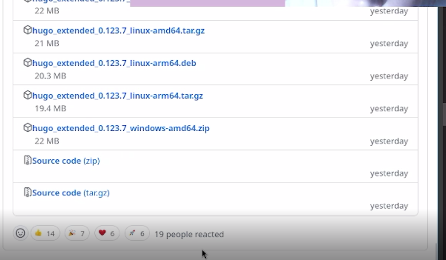{#fig:001 width=40%}

# Выполнение лабораторной работы
Далее разархивируем установленный файл

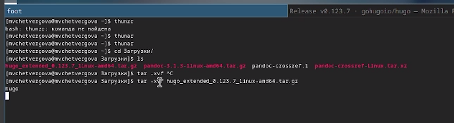{#fig:002 width=40%}

# Выполнение лабораторной работы
С помощью режима суперпользователя перенесём разархивированный файл hugo  в каталог */usr/local/bin* . Перейдём в данный каталог и проверим, всё ли переместилось успешно

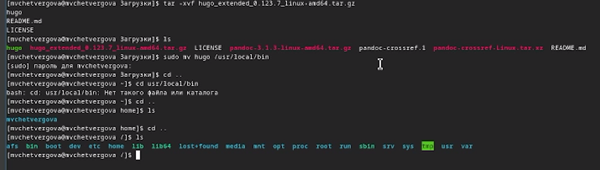{#fig:003 width=40%}

Всё прошло успешно!

# Выполнение лабораторной работы
2. Далее необходимо установить нужную тему. Установить её можно по ссылке из туиса в разделе "Техническая реализация проекта"

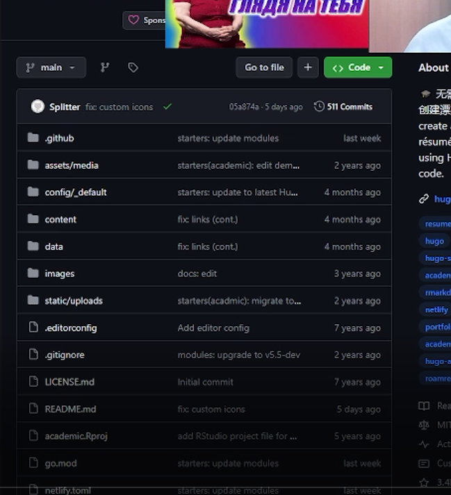{#fig:004 width=40%}

# Выполнение лабораторной работы
Необходимо создать такой же репозиторий. Нажмём на кнопку *use this template* и создадим свой новый репозиторий.
Назовём его *site*

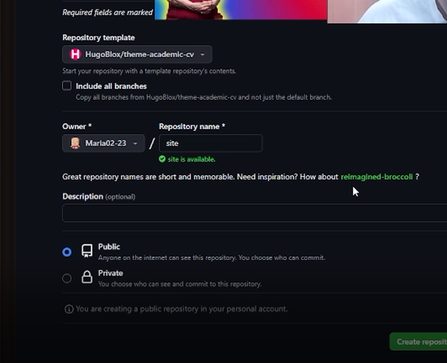{#fig:005 width=40%}

# Выполнение лабораторной работы
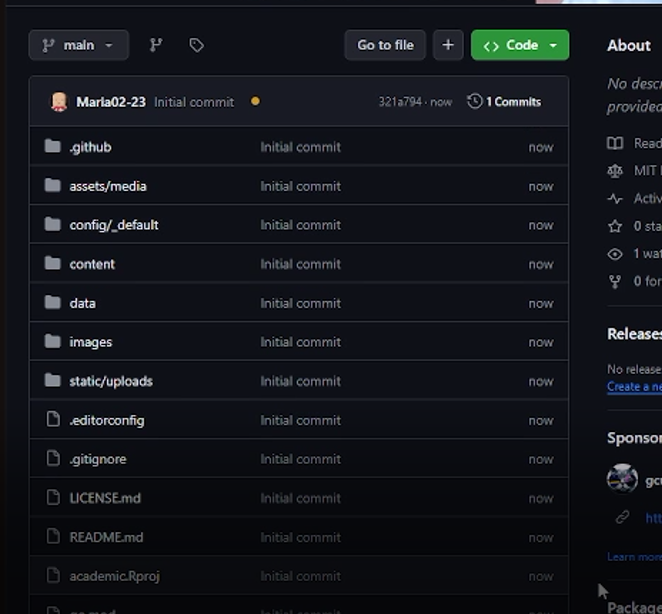{#fig:006 width=40%}

# Выполнение лабораторной работы
3. Перейдём в папку *work/*  и клонируем туда новый репозиторий с помощью команды *git clone --recursive SSH-ключ*  и перейдём в каталог этого репозитория

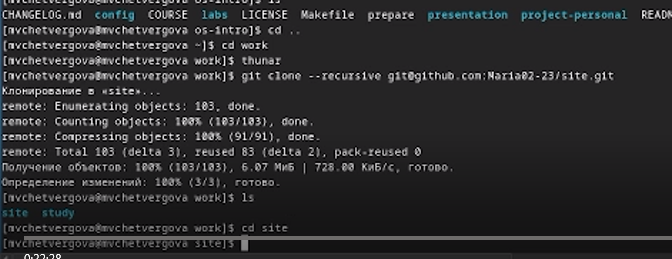{#fig:007 width=40%}

# Выполнение лабораторной работы
4. После перехода в папку с названием репозитория, установим паке go *sudo dnf install go*

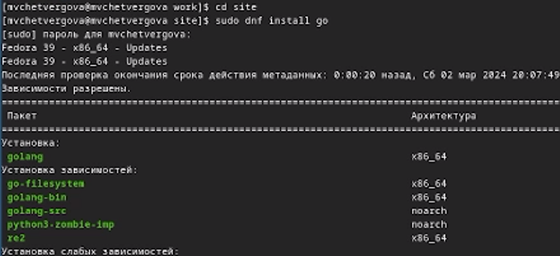{#fig:008 width=40%}

# Выполнение лабораторной работы
В ходе выполнения у нас появился файл public, который не понадобится в зоды выполнения проекта. Удалим его. Затем введём команду *hugo server* для просмотра информации. В конце должна появиться ссылка на сайт, указанный в разделе "Техническая реализация проекта"

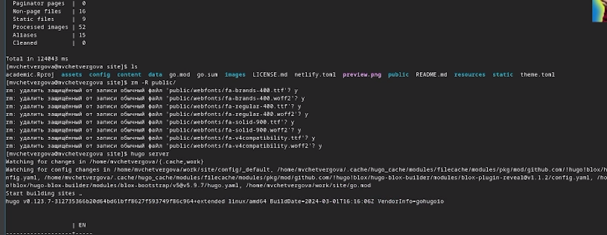{#fig:009 width=40%}

# Выполнение лабораторной работы
5. Переходим в гитхаб и создаём новый пустой репозиторий "Maria02-23.."

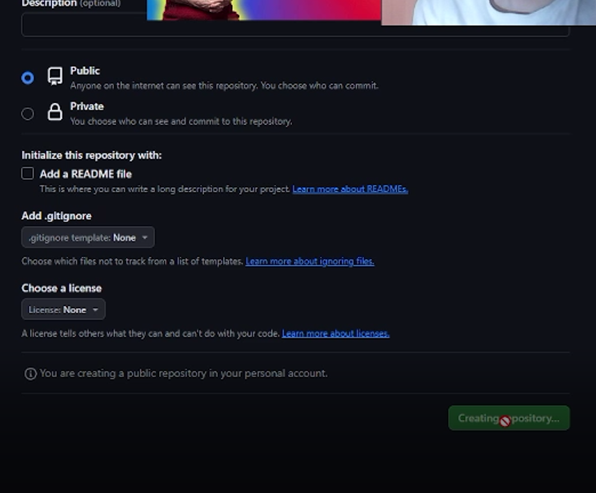{#fig:010 width=40%}

# Выполнение лабораторной работы
переходим в каталог work и клонируем новый репозиторий в него.

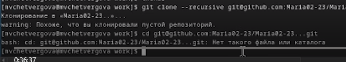{#fig:011 width=40%}

# Выполнение лабораторной работы
6. Переходим в репозиторий и вводим команду *git checkout -b main* для создания бранча. Там же создаём файл README.md и отправляем все эти изменения на гитхаб командами *git add/commit/push*

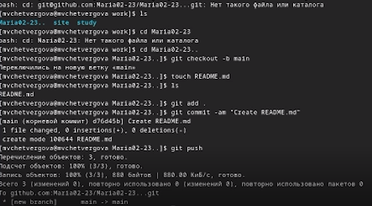{#fig:012 width=40%}

# Выполнение лабораторной работы
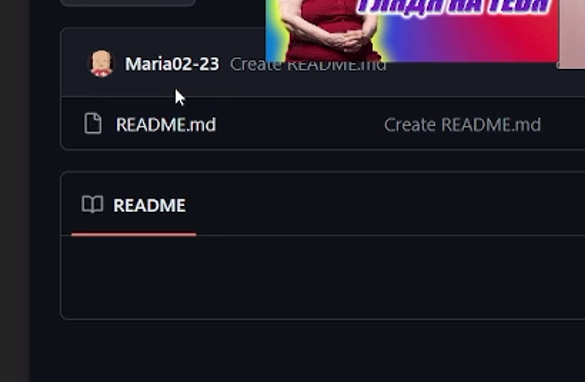{#fig:013 width=40%}

# Выполнение лабораторной работы
7. Возвращаемся в каталог *site*, в редакторе mcedit перед словом public  ставим знак # и вводим команду *git submodule add -b ~SSH~*
	+ Удаляем вновь появившийся файл public и вновь вводим команду

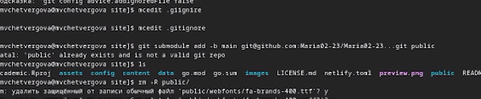{#fig:014 width=40%}

# Выполнение лабораторной работы
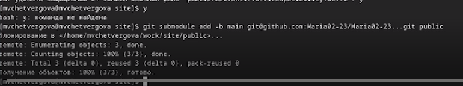{#fig:015 width=40%}

# Выполнение лабораторной работы
Далее вводим в терминал команду hugo для просмотра необходимой информации. Затем переходим в каталог public и проводим операцию *git remote -v*

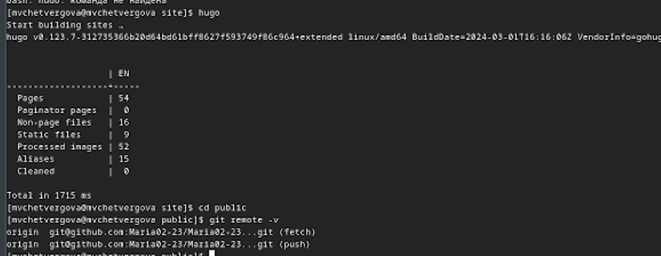{#fig:016 width=40%}

# Выполнение лабораторной работы
Для сохранения и переноса изменений отправляем файлы на репозиторий site

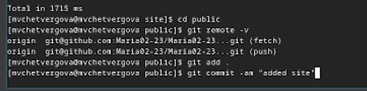{#fig:017 width=40%}
 
 # Выполнение лабораторной работы
8. переходим в репозиторий на гитхабе и проверяем изменения. всё прошло успешно!

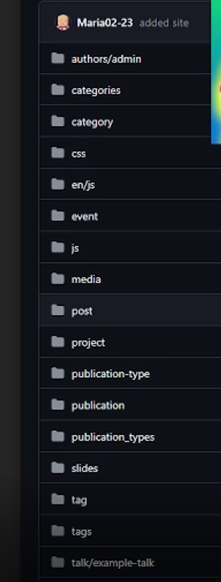{#fig:018 width=40%}

# Выводы
В ходе выполнения первой части индивидуального проекта по созданию сайта, мы применили необходимые навыки для работы с СКВ гит и  командной строкой. 
а также Установили необходимое программное обеспечение, Скачали шаблон темы сайта, разместили его на хостинге git, Установили параметр для URLs сайта и Разместили заготовку сайта на Github pages.

