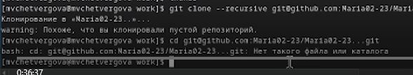
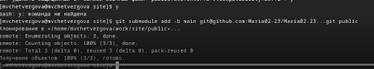

---
## Front matter
title: "Отчёт к первой части индивидуального проекта"
subtitle: "Размещение на Github pages заготовки для персонального сайта"
author: "Четвергова Мария Викторовна"

## Generic otions
lang: ru-RU
toc-title: "Содержание"

## Bibliography
bibliography: bib/cite.bib
csl: pandoc/csl/gost-r-7-0-5-2008-numeric.csl

## Pdf output format
toc: true # Table of contents
toc-depth: 2
lof: true # List of figures
lot: true # List of tables
fontsize: 12pt
linestretch: 1.5
papersize: a4
documentclass: scrreprt
## I18n polyglossia
polyglossia-lang:
  name: russian
  options:
	- spelling=modern
	- babelshorthands=true
polyglossia-otherlangs:
  name: english
## I18n babel
babel-lang: russian
babel-otherlangs: english
## Fonts
mainfont: PT Serif
romanfont: PT Serif
sansfont: PT Sans
monofont: PT Mono
mainfontoptions: Ligatures=TeX
romanfontoptions: Ligatures=TeX
sansfontoptions: Ligatures=TeX,Scale=MatchLowercase
monofontoptions: Scale=MatchLowercase,Scale=0.9
## Biblatex
biblatex: true
biblio-style: "gost-numeric"
biblatexoptions:
  - parentracker=true
  - backend=biber
  - hyperref=auto
  - language=auto
  - autolang=other*
  - citestyle=gost-numeric
## Pandoc-crossref LaTeX customization
figureTitle: "Рис."
tableTitle: "Таблица"
listingTitle: "Листинг"
lofTitle: "Список иллюстраций"
lotTitle: "Список таблиц"
lolTitle: "Листинги"
## Misc options
indent: true
header-includes:
  - \usepackage{indentfirst}
  - \usepackage{float} # keep figures where there are in the text
  - \floatplacement{figure}{H} # keep figures where there are in the text
---

# Цель работы

- Целью данной работы является применение знаний при создании собственного сайта-визитки.
- Размещение на Github pages заготовки для персонального сайта.

# Задание

1. Установить необходимое программное обеспечение.
2. Скачать шаблон темы сайта.
3. Разместить его на хостинге git.
4. Установить параметр для URLs сайта.
5. Разместить заготовку сайта на Github pages.

# Выполнение лабораторной работы

1. Для начала выполнения индивидуального пректа необходимо установить необходимое программное обеспечение.
Я перешла на сайт Hudo и установила подходящую версию *hugo_extended_0.123.7_linux-amd64.tar.gz*

{#fig:001 width=70%}

Далее разархивируем установленный файл

{#fig:002 width=70%}

С помощью режима суперпользователя перенесём разархивированный файл hugo  в каталог */usr/local/bin*

Перейдём в данный каталог и проверим, всё ли переместилось успешно

{#fig:003 width=70%}

Всё прошло успешно!

2. Далее необходимо установить нужную тему. Установить её можно по ссылке из туиса в разделе "Техническая реализация проекта"

{#fig:004 width=70%}

Необходимо создать такой же репозиторий. Нажмём на кнопку *use this template* и создадим свой новый репозиторий.
Назовём его *site*

{#fig:005 width=70%}

{#fig:006 width=70%}

3. Перейдём в папку *work/*  и клонируем туда новый репозиторий с помощью команды

*git clone --recursive SSH-ключ*

и перейдём в каталог этого репозитория

{#fig:007 width=70%}

4. После перехода в папку с названием репозитория, установим паке go

*sudo dnf install go*

{#fig:008 width=70%}

В ходе выполнения у нас появился файл public, который не понадобится в зоды выполнения проекта. Удалим его.

Затем введём команду *hugo server* для просмотра информации. В конце должна появиться ссылка на сайт, указанный в разделе "Техническая реализация проекта"

{#fig:009 width=70%}

5. Переходим в гитхаб и создаём новый пустой репозиторий "Maria02-23.."

{#fig:010 width=70%}

переходим в каталог work и клонируем новый репозиторий в него.

{#fig:011 width=70%}

6. Переходим в репозиторий и вводим команду *git checkout -b main* для создания бранча. Там же создаём файл README.md и отправляем все эти изменения на гитхаб командами *git add/commit/push*

{#fig:012 width=70%}

{#fig:013 width=70%}

7. Возвращаемся в каталог *site*, в редакторе mcedit перед словом public  ставим знак # и вводим команду *git submodule add -b ~SSH~*
	+ Удаляем вновь появившийся файл public и вновь вводим команду

{#fig:014 width=70%}

{#fig:015 width=70%}

Далее вводим в терминал команду hugo для просмотра необходимой информации. Затем переходим в каталог public и проводим операцию *git remote -v*

{#fig:016 width=70%}

Для сохранения и переноса изменений отправляем файлы на репозиторий site

{#fig:017 width=70%}
 
8. переходим в репозиторий на гитхабе и проверяем изменения. всё прошло успешно!

{#fig:018 width=70%}

# Выводы
В ходе выполнения первой части индивидуального проекта по созданию сайта, мы применили необходимые навыки для работы с СКВ гит и  командной строкой. 
а также Установили необходимое программное обеспечение, Скачали шаблон темы сайта, разместили его на хостинге git, Установили параметр для URLs сайта и Разместили заготовку сайта на Github pages.

::: {#refs}
:::
