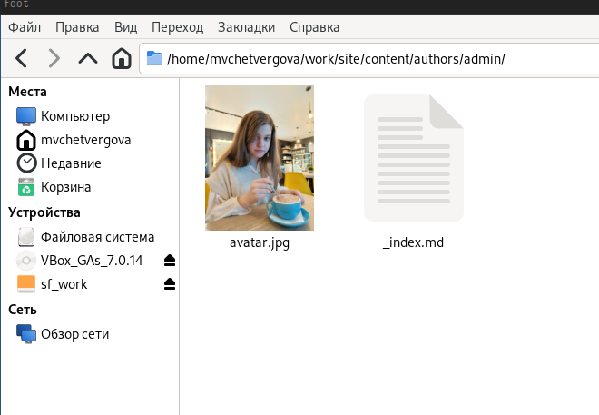
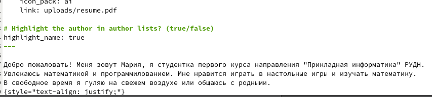
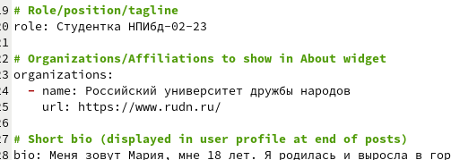
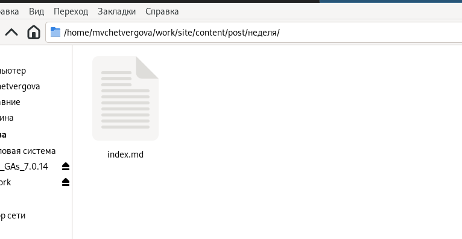
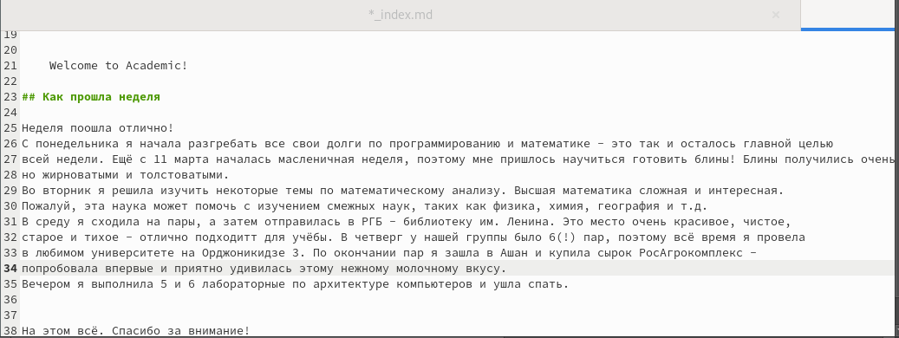
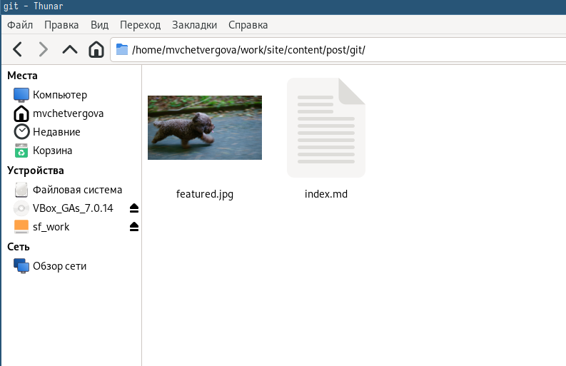
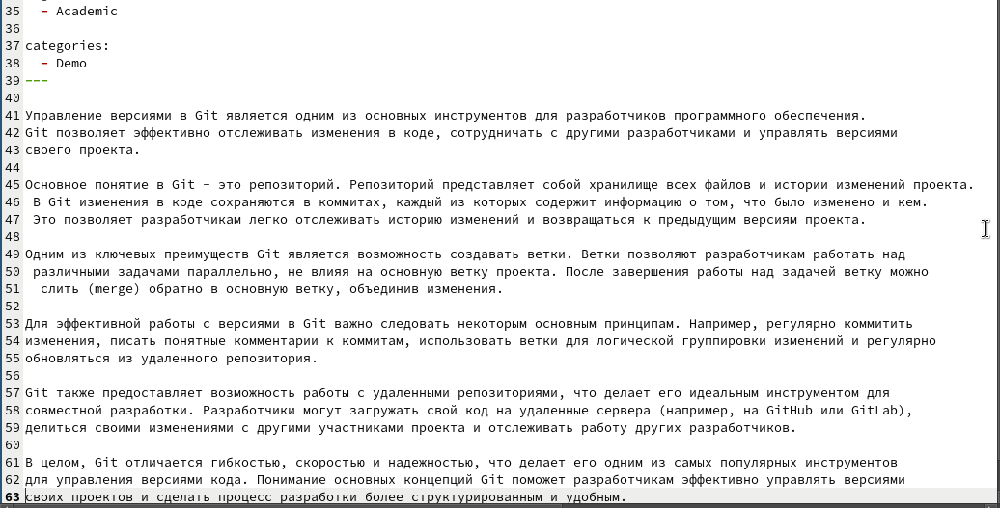
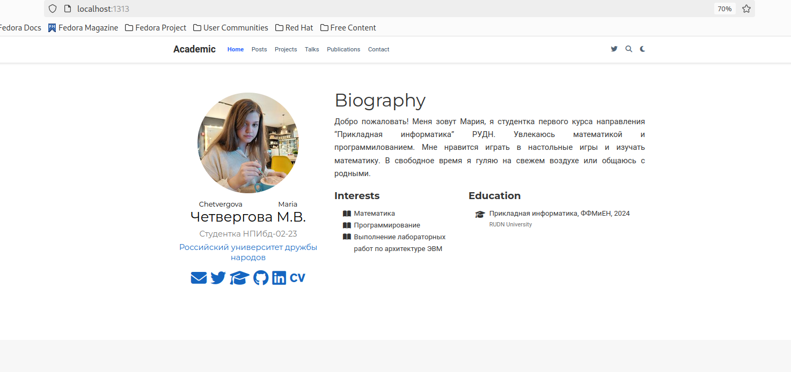

---
## Front matter
title: "Отчёт к 2 части индивидуального проекта"
subtitle: "Создание сайта-визитки"
author: "Четвергова Мария Викторовна"

## Generic otions
lang: ru-RU
toc-title: "Содержание"

## Bibliography
bibliography: bib/cite.bib
csl: pandoc/csl/gost-r-7-0-5-2008-numeric.csl

## Pdf output format
toc: true # Table of contents
toc-depth: 2
lof: true # List of figures
lot: true # List of tables
fontsize: 12pt
linestretch: 1.5
papersize: a4
documentclass: scrreprt
## I18n polyglossia
polyglossia-lang:
  name: russian
  options:
	- spelling=modern
	- babelshorthands=true
polyglossia-otherlangs:
  name: english
## I18n babel
babel-lang: russian
babel-otherlangs: english
## Fonts
mainfont: PT Serif
romanfont: PT Serif
sansfont: PT Sans
monofont: PT Mono
mainfontoptions: Ligatures=TeX
romanfontoptions: Ligatures=TeX
sansfontoptions: Ligatures=TeX,Scale=MatchLowercase
monofontoptions: Scale=MatchLowercase,Scale=0.9
## Biblatex
biblatex: true
biblio-style: "gost-numeric"
biblatexoptions:
  - parentracker=true
  - backend=biber
  - hyperref=auto
  - language=auto
  - autolang=other*
  - citestyle=gost-numeric
## Pandoc-crossref LaTeX customization
figureTitle: "Рис."
tableTitle: "Таблица"
listingTitle: "Листинг"
lofTitle: "Список иллюстраций"
lotTitle: "Список таблиц"
lolTitle: "Листинги"
## Misc options
indent: true
header-includes:
  - \usepackage{indentfirst}
  - \usepackage{float} # keep figures where there are in the text
  - \floatplacement{figure}{H} # keep figures where there are in the text
---

# Цель работы

Добавление к сайту данных о себе и создание постов на разные темы

# Задание

- Добавить необходимые данные на сайт 
- Сделать пост по прошедшей неделе
- Добавить пост на тему "Управление вериями.Git."

# Выполнение второй части проекта

## Добавим необходимые данные на сайт

1. В каталоге "author" изменим шаблонное фото на своё и изменим его название на *'avatar.jpg'*

{#fig:001 width=50%}

2. Далее разместим краткое описание владельца сайта (меня) в конце документа:

{#fig:002 width=50%}

3. Добавим информацию об интересах в разделе Interests

{#fig:003 width=50%}

4. Добавим информацию об образовании в разделе Education

{#fig:004 width=50%}

## Сделаем пост по прошедшей неделе.

Для этого перейдём в каталог posts и изменим название одного из подкаталогов на "пост по прошедшей неделе"
Заполним информацию внутри и напишем пост в документе формата '____.md'

{#fig:005 width=50%}

{#fig:006 width=50%}

## Добавим пост на тему "Управление версиями. Git."

Для этого перейдём в каталог posts и изменим название одного из подкаталогов на "Git"
Заполним информацию внутри и напишем пост в документе формата '____.md'

{#fig:007 width=50%}

{#fig:008 width=50%}

## Итоговый вид сайта

{#fig:009 width=50%}

# Выводы

В ходе выполнения второй части индивидуального проекта мы заполнили основную информацию о владельце сайта и написали два поста на разные темы.

::: {#refs}
:::
