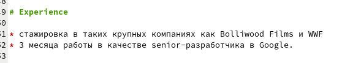
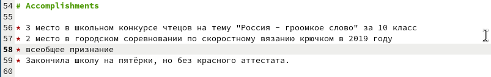
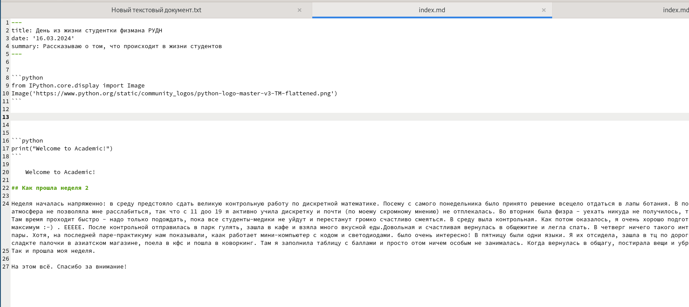
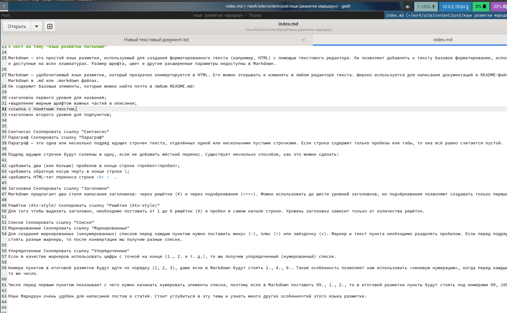

---
## Front matter
lang: ru-RU
title: Презентация ко второй части индивидуального проекта
subtitle: Создание сайта-визитки
author:
  - Четвергова Мария Викторовна
institute:
  - Российский университет дружбы народов, Москва, Россия
date: 16 марта 2024 г.

## i18n babel
babel-lang: russian
babel-otherlangs: english

## Formatting pdf
toc: false
toc-title: Содержание
slide_level: 2
aspectratio: 169
section-titles: true
theme: metropolis
header-includes:
 - \metroset{progressbar=frametitle,sectionpage=progressbar,numbering=fraction}
 - '\makeatletter'
 - '\beamer@ignorenonframefalse'
 - '\makeatother'
 
## Fonts
mainfont: PT Serif
romanfont: PT Serif
sansfont: PT Sans
monofont: PT Mono
mainfontoptions: Ligatures=TeX
romanfontoptions: Ligatures=TeX
sansfontoptions: Ligatures=TeX,Scale=MatchLowercase
monofontoptions: Scale=MatchLowercase,Scale=0.9
---

# Информация

## Докладчик

:::::::::::::: {.columns align=center}
::: {.column width="70%"}

  * Четвергова Мария Викторовна
  * студент НПИбд-02-23
  * Российский университет дружбы народов
  * 1132232886@pfur.ru

:::
::: {.column width="30%"}

:::
::::::::::::::

# Цель работы

1. Заполнить несколько разделов сайта:
* добавить информацию о навыках
* информацию об опыте
* информацию о достижениях

2. Написать пост по прошедшей неделе

3. Написать пост на тему "Язык разметки Маркдаун" 

# Задание

Выполнить поставленные цели и реализовать новые разделы на сайте-визитке

# Выполнение

1. Заполним несколько новых разделов сайта.

Откроем папку work и перейдём в папку с названием репозитория, в котором хранится шаблон сайта.
Найдём текстовый документ и по очереди заполним информацию о навыках, опыте и достижениях.

{#fig:001 width=60%}

## опыт 

{#fig:002 width=60%}

## достижения 

{#fig:003 width=60%}

## Пост по прошедшей неделе
2. Далее перейдём в папку post  и по подобию предыдущих постов создадим папку для написания поста по прошедшей недели.
заполним информацию в текстовом документе

{#fig:004 width=60%}

## Пост на тему "Язык разметки маркдаун"
3. На подобии предыдущих постов создадим папку дляя выполнения поста на тему "Язык разметки Маркдаун"
Заполним информацию в текстофом документе и сохраним.

{#fig:005 width=60%}

# Выводы

Мы выполнили поставленные задачи: заполнили несколько разжелов сайта и написали два поста.
Теперь сайт-визитка выглядит более заполненным.

::: {#refs}
:::
