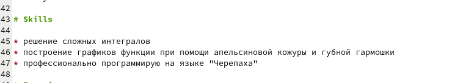
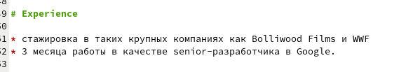
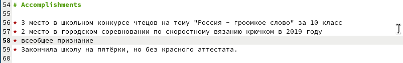
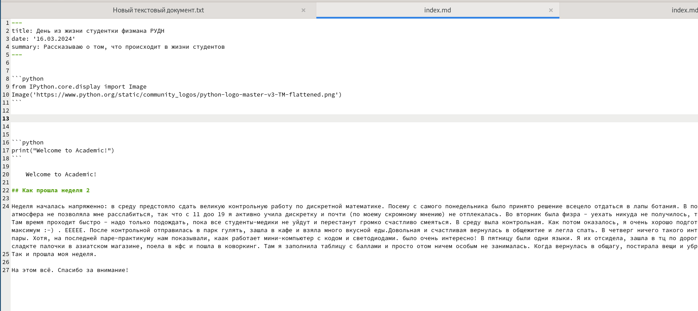
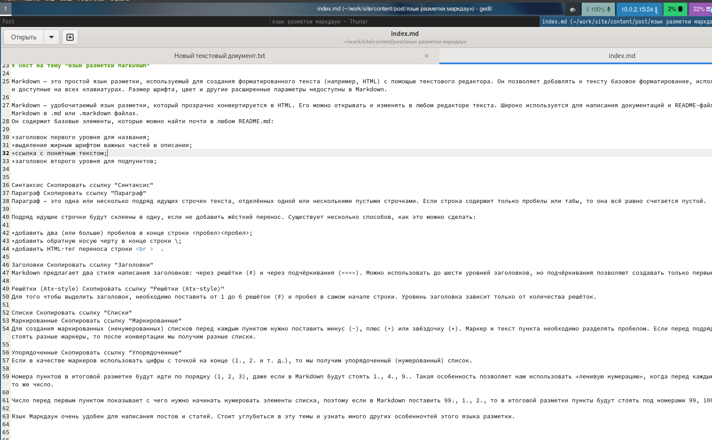

---
## Front matter
title: "Отчёт к третьему этапу выполнения индивидуального проекта"
subtitle: "Создание сайта-визитки"
author: "Четвергова Мария Викторовна"

## Generic otions
lang: ru-RU
toc-title: "Содержание"

## Bibliography
bibliography: bib/cite.bib
csl: pandoc/csl/gost-r-7-0-5-2008-numeric.csl

## Pdf output format
toc: true # Table of contents
toc-depth: 2
lof: true # List of figures
lot: true # List of tables
fontsize: 12pt
linestretch: 1.5
papersize: a4
documentclass: scrreprt
## I18n polyglossia
polyglossia-lang:
  name: russian
  options:
	- spelling=modern
	- babelshorthands=true
polyglossia-otherlangs:
  name: english
## I18n babel
babel-lang: russian
babel-otherlangs: english
## Fonts
mainfont: PT Serif
romanfont: PT Serif
sansfont: PT Sans
monofont: PT Mono
mainfontoptions: Ligatures=TeX
romanfontoptions: Ligatures=TeX
sansfontoptions: Ligatures=TeX,Scale=MatchLowercase
monofontoptions: Scale=MatchLowercase,Scale=0.9
## Biblatex
biblatex: true
biblio-style: "gost-numeric"
biblatexoptions:
  - parentracker=true
  - backend=biber
  - hyperref=auto
  - language=auto
  - autolang=other*
  - citestyle=gost-numeric
## Pandoc-crossref LaTeX customization
figureTitle: "Рис."
tableTitle: "Таблица"
listingTitle: "Листинг"
lofTitle: "Список иллюстраций"
lotTitle: "Список таблиц"
lolTitle: "Листинги"
## Misc options
indent: true
header-includes:
  - \usepackage{indentfirst}
  - \usepackage{float} # keep figures where there are in the text
  - \floatplacement{figure}{H} # keep figures where there are in the text
---

# Цель работы

1. Заполнить несколько разделов сайта:
* добавить информацию о навыках
* информацию об опыте
* информацию о достижениях

2. Написать пост по прошедшей неделе

3. Написать пост на тему "Язык разметки Маркдаун" 

# Задание

Выполнить поставленные цели и реализовать новые разделы на сайте-визитке

# Выполнение

1. Заполним несколько новых разделов сайта.

Откроем папку work и перейдём в папку с названием репозитория, в котором хранится шаблон сайта.
Найдём текстовый документ и по очереди заполним информацию о навыках, опыте и достижениях.

{#fig:001 width=60%}

{#fig:002 width=60%}

{#fig:003 width=60%}

2. Далее перейдём в папку post  и по подобию предыдущих постов создадим папку для написания поста по прошедшей недели.
заполним информацию в текстовом документе

{#fig:004 width=60%}

3. На подобии предыдущих постов создадим папку дляя выполнения поста на тему "Язык разметки Маркдаун"
Заполним информацию в текстофом документе и сохраним.

{#fig:005 width=60%}

# Выводы

Мы выполнили поставленные задачи: заполнили несколько разжелов сайта и написали два поста.
Теперь сайт-визитка выглядит более заполненным.

::: {#refs}
:::
