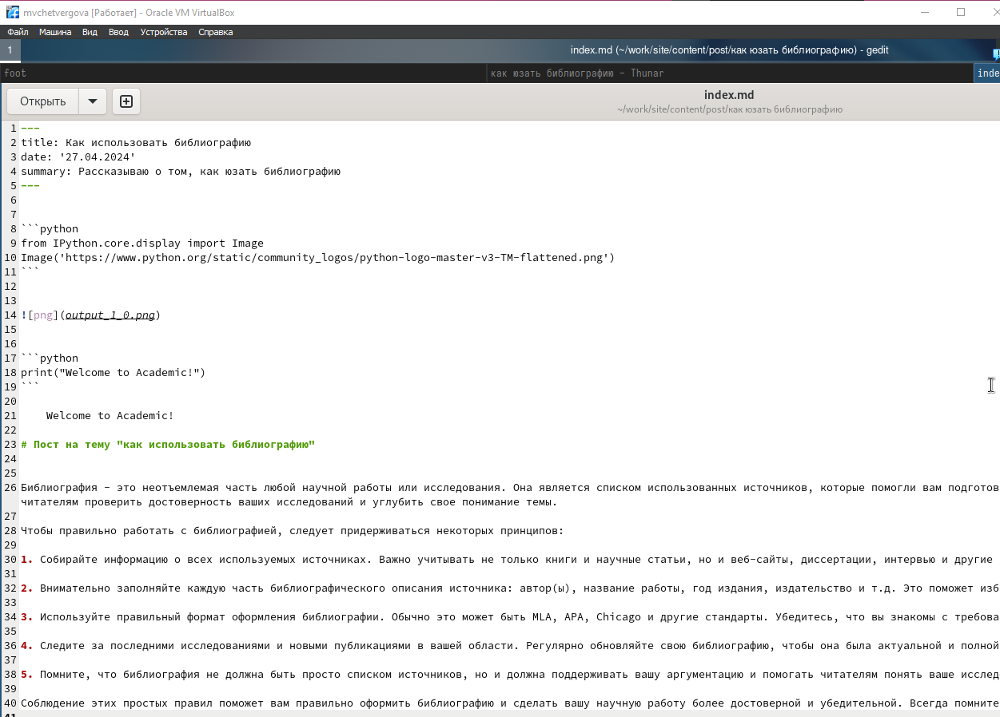
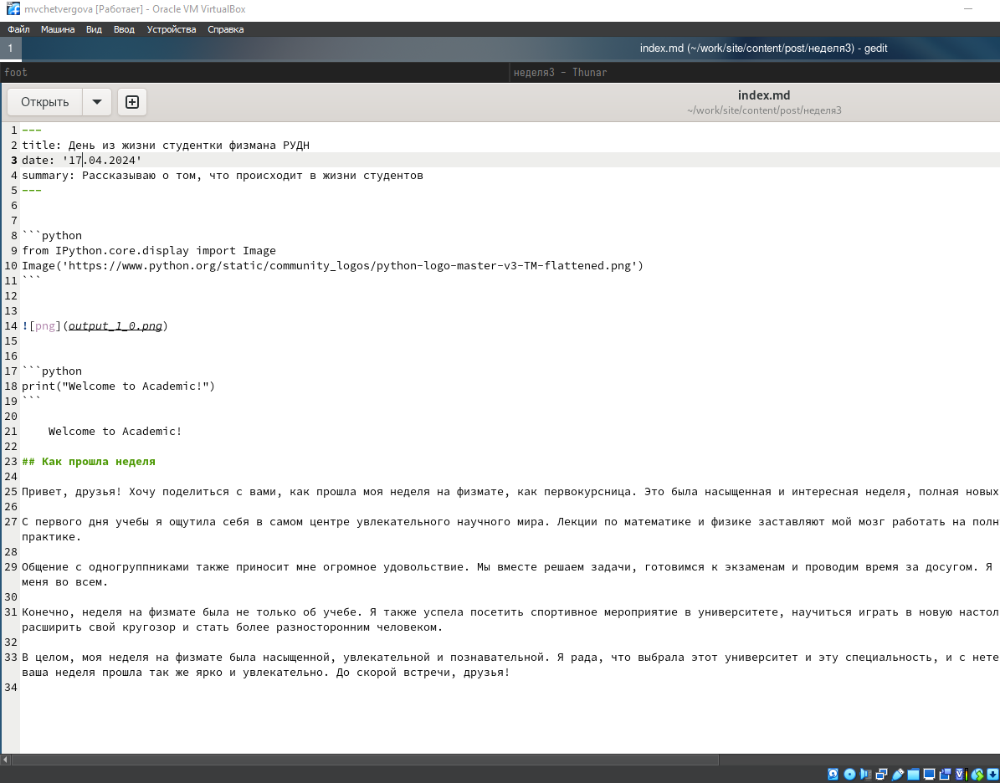
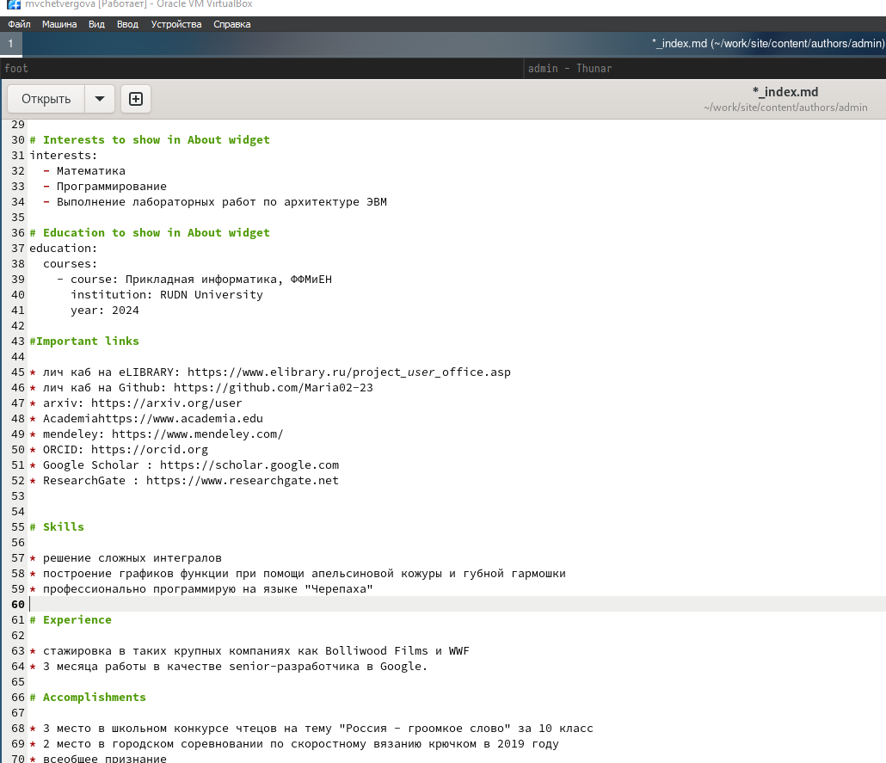

---
## Front matter
lang: ru-RU
title: Презентация ко второй части индивидуального проекта
subtitle: Создание сайта-визитки
author:
  - Четвергова Мария Викторовна
institute:
  - Российский университет дружбы народов, Москва, Россия
date: 16 марта 2024 г.

## i18n babel
babel-lang: russian
babel-otherlangs: english

## Formatting pdf
toc: false
toc-title: Содержание
slide_level: 2
aspectratio: 169
section-titles: true
theme: metropolis
header-includes:
 - \metroset{progressbar=frametitle,sectionpage=progressbar,numbering=fraction}
 - '\makeatletter'
 - '\beamer@ignorenonframefalse'
 - '\makeatother'
 
## Fonts
mainfont: PT Serif
romanfont: PT Serif
sansfont: PT Sans
monofont: PT Mono
mainfontoptions: Ligatures=TeX
romanfontoptions: Ligatures=TeX
sansfontoptions: Ligatures=TeX,Scale=MatchLowercase
monofontoptions: Scale=MatchLowercase,Scale=0.9
---

# Информация

## Докладчик

:::::::::::::: {.columns align=center}
::: {.column width="70%"}

  * Четвергова Мария Викторовна
  * студент НПИбд-02-23
  * Российский университет дружбы народов
  * 1132232886@pfur.ru

:::
::: {.column width="30%"}

# Задание

Заполнить несколько разделов сайта, оставить ссылки и написать посты

# Выполнение

1. Сначала я написала пост по прошедшей неделе

{#fig:001 width=60%}

2. Затем я написала пост на тему использования библиографии

{#fig:002 width=60%}

3. После этого я оставила ссылки на необходимые сайты

{#fig:003 width=60%}

# Вывод

 В ходе выполнения этого этапа я заполнила разделы сайта
::: {#refs}
:::

