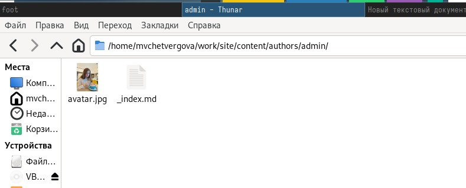
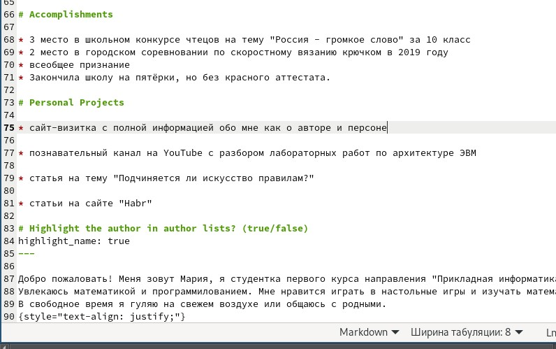
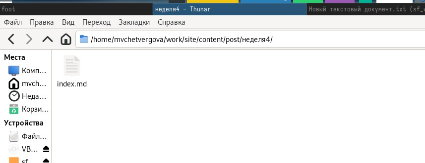
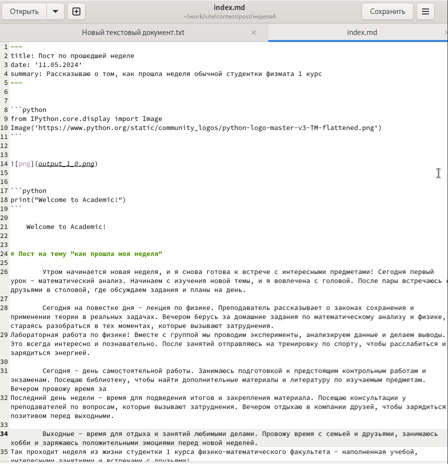
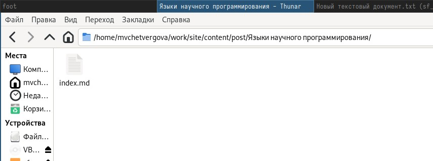

---
## Front matter
lang: ru-RU
title: Презентация к пятой части индивидуального проекта
subtitle: Создание сайта-визитки
author:
  - Четвергова Мария Викторовна
institute:
  - Российский университет дружбы народов, Москва, Россия
date: 10 мая 2024 г.

## i18n babel
babel-lang: russian
babel-otherlangs: english

## Formatting pdf
toc: false
toc-title: Содержание
slide_level: 2
aspectratio: 169
section-titles: true
theme: metropolis
header-includes:
 - \metroset{progressbar=frametitle,sectionpage=progressbar,numbering=fraction}
 - '\makeatletter'
 - '\beamer@ignorenonframefalse'
 - '\makeatother'
 
## Fonts
mainfont: PT Serif
romanfont: PT Serif
sansfont: PT Sans
monofont: PT Mono
mainfontoptions: Ligatures=TeX
romanfontoptions: Ligatures=TeX
sansfontoptions: Ligatures=TeX,Scale=MatchLowercase
monofontoptions: Scale=MatchLowercase,Scale=0.9
---

# Информация

## Докладчик

:::::::::::::: {.columns align=center}
::: {.column width="70%"}

  * Четвергова Мария Викторовна
  * студент НПИбд-02-23
  * Российский университет дружбы народов
  * 1132232886@pfur.ru

:::
::: {.column width="30%"}

# Цель работы

Дополнение сайта-визитки новой информацией. Получение новых практических навыков по работе с языком разметки МаркДаун и работа в редакторе gedit. 

# Задание

На пятом этапе необходимо выполнить 3 задачи: заполнить информацию о персональных проектах, написать пост по прошедшей неделе и написать пост на тему "языки научного программирования".

# Выполнение лабораторной работы

## 1 задание - добавить информацию о персональных проектах на главную страницу сайта

Для выполнения этого задания я зашла в директорию репозитория, на котором зранятся все данные сайта и его посты. Затем я нашла нужную папку author -> _index.md . Этот текстовый документ отвечает за вид главной страницы сайта.

{#fig:001 width=70%}

## 1 задание - добавить информацию о персональных проектах на главную страницу сайта

Далее за полняем нужный раздел информацией о моих персональных проектах.

{#fig:002 width=70%}

Отлично! Мы справились с первым заданием этого этапа.

## 2 этап - Добавление поста по прошедшей неделе

Для реализации этого задания я нашла директорию post, в которой хранятся все существующие на сайте посты, скопировала один из них и открыла для написания нового поста.

{#fig:003 width=70%}

## 2 этап - Добавление поста по прошедшей неделе

Далее заполняем данные в файле и пишем в нём сам пост.

{#fig:004 width=70%}

Супер! Мы завершили второе задание этого этапа.

## 3 задание - написать пост на тему "Языки научного программирования"

Для начала откроем файл, в который будем записывать этот пост. Файл и сама папка хранятся в директории post. 

{#fig:005 width=70%}

## 3 задание - написать пост на тему "Языки научного программирования"

Затем открываем текстовый файл и пишем пост на тему "Языки научного программирования"

{#fig:006 width=70%}

На этом выполнение заданий подходит к концу. Сохраняем все изменения и отправляем их на репозиторий ГитХаб.

# Выводы

В ходе выполнения пятого этапа индивидуального проекта мы получили ценные теоретические и практические навыки по работе с языком разметки МаркДаун и научились правильно оформлять посты и разделы сайта.

::: {#refs}
:::

