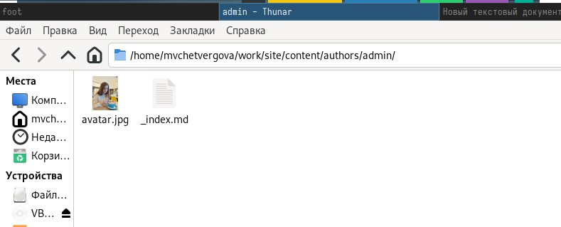
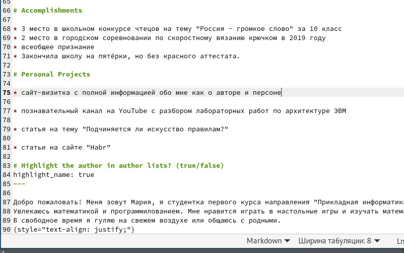
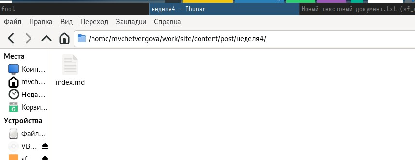
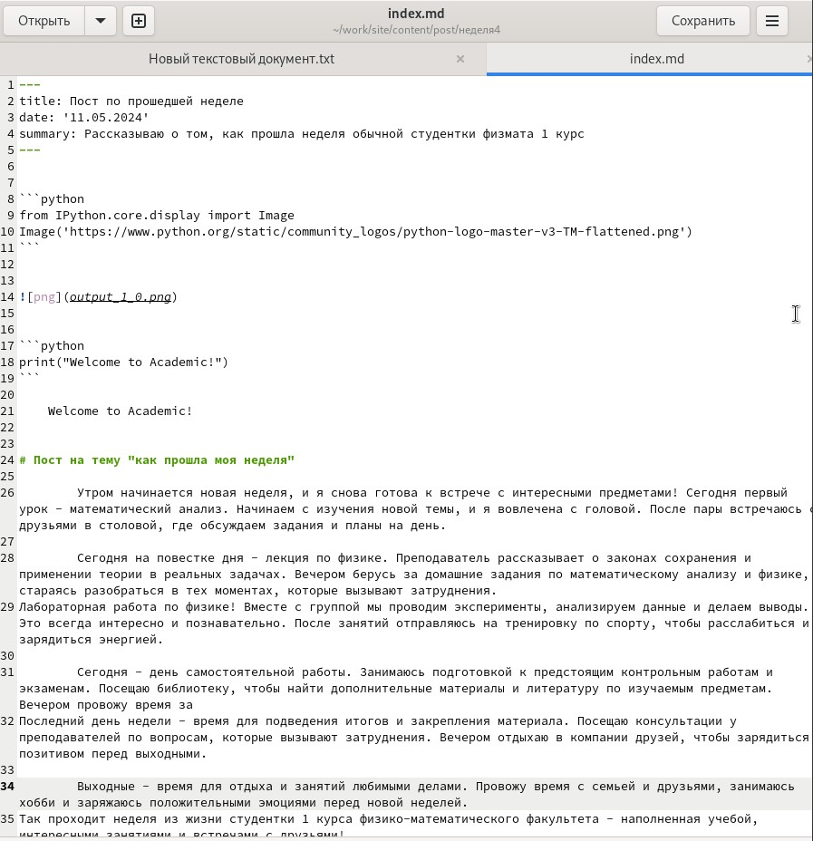
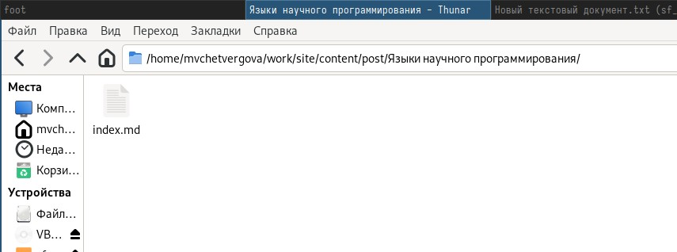
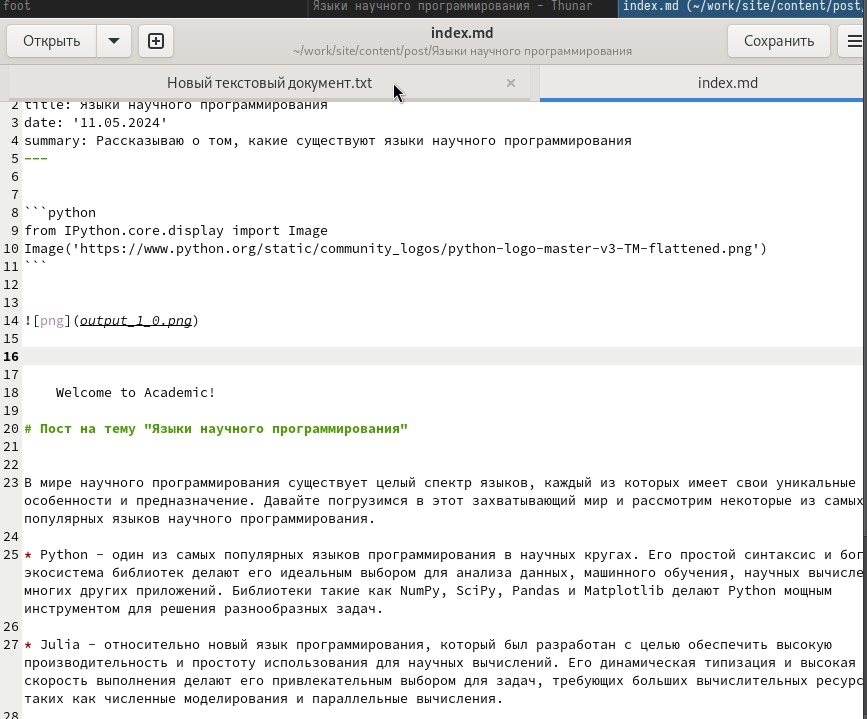

---
## Front matter
title: "Презентация к пятой части индивидуального проекта"
subtitle: "Создание сайта-визитки"
author: "Четвергова М.В."

## Generic otions
lang: ru-RU
toc-title: "Содержание"

## Bibliography
bibliography: bib/cite.bib
csl: pandoc/csl/gost-r-7-0-5-2008-numeric.csl

## Pdf output format
toc: true # Table of contents
toc-depth: 2
lof: true # List of figures
lot: true # List of tables
fontsize: 12pt
linestretch: 1.5
papersize: a4
documentclass: scrreprt
## I18n polyglossia
polyglossia-lang:
  name: russian
  options:
	- spelling=modern
	- babelshorthands=true
polyglossia-otherlangs:
  name: english
## I18n babel
babel-lang: russian
babel-otherlangs: english
## Fonts
mainfont: PT Serif
romanfont: PT Serif
sansfont: PT Sans
monofont: PT Mono
mainfontoptions: Ligatures=TeX
romanfontoptions: Ligatures=TeX
sansfontoptions: Ligatures=TeX,Scale=MatchLowercase
monofontoptions: Scale=MatchLowercase,Scale=0.9
## Biblatex
biblatex: true
biblio-style: "gost-numeric"
biblatexoptions:
  - parentracker=true
  - backend=biber
  - hyperref=auto
  - language=auto
  - autolang=other*
  - citestyle=gost-numeric
## Pandoc-crossref LaTeX customization
figureTitle: "Рис."
tableTitle: "Таблица"
listingTitle: "Листинг"
lofTitle: "Список иллюстраций"
lotTitle: "Список таблиц"
lolTitle: "Листинги"
## Misc options
indent: true
header-includes:
  - \usepackage{indentfirst}
  - \usepackage{float} # keep figures where there are in the text
  - \floatplacement{figure}{H} # keep figures where there are in the text
---

# Цель работы

Дополнение сайта-визитки новой информацией. Получение новых практических навыков по работе с языком разметки МаркДаун и работа в редакторе gedit. 

# Задание

На пятом этапе необходимо выполнить 3 задачи: заполнить информацию о персональных проектах, написать пост по прошедшей неделе и написать пост на тему "языки научного программирования".

# Выполнение лабораторной работы

## 1 задание - добавить информацию о персональных проектах на главную страницу сайта

Для выполнения этого задания я зашла в директорию репозитория, на котором зранятся все данные сайта и его посты. Затем я нашла нужную папку author -> _index.md . Этот текстовый документ отвечает за вид главной страницы сайта.

{#fig:001 width=70%}

Далее за полняем нужный раздел информацией о моих персональных проектах.

{#fig:002 width=70%}

Отлично! Мы справились с первым заданием этого этапа.

## 2 этап - Добавление поста по прошедшей неделе

Для реализации этого задания я нашла директорию post, в которой хранятся все существующие на сайте посты, скопировала один из них и открыла для написания нового поста.

{#fig:003 width=70%}

Далее заполняем данные в файле и пишем в нём сам пост.

{#fig:004 width=70%}

Супер! Мы завершили второе задание этого этапа.

## 3 задание - написать пост на тему "Языки научного программирования"

Для начала откроем файл, в который будем записывать этот пост. Файл и сама папка хранятся в директории post. 

{#fig:005 width=70%}

Затем открываем текстовый файл и пишем пост на тему "Языки научного программирования"

{#fig:006 width=70%}

На этом выполнение заданий подходит к концу. Сохраняем все изменения и отправляем их на репозиторий ГитХаб.

# Выводы

В ходе выполнения пятого этапа индивидуального проекта мы получили ценные теоретические и практические навыки по работе с языком разметки МаркДаун и научились правильно оформлять посты и разделы сайта.

::: {#refs}
:::
