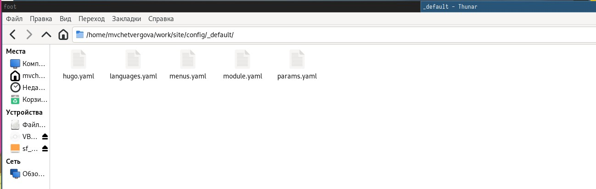
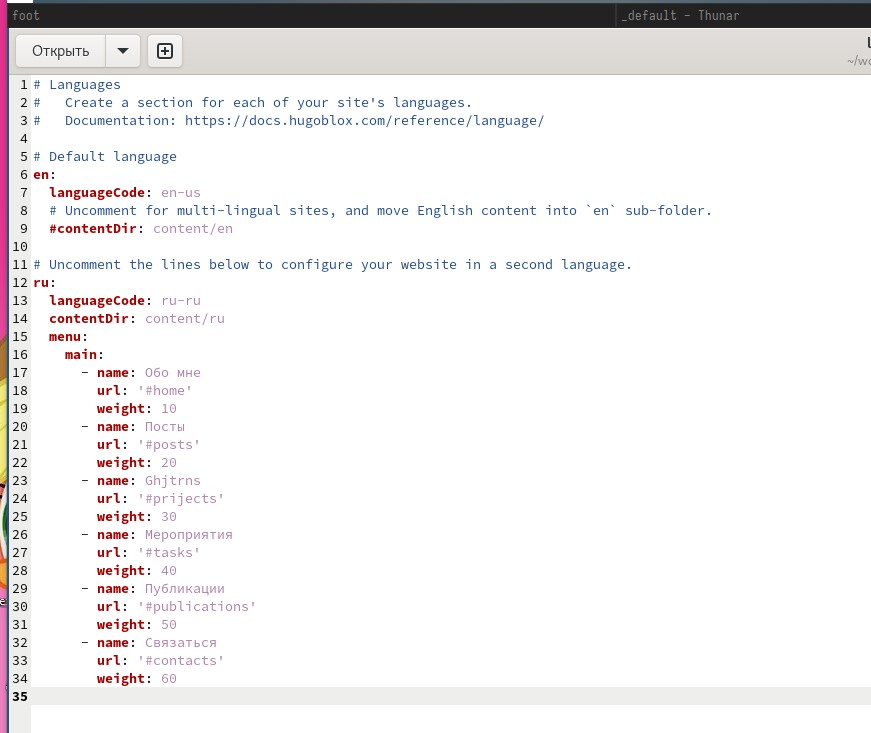
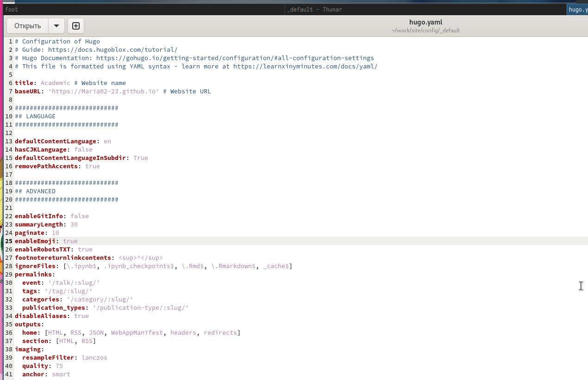
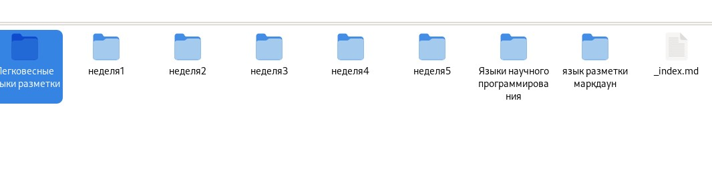
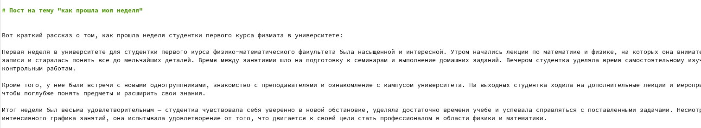
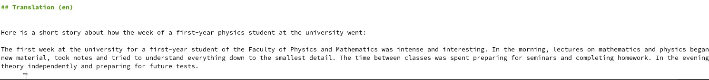
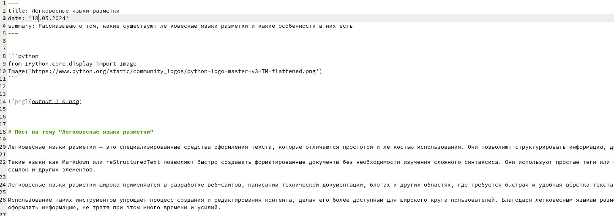
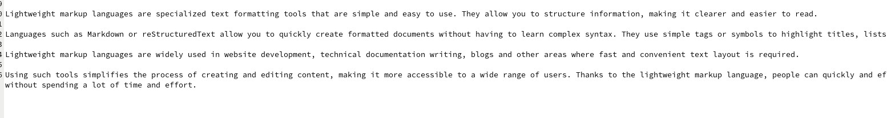

---
## Front matter
lang: ru-RU
title: Презентация к шестой части индивидуального проекта
subtitle: Создание сайта-визитки
author:
  - Четвергова Мария Викторовна
institute:
  - Российский университет дружбы народов, Москва, Россия
date: 18 мая 2024 г.

## i18n babel
babel-lang: russian
babel-otherlangs: english

## Formatting pdf
toc: false
toc-title: Содержание
slide_level: 2
aspectratio: 169
section-titles: true
theme: metropolis
header-includes:
 - \metroset{progressbar=frametitle,sectionpage=progressbar,numbering=fraction}
 - '\makeatletter'
 - '\beamer@ignorenonframefalse'
 - '\makeatother'
 
## Fonts
mainfont: PT Serif
romanfont: PT Serif
sansfont: PT Sans
monofont: PT Mono
mainfontoptions: Ligatures=TeX
romanfontoptions: Ligatures=TeX
sansfontoptions: Ligatures=TeX,Scale=MatchLowercase
monofontoptions: Scale=MatchLowercase,Scale=0.9
---

# Информация

## Докладчик

:::::::::::::: {.columns align=center}
::: {.column width="70%"}

  * Четвергова Мария Викторовна
  * студент НПИбд-02-23
  * Российский университет дружбы народов
  * 1132232886@pfur.ru

:::
::: {.column width="30%"}

:::
::::::::::::::

# Цель работы

Размещение двуязычного сайта на Github. Сайт должен поддерживать как русский, так и английский языки.

# Задание

1. Сделать поддержку английского и русского языков.
2. Разместить элементы сайта на обоих языках.
3. Разместить контент на обоих языках.
4. Сделать пост по прошедшей неделе.
5. Добавить пост на тему по выбору (на двух языках).

# Выполнение лабораторной работы

# 1. Настройка Английского языка на сайте

## 1. Настройка Английского языка на сайте

В первой части выполнения я настроила поддержку английского языка на сайте. 
Для этого перейдём в каталог под адресом work/site_name/config/__default/. В этом каталоге находятся несколько текстовых файлов, отвечающих за возможности сайта. Нам нужно изменить настройки в языке, поэтому нам понадобиться изменить только два из них: hugo.yaml и languages.yaml

{#fig:001 width=70%}

## 1. Настройка Английского языка на сайте
Сначала изменим файл languages.yaml . Для этого переходим в него и переписываем ряд строк. 
Скрипт файла - на скриншоте ниже. Мы изменили несколько строк и позволили программе переводить разделы сайта на английский.

{#fig:002 width=70%}

## 1. Настройка Английского языка на сайте

После этого сохраняем изменения и открываем файл hugo.yaml и немного меняем скрипт файла. 
Результат на скриншоте:

{#fig:003 width=70%}

Отлично! Мы настроили поддержку английского языка и русского языка. Теперь переходим ко второй части этапа - написанию постов.

# 2. Написание постов

## 2. Написание постов

В этом этапе мы напишем два поста: пост по прошедшей неделе и "Легковесные языки разметки". Для начала сохраняем изменения предыдущего этапа и переходим в директорию по адресу site_name/content/post. Там создаём нужные папки для постов и переименовываем их в название поста.

{#fig:004 width=70%}

## 2. Написание постов

Первым делом заполним пост по прошедшей неделе. Переходим в файл index.md соответствующего каталога и пишем пост на русском языке

{#fig:005 width=70%}

## 2. Написание постов

А затем - на английском

{#fig:006 width=70%}

## 2. Написание постов

Сохраняем изменения и выходим из данного каталога. Далее переходим в каталог, посвященный "Легковесным языкам разметки".
Там также заполняем пост на русском

{#fig:007 width=70%}

## 2. Написание постов

И на английском языке:

{#fig:008 width=70%}

Сохраняем изменения и отправляем их на гитхаб с помощью команд git add/commit/push. На этом выполнение 6 этапа проекта подходит к концу.

# Выводы

В ходе выполнения 6 этапа индивидуального проекта по созданию сайта-визитки, мы заполнили оставшиесы разделы сайта и 
настроили его так, чтобы помимо русского языка на нём поддерживался и английский. Таким образом мы выполнили все поставленные задачи: 
Сделали поддержку английского и русского языка, разместили элементы сайта на обоих языках, сделали пост по прошежшей неделе и добавили пост на тему "Легковесные языки разметки". 
Мы не только приобрели важные теоретические навыки по работе с ОС Линукс, но и закрепили их на практике.

::: {#refs}
:::
