---
## Front matter
title: "Отчёт к прохождению курса"
subtitle: "Введение в Linux"
author: "Четвергова Мария Викторовна"

## Generic otions
lang: ru-RU
toc-title: "Содержание"

## Bibliography
bibliography: bib/cite.bib
csl: pandoc/csl/gost-r-7-0-5-2008-numeric.csl

## Pdf output format
toc: true # Table of contents
toc-depth: 2
lof: true # List of figures
lot: true # List of tables
fontsize: 12pt
linestretch: 1.5
papersize: a4
documentclass: scrreprt
## I18n polyglossia
polyglossia-lang:
  name: russian
  options:
	- spelling=modern
	- babelshorthands=true
polyglossia-otherlangs:
  name: english
## I18n babel
babel-lang: russian
babel-otherlangs: english
## Fonts
mainfont: PT Serif
romanfont: PT Serif
sansfont: PT Sans
monofont: PT Mono
mainfontoptions: Ligatures=TeX
romanfontoptions: Ligatures=TeX
sansfontoptions: Ligatures=TeX,Scale=MatchLowercase
monofontoptions: Scale=MatchLowercase,Scale=0.9
## Biblatex
biblatex: true
biblio-style: "gost-numeric"
biblatexoptions:
  - parentracker=true
  - backend=biber
  - hyperref=auto
  - language=auto
  - autolang=other*
  - citestyle=gost-numeric
## Pandoc-crossref LaTeX customization
figureTitle: "Рис."
tableTitle: "Таблица"
listingTitle: "Листинг"
lofTitle: "Список иллюстраций"
lotTitle: "Список таблиц"
lolTitle: "Листинги"
## Misc options
indent: true
header-includes:
  - \usepackage{indentfirst}
  - \usepackage{float} # keep figures where there are in the text
  - \floatplacement{figure}{H} # keep figures where there are in the text
---

# Цель работы

Изучить основы Линукса, научиться ориентироваться в ОС ядра Линукс и углубиться в тему его возможностей. Этот курс должен дать практические базовые знания по работе с ним и дать представление о том, как работать с операционными системами типа Линукс.

# Задание

Пройти все 3 этапа курса. Для получения аттестата нужно 121 балл - их я буду зарабатывать в ходе выполнения заданий и тестов. Важной целью является приобратение теоретических и  практических навыков по работе с ОС Линукс.

# Выполнение заданий курса

## 1 этап - "Введение"

###1 Шаг:

В самом первом уроке преподаватель объяясняет, по какому принципу будут проходить занятия: вся работа самостоятельна и без дедлайнов. Помимо текстовых инструкций будут даны и короткие видео с пояснениями и комментариями. Объясняется принцип работы платформы Степик и то, как отвечать на вопросы.

Первая страница курса выглядит следующим образом: 

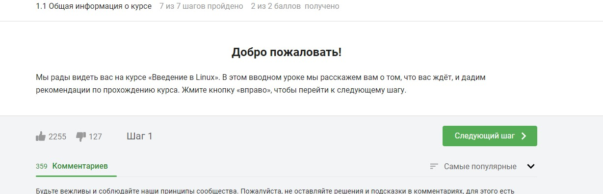{#fig:001 width=50%}

При прохождении первого шага предлагается написать комментарий и ответить на вопросы в тесте. Есть и видеоинструкция по работе с платформой.

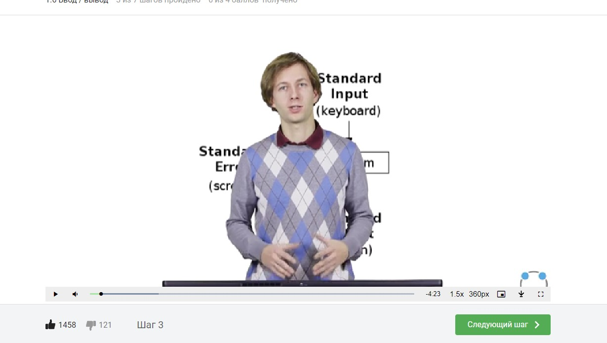{#fig:002 width=50%}

Пример прохождения теста в данном шаге:

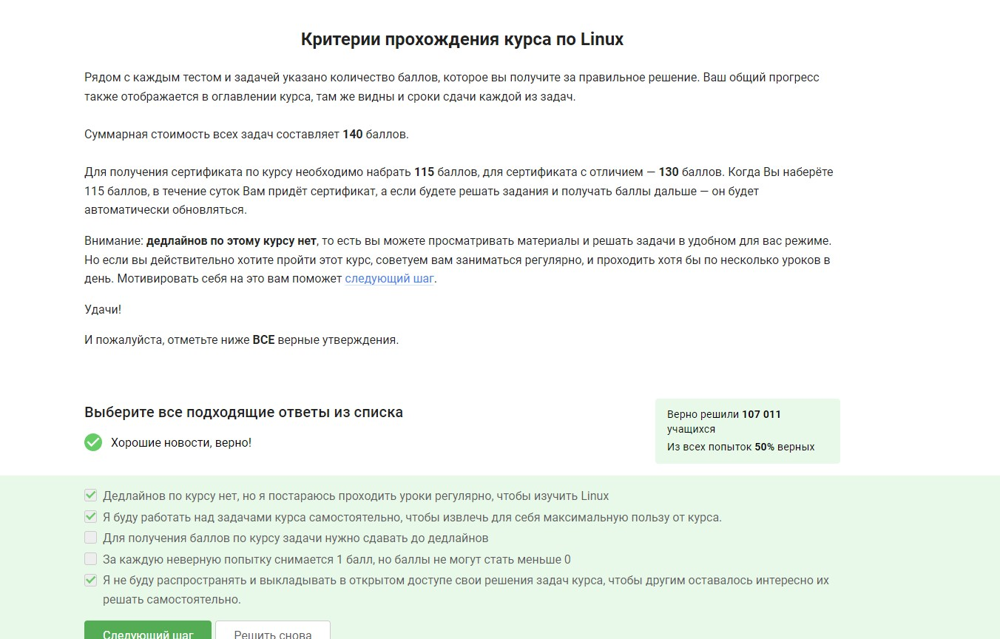{#fig:003 width=50%}

На этом первый шаг заканчивается. В ходе его выполнения мы научились раьотать с платформой Степик.

### 2 Шаг: 

Второй шаг первого этапа состоит из рекомендаций по установке ОС Линукс. Преподаватель объясняет все тонкости работы с этой системой и показывает на своём примере верный ход действий.

Пример видео-урока по установке ОС Линукс

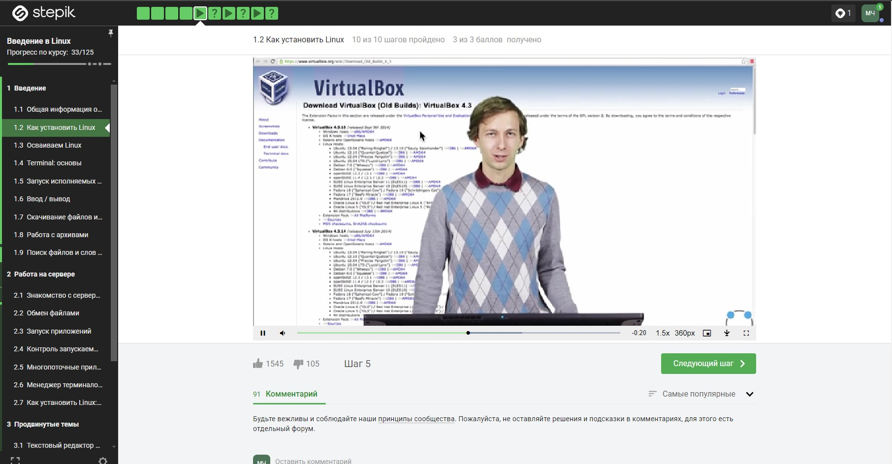{#fig:004 width=50%}

После видео был дан тест на закрепление полученных знаний

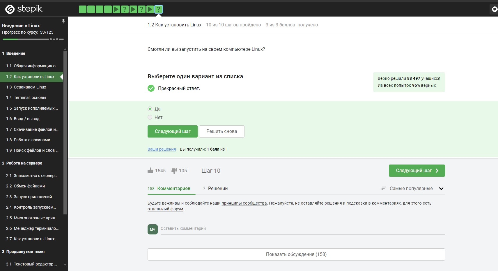{#fig:005 width=50%}

После установки шаг 2 закончился. 

### 3 Шаг:

 На этом занятии мы познакомились с основными приложениями из панели быстрого запуска Linux. Для начала научились просматривать, создавать и удалять файлы и папки через файловый менеджер. Познакомились с простым и более продвинутым текстовыми редакторами. Узнали, как создавать документы с электронными таблицами и как выходить в интернет. В конце занятия были рассмотрены способы установки новых программ на компьютер.

Пример текстовой инструкции по теме и вступления:

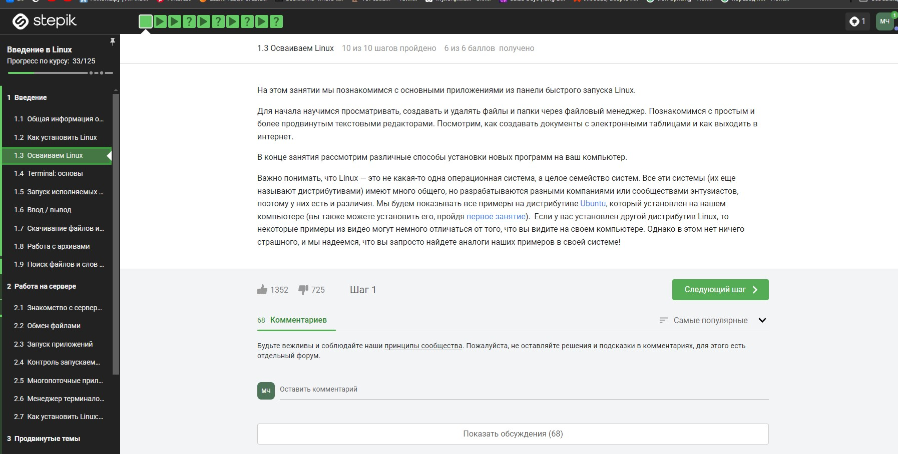{#fig:006 width=50%}

Пример видеоурока по теме:

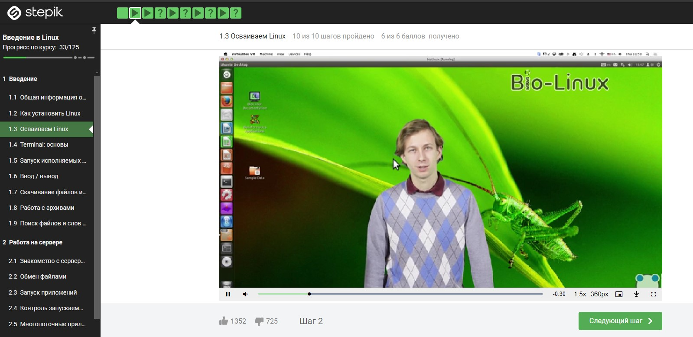{#fig:007 width=50%}

Пример теста по теме третьего шага:

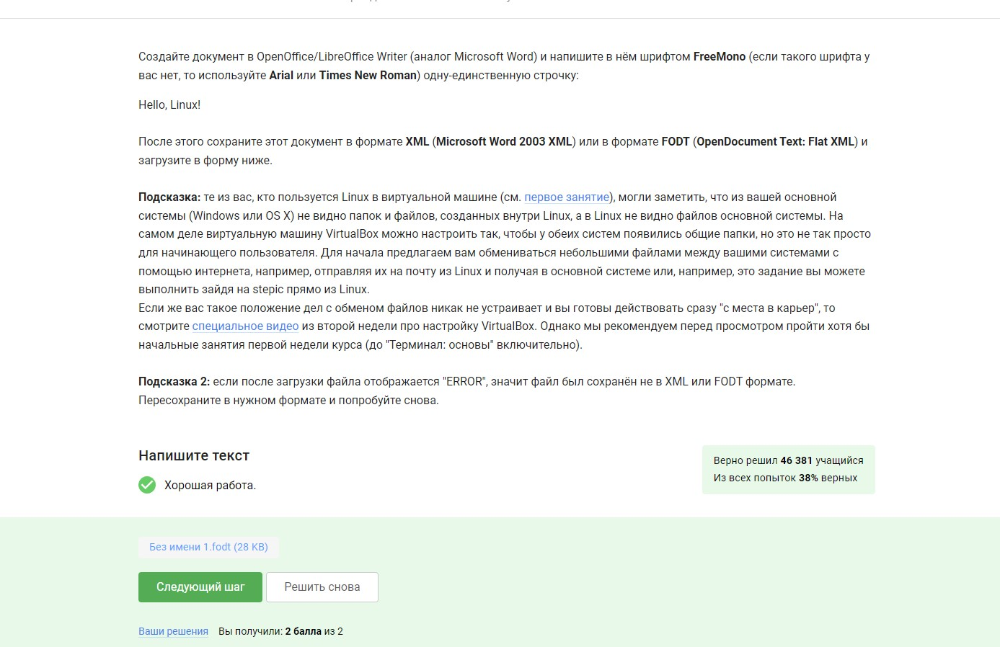{#fig:008 width=50%}

В ходе выполнения  заданий из шага №4 были приобретены ценные теоретические и практическре навыки по работе с основными приложениями Линукс.

### 4 Шаг:

На этом занятии мы научились запускать Terminal, а также изучили несколько базовых команд для работы в нём. Мы привыкли работать на компьютере, кликая с помощью мышки на иконки и выбирая пункты в различных меню. Однако есть и другой подход, который позволяет отдавать команды компьютеру, вводя их с помощью клавиатуры в специальную программу Terminal. Поначалу это будет непривычно и, возможно, даже неудобно, но вскоре мы поймем преимущество именно такого подхода.

Пример текстового введения 4 шага:

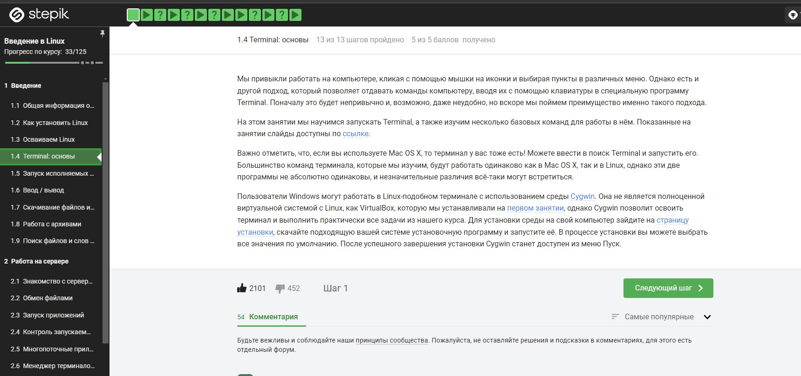{#fig:009 width=50%}

Пример видеоурока к 4 Шагу:

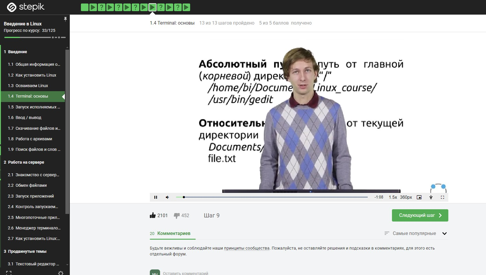{#fig:010 width=50%}

Пример теста к 4 шагу:

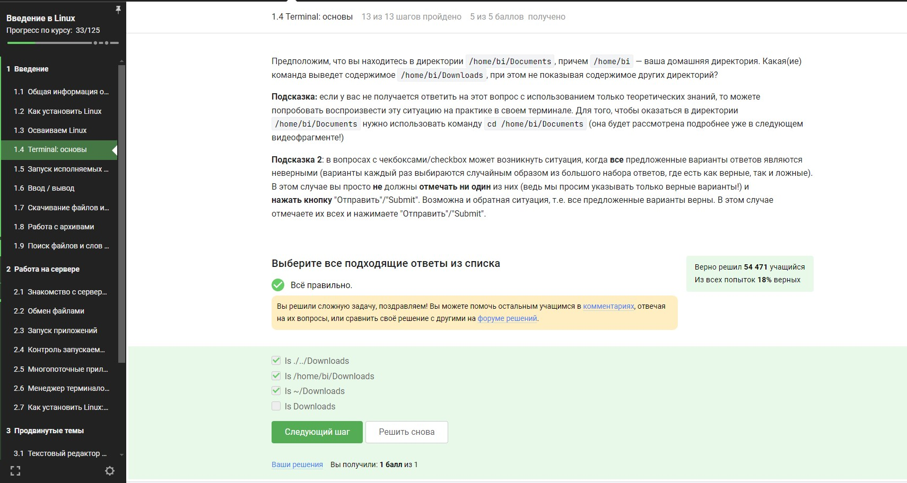{#fig:011 width=50%}

### 5 Шаг:

На этом занятии мы научимся запускать программы из командной строки. Сделаем это как для уже установленных в системе приложений (например, Firefox), так и скачанных из интернета или написанных нами программ. Будут рассмотрены возможности прервать или приостановить запущенную программу, а также запустить сразу несколько приложений одновременно.  

Пример текстового введения 5 шага:

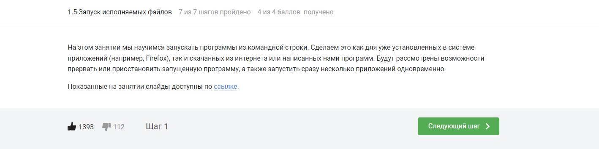{#fig:012 width=50%}

Пример видеоурока к 5 Шагу:

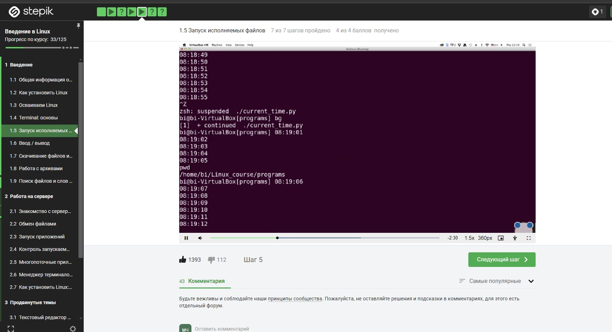{#fig:013 width=50%}

Пример теста к 5 шагу:

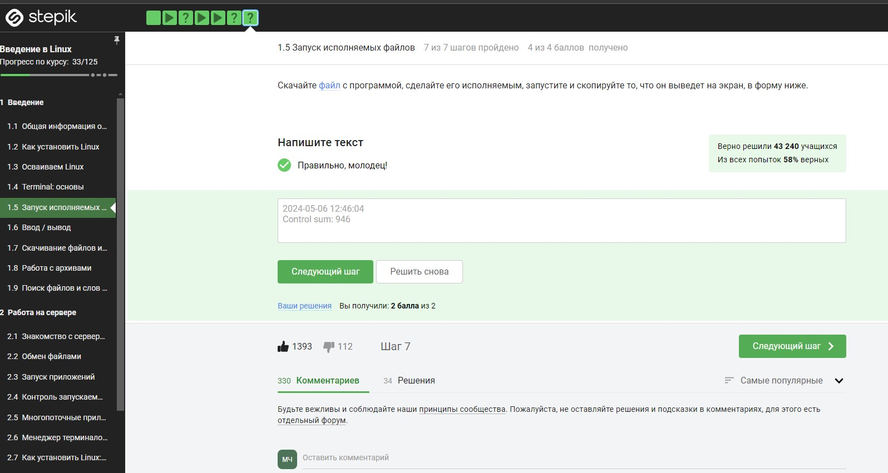{#fig:014 width=50%}

### 6 Шаг:

Большинство программ, запущенных в терминале, активно взаимодействует с пользователем: они требуют от него некоторые данные на вход, сообщая результаты своей работы на выходе. Чаще всего для ввода данных используется клавиатура, а результаты выводятся на экран. Однако это не всегда может быть удобно. Мы научимся передавать приложению входные данные не с клавиатуры, а из файла, а также записывать (перенаправлять) результаты его выполнения и возникшие при этом ошибки не на экран, а в файл или несколько файлов.

Пример видеоурока к 6 Шагу:

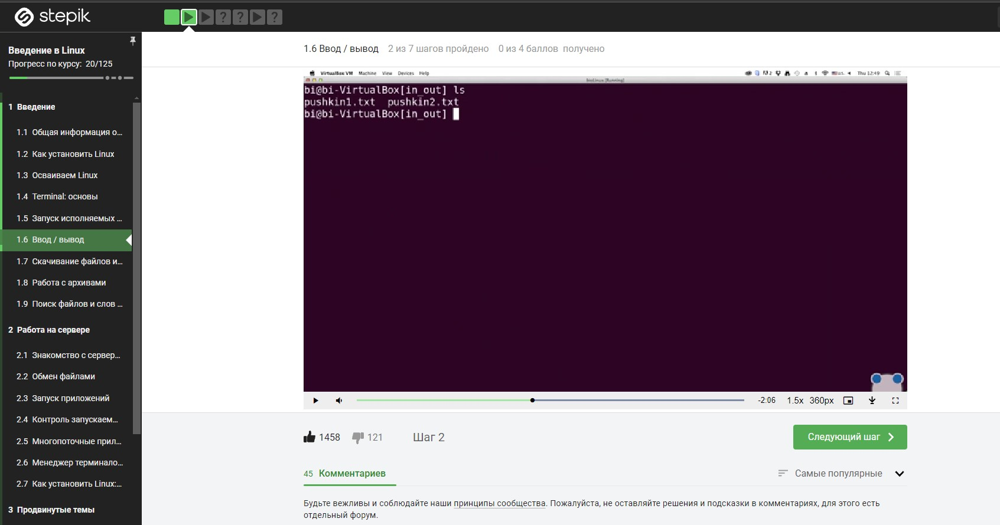{#fig:015 width=50%}

Пример теста к 6 шагу:

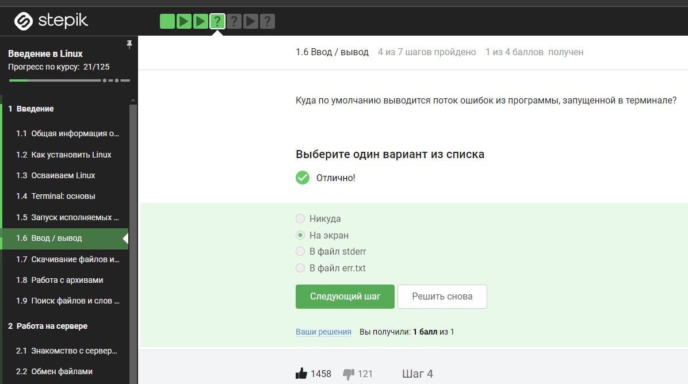{#fig:016 width=50%}

### 7 шаг:

Скачивать файлы из интернета можно не только через браузер, но и через терминал. На этом занятии мы научимся это делать при помощи команды wget. 
Эта программа очень многофункциональна, но мы рассмотрим только основные её возможности. Однако для прохождения всех тестовых заданий вам нужно будет посмотреть справку по wget, чтобы ознакомиться с этой программой подробнее!

Пример видеоурока к 7 Шагу:

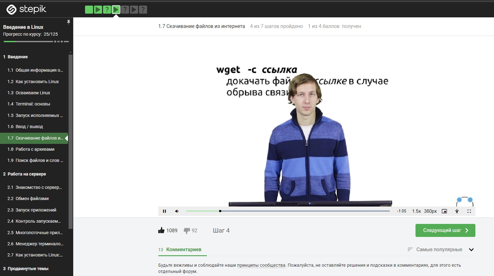{#fig:017 width=50%}

Пример теста к 7 шагу:

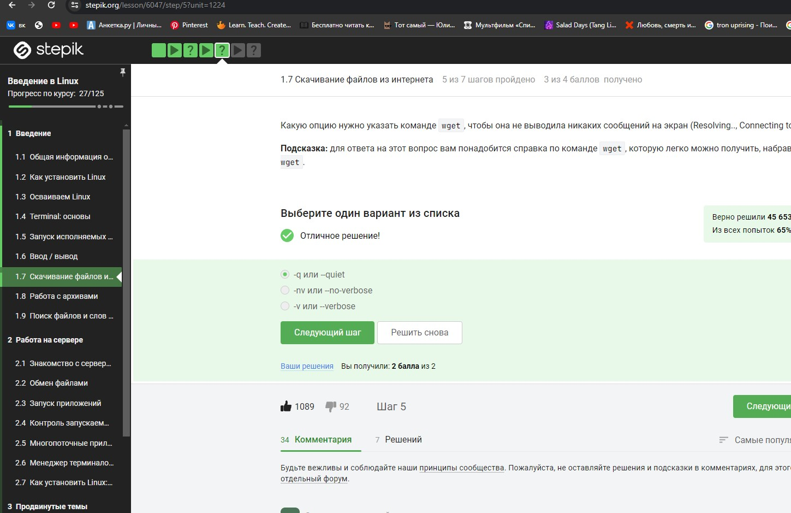{#fig:018 width=50%}

### 8 Шаг: 

Иногда нам нужно передать по почте или скачать из интернета очень большой файл. Или на нашем жестком диске заканчивается место и хочется, чтобы некоторые файлы занимали поменьше пространства. В этом случае нам на помощь могут прийти специальные программы — архиваторы. Они позволяют записывать хранящуюся в файлах информацию в более компактном виде, т. е. уменьшить их размер без потери информации. Обработанные архиватором данные (файлы и папки) помещаются в файл, который называется архив, а сам процесс обработки называется архивированием (сжатием, запаковыванием). Размер архива зависит от того, какая информация была в исходных данных: например, тексты сжимаются очень хорошо (архив может иметь размер в десятки раз меньше, чем исходный файл), а видео-файлы почти не сжимаются.И мы познакомимся с несколькими архиваторами и научимся работать с ними в терминале: будем как создавать архивы, так и распаковывать их, т. е. получать из архива исходные файлы и папки.

Пример видеоурока к 8 Шагу:

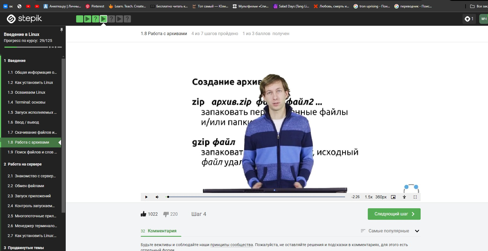{#fig:019 width=50%}

Пример теста к 8 шагу:

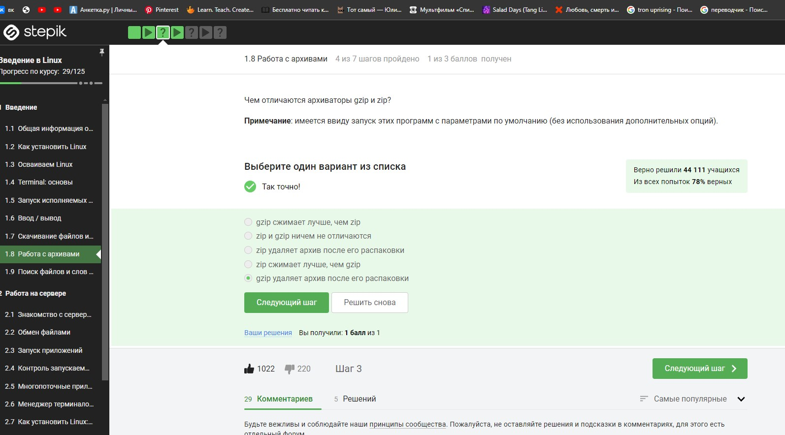{#fig:020 width=50%}

### 9 Шаг:

Терминал предоставляет мощные инструменты для поиска данных. Мы научимся использовать их как для поиска файлов (по имени или даже части имени или расширения), так и для поиска слов в файле или сразу нескольких файлах.

Пример видеоурока к 9 Шагу:

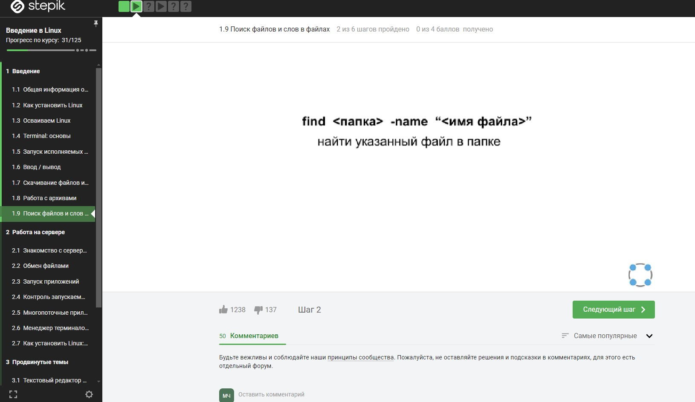{#fig:021 width=50%}

Пример теста к 9 шагу:

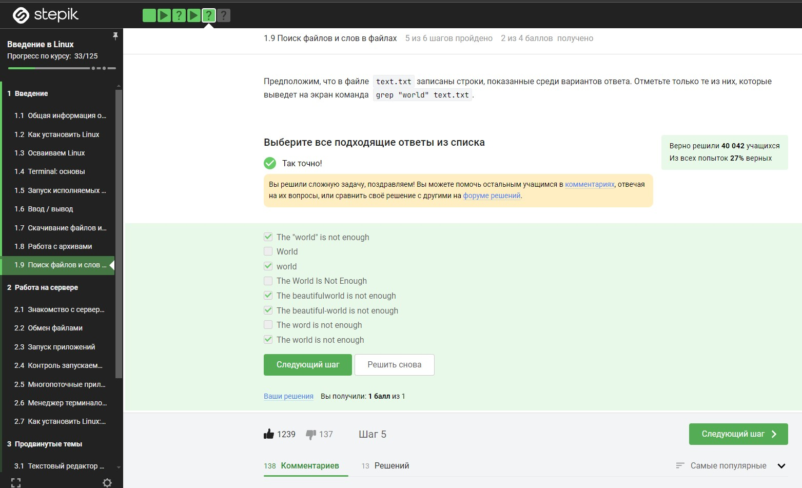{#fig:022 width=50%}

### Вывод  к 1 этапу курса:

В ходе выполнения первого этапа курса мы освоили самые базовые навыки работы с ОС Линукс. Мы научились устанавивать Линукс на Свою ОС с помощью виртуальной машины ВиртуалБокс, Пользоваться командной строкой, запускать приложения и файлы, скачивать и искать нужную информацию. Видеоуроки длятся недолгл (1-4 мин), но несут в себе много знаний и примеров использования этих команд. Задание в конце первого этапа затрагивает все пройденные темы и заставляет полумать. Мне понравился первый этап курса: я многому научилась.

## Этап 2 "Работа на сервере"

Целью данного этапа курса является обучение пользователей работе на сервере. Мы приобретём навыки по работе с файлами на сервере и научимся их открывать, копировать, пересылать другим пользователям и т.д. Также в конце курса представлена удобная инструкция по установлению ОС Linux на свой компьютер. Это может пригодиться тем, кому ОС Linux понравилась настолько сильно, что её хочется сделать основной ОС.  Этап состоит из 7 шагов. Пройдём их по порядку.

### 1 Шаг "Знакомство с сервером"

На первом занятии второго этапа мы обсудим, что такое сервер и зачем на нем работать. Кроме того, мы рассмотрим два способа войти на удаленный сервер с помощью терминала.
Преподаватель объясняет терминологию и показывает, какие команды и когда вводить, чтобы получить ту или иную информацию о сервере. 

Пример видеоурока к 1 Шагу:

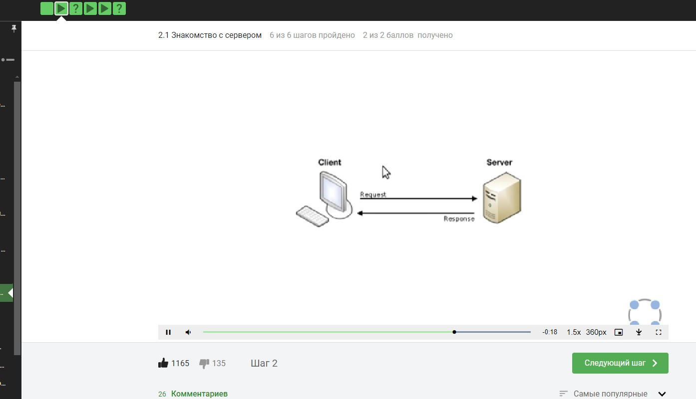{#fig:023 width=50%}

Пример задания к 1 шагу:

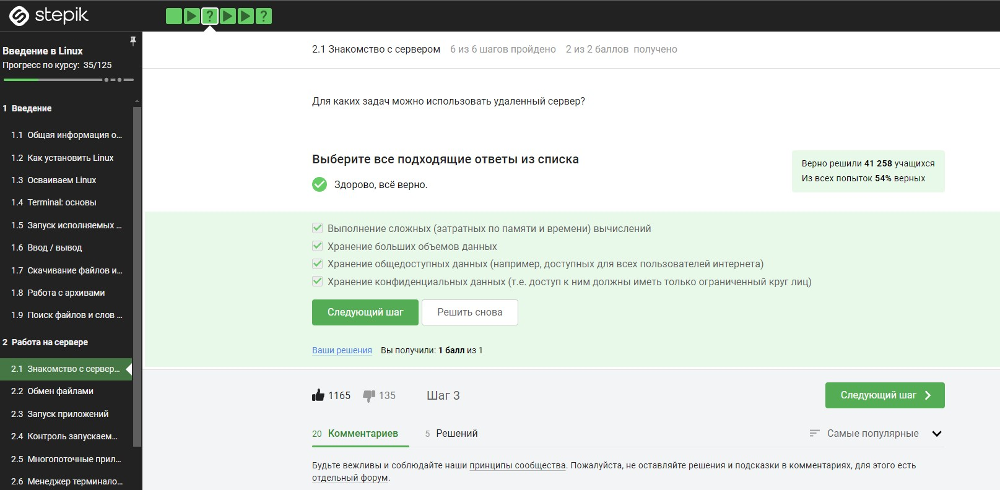{#fig:024 width=50%}

### 2 Шаг "Обмен файлами"

В ходе этого урока мы узнаём, как происходит процесс обмена файлами на сервере. Для полноценной работы на удаленном сервере нужно уметь не только заходить на него с компьютера-клиента, но и обмениваться файлами как в одну, так и в другую сторону. На этом занятии мы рассмотрим два способа обмена файлами: с использованием терминала и при помощи графического приложения Filezilla. 
Кроме того, на этом занятии будет рассмотрен новый способ установки программ на Linux. Этот подход использует терминал и не требует графического приложения, поэтому он может быть успешно применен как на своем локальном компьютере, так и на удаленном сервере.

Пример видеоурока к 2 Шагу:

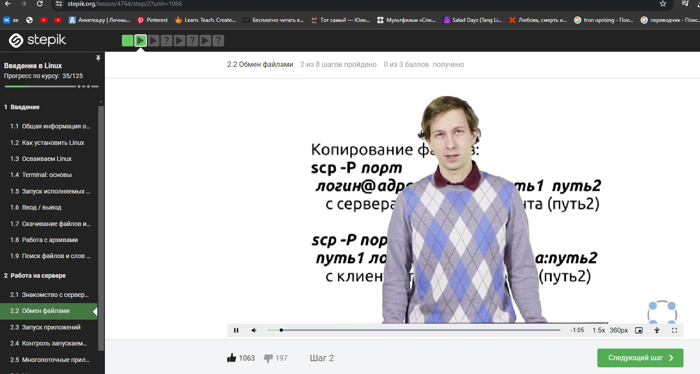{#fig:025 width=50%}

Пример теста к 2 шагу:

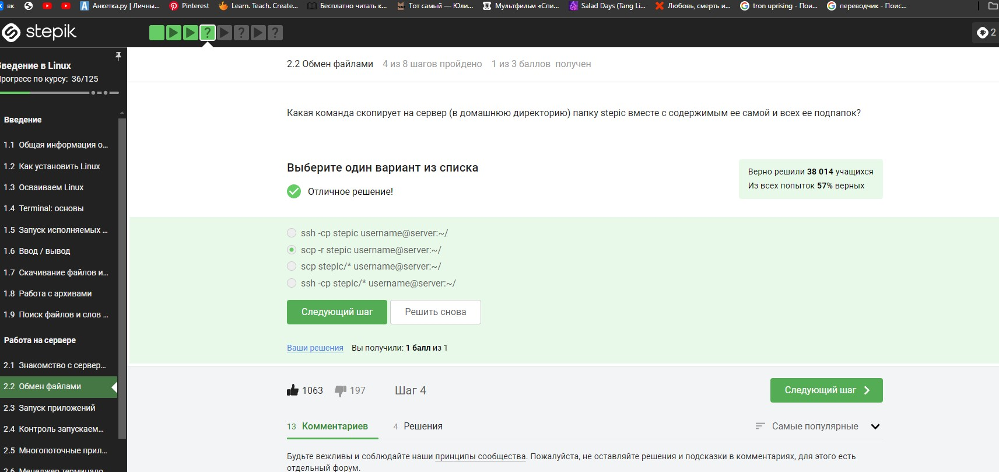{#fig:026 width=50%}

### 3 Шаг "Запуск приложений"

Для полноценной работы на сервере нужно уметь не только зайти на него и обменяться с ним файлами, но и запускать приложения на нем. На этом занятии мы рассмотрим несколько примеров таких запусков. С приложениями, работе которых необходим только терминал, особых сложностей у нас не возникнет.

Пример видеоурока к 3 Шагу:

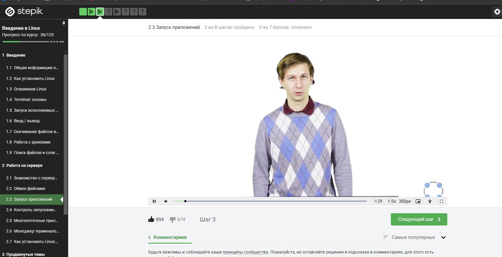{#fig:027 width=50%}

Пример теста к 3 шагу:

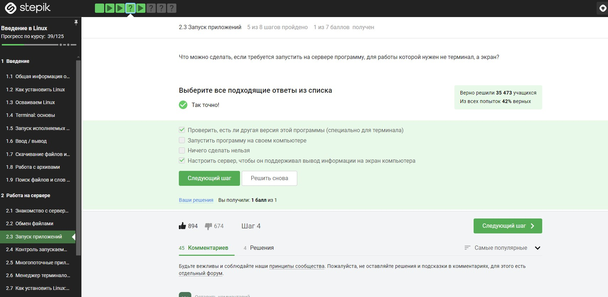{#fig:028 width=50%}

### 4 Шаг "Контроль запускаемых программ"

На данном занятии рассматривается тема открытия приложений на сервере и их контроль. Дело в том, что обычно на сервере могут одновременно работать очень много пользователей. Кроме того, каждый из них может загружать сервер множеством задач. Чтобы не мешать друг другу, каждый пользователь должен уметь контролировать все запущенные им программы. На этом занятии мы научимся следить за приложениями, запускать их в фоновом и основном режимах, и, наконец, отменять некоторые из запусков в случае необходимости.

Пример видеоурока к 4 Шагу:

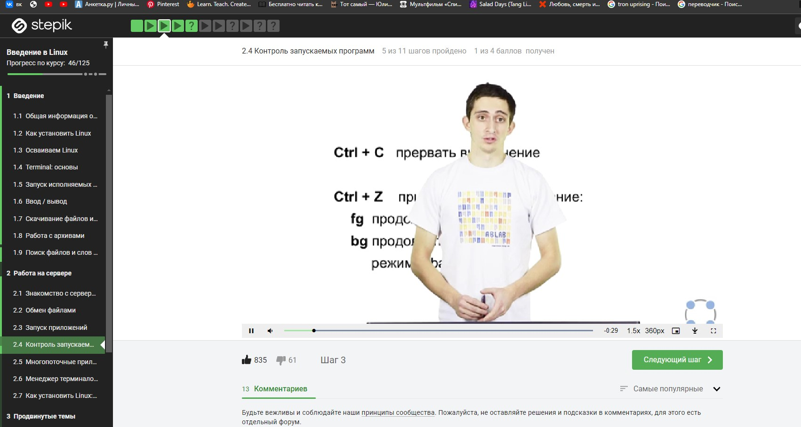{#fig:029 width=50%}

Пример теста к 4 шагу:

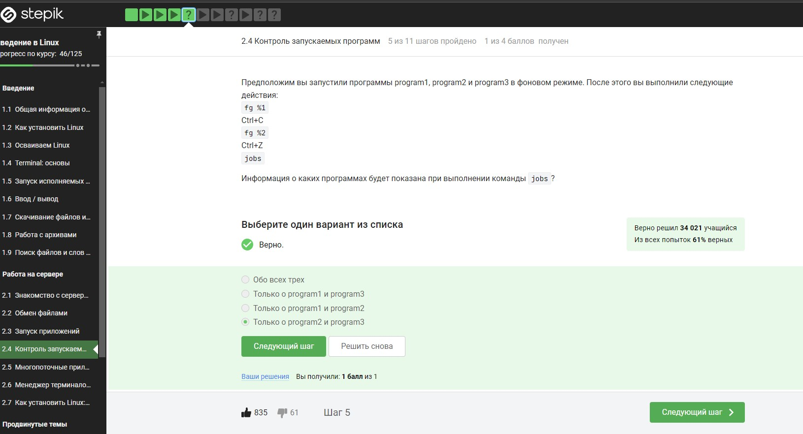{#fig:030 width=50%}

### 5 Шаг "Многопоточные приложения"

На этом занятии мы обсудим понятие потоков и процессов, без которых практически невозможно представить обработку больших объемов данных. Запуск и контроль многопоточного
приложения рассмотрен на примере программы bowtie2.

Пример видеоурока к 5 Шагу:

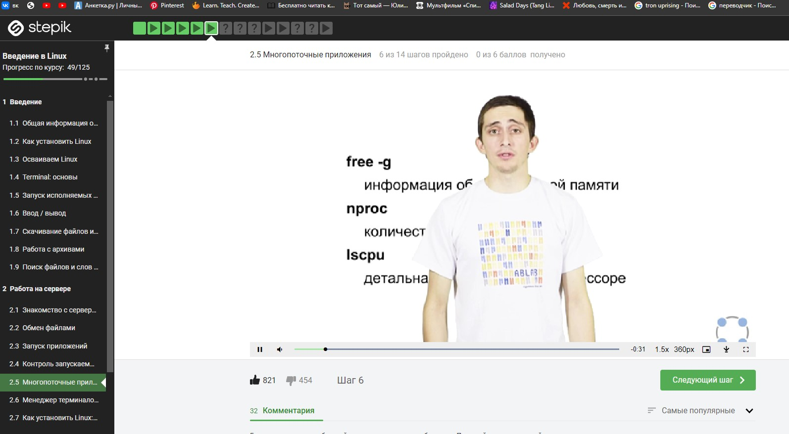{#fig:031 width=50%}

Пример теста к 5 шагу:

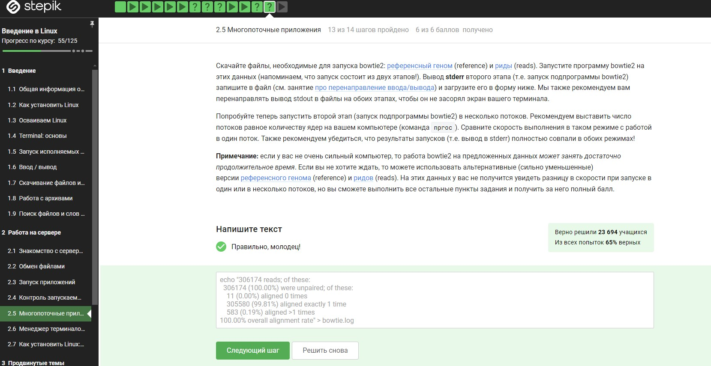{#fig:032 width=50%}

### 6 Шаг "Менеджер терминалов tmux"

В ходе этого занятия мы обсудили важную тему: менеджер терминалов tmux. Это специальная программа, которая может объединять в себе несколько терминалов, каждый из которых содержит свои процессы. Важная особенность tmux заключается в том, что если запустить его на сервере, то он будет помнить историю запусков процессов и они продолжат выполнение даже если соединение с сервером будет потеряно. Кроме того, при новом соединении с сервером можно будет подключиться к уже запущенному tmux и продолжить работу с момента потери связи.

Пример видеоурока к 6 Шагу:

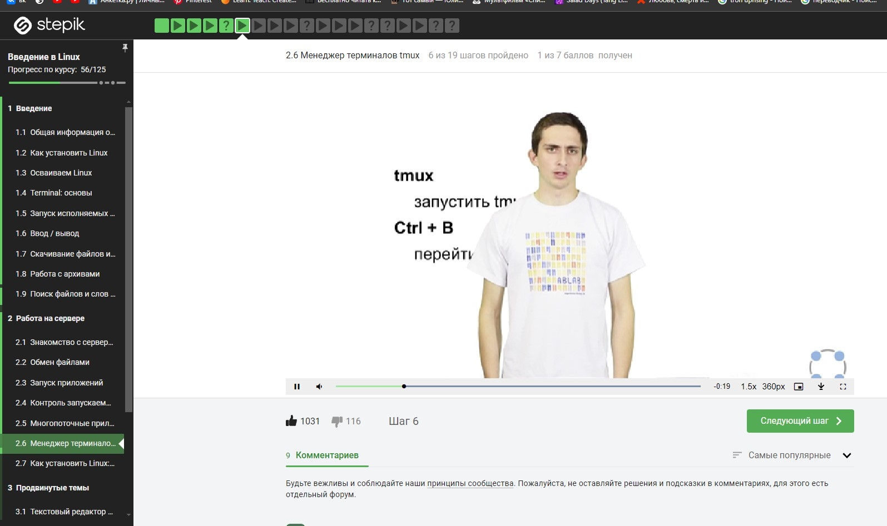{#fig:033 width=50%}

Пример теста к 6 шагу:

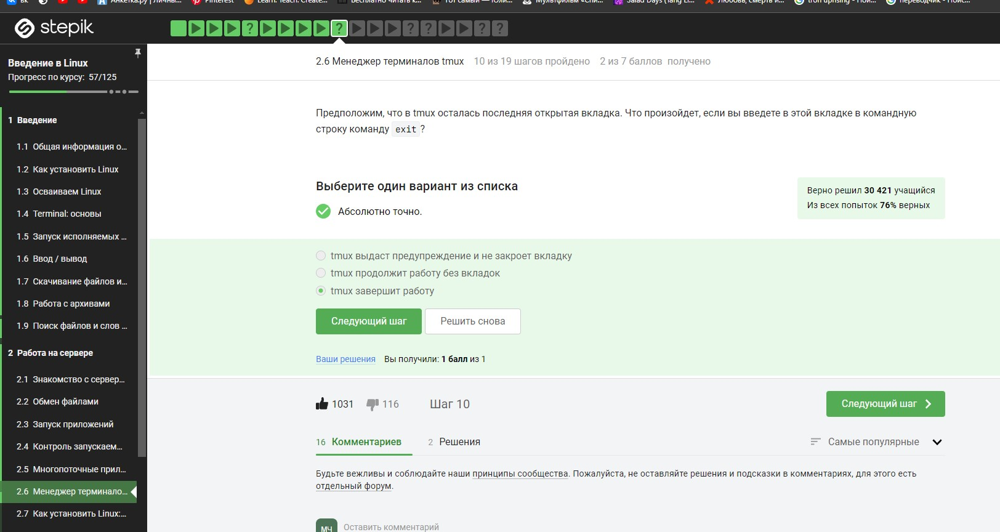{#fig:034 width=50%}

### 7 Шаг 

Этот шаг необязателен для прохождения курса: в нём нет тестов и проверки знаний. Преподаватель просто объясняет,как установить Линукс на свой компьютер (  не на виртуальную машину, а как основную ОС ). Я не буду устанавливать ОС Линукс на свой ноутбук, но всё равно посмотрю видео-инструкции в образовательных целях. 

Пример видеоурока к 7 Шагу:

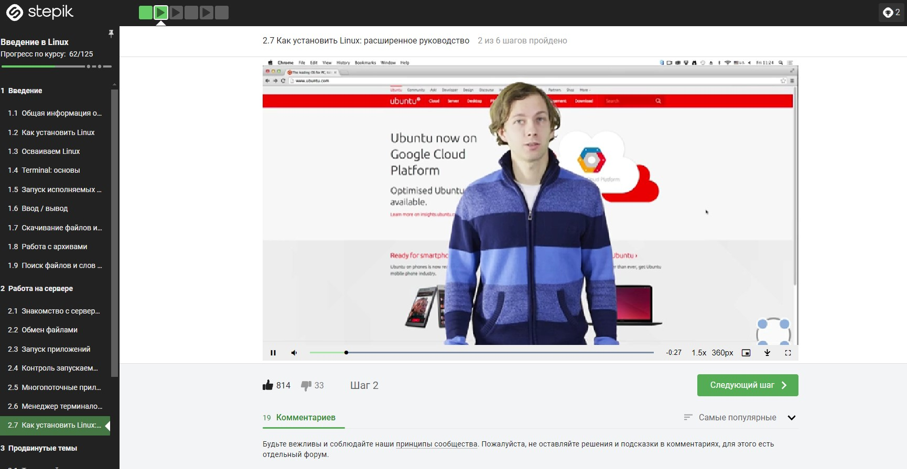{#fig:035 width=50%}

Пример текстовой инструкции к 7 Шагу:

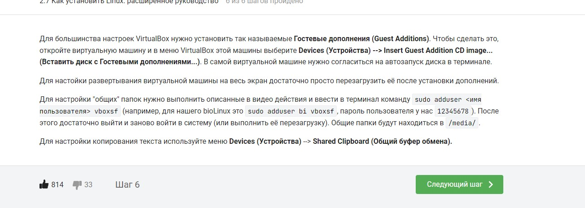{#fig:036 width=50%}

##Вывод ко 2 этапу курса

В ходе прохождения второго этапа я набралась действительно ценных теоретических и практических знаний по работе с ОС Линукс.  В каждом занятии после видеоурока был представлен тест на закрепление материала. Вопросы в этих тестах местами были каверзными и на решение уходило больше времени, чем планировалось. Периодически возникали и практические задания, требующие практического применения навыков, приобретённых из всех уроков ранее. Решать такие задания было не столько сложно, сколько интересно и необычно. Мне очень понравился второй шаг. Я не согласна  с тем, что авторы адресуют его тем, кто только начинает работать в ОС Линукс. Всё-таки этот курс больше подойдёт тем, кто уже знает самые базовые команды и приложения на Линукс, но хочет расширить кругозор и узнать что-то новое. Второй этап оказался более полным, чем первый. Очень интересно и удобно проходить такие курсы. Спасибо!

## Этап 3 "Продвинутые темы"

На этом этапе мне предстояло изучить темы, которые считаются более сложными при изучении основ ОС Линукс. Затрагивается программирование на языке bash, текстовый редактор vim и некоторые дополнительные темы, которые включены в отдельный урок. В третьем разделе очень много практики и возможностей самому, например, написать код для решения задачи. Подробнее о каждом шаге - далее.

### 1 Шаг

Третья неделя курса посвящена более сложным и интересным темам, таким, как редактор Vim, интерпретатор bash и другие приложения.

Пример видеоурока к  1 Шагу:

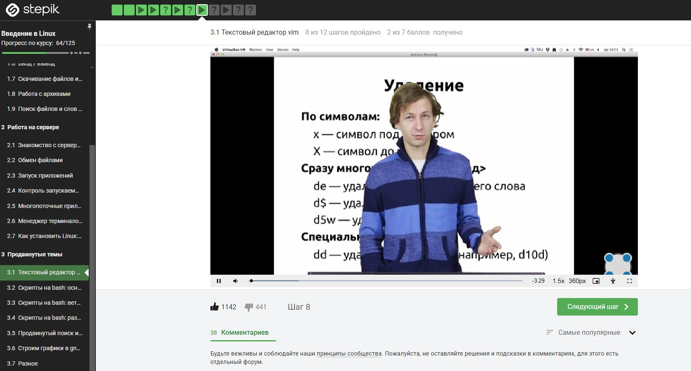{#fig:037 width=50%}

Пример теста к  шагу:

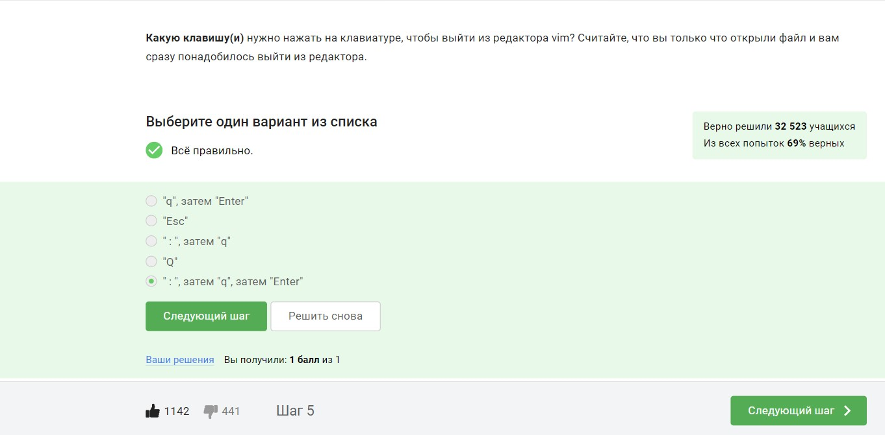{#fig:038 width=50%}

###2 Шаг

Это занятие открывает мини-курс из трех занятий по программированию на bash. Начнем мы с обсуждения, что такое программирование вообще и что такое bash. Затем перейдем и к практической части -- посмотрим, что должна включать в себя программа (скрипт) на bash, напишем первый простой скрипт и запустим его в терминале. Ближе к концу занятия рассмотрим и попробуем на практике такие понятия как переменные и аргументы скрипта.

Пример видеоурока к 2  Шагу:

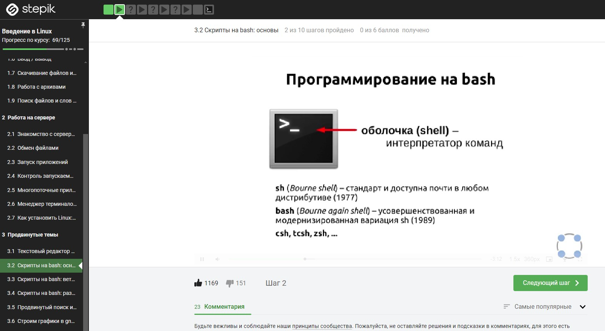{#fig:039 width=50%}

Примеры решения заданий к 2 шагу:

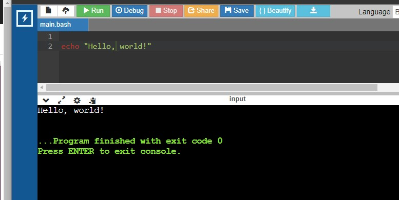{#fig:040 width=50%}

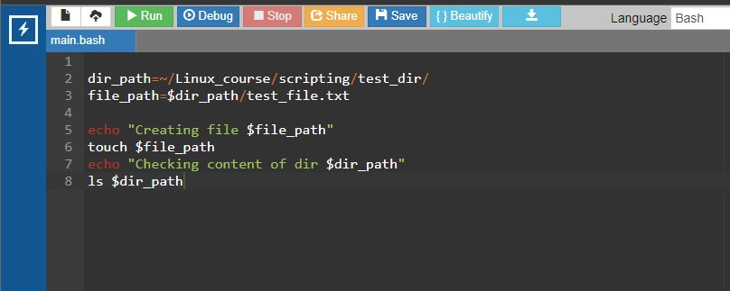{#fig:041 width=50%}

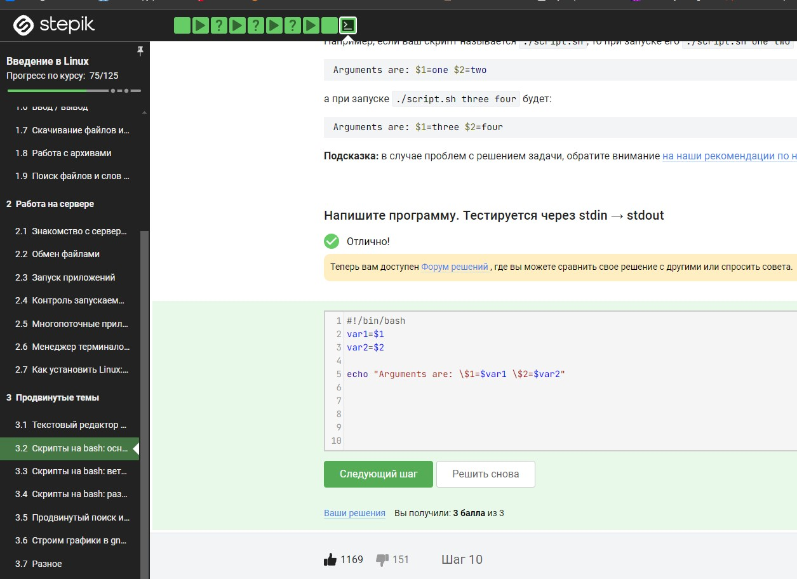{#fig:042 width=50%}

### 3 Шаг

Скрипты, которые мы писали на предыдущем занятии были прямолинейны, т.е. все инструкции в них выполнялись последовательно от первой до последней. Однако такое поведение подходит далеко не всегда. На этом занятии мы изучим управляющие конструкции языка bash, которые позволят нам писать скрипты, где часть инструкций выполняется только при определенных условиях (ветвления), а часть инструкций выполняется по много раз подряд (циклы).

Пример видеоурока к 3  Шагу:

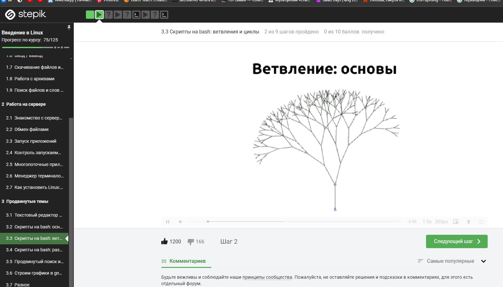{#fig:043 width=50%}

Пример теста к 3 шагу:

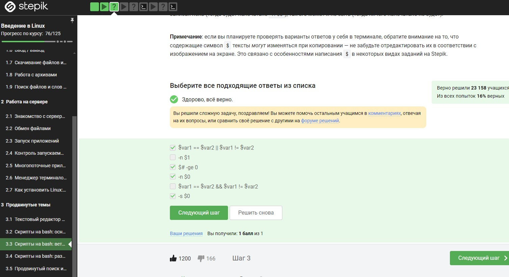{#fig:044 width=50%}

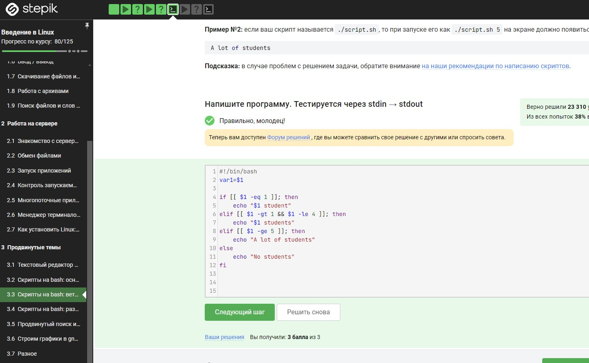{#fig:045 width=50%}

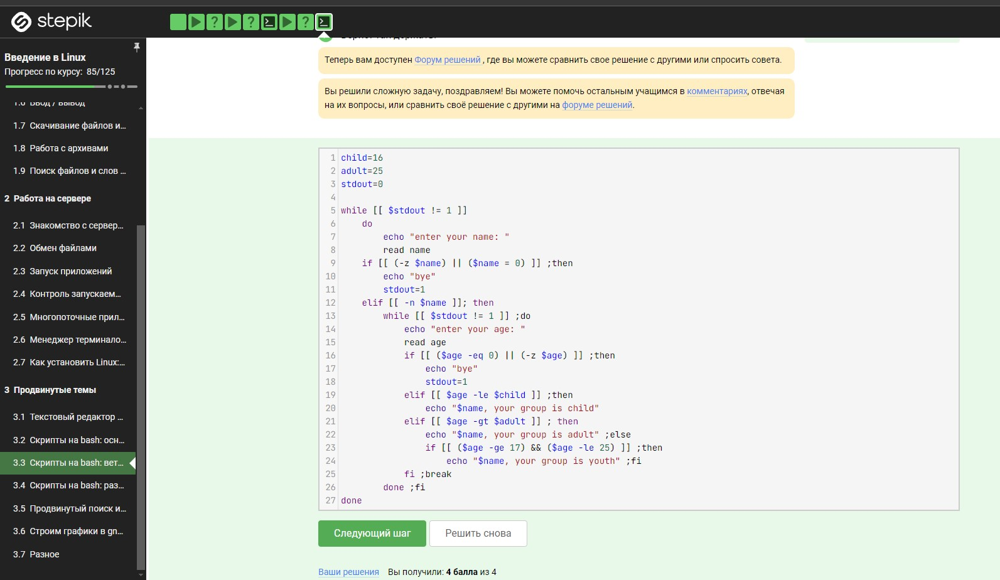{#fig:046 width=50%}

### 4 Шаг

На этом занятии мы заканчиваем изучение основ программирования на bash. С использованием уже пройденного материала можно написать довольно сложные и полезные скрипты на bash, но на этом занятии будет рассмотрено еще несколько полезных тем. Среди них будут: арифметические операции;  запуск внешних программ и обработка результатов их работы; понятие функций в языке bash и их использование.

Пример видеоурока к 4 Шагу:

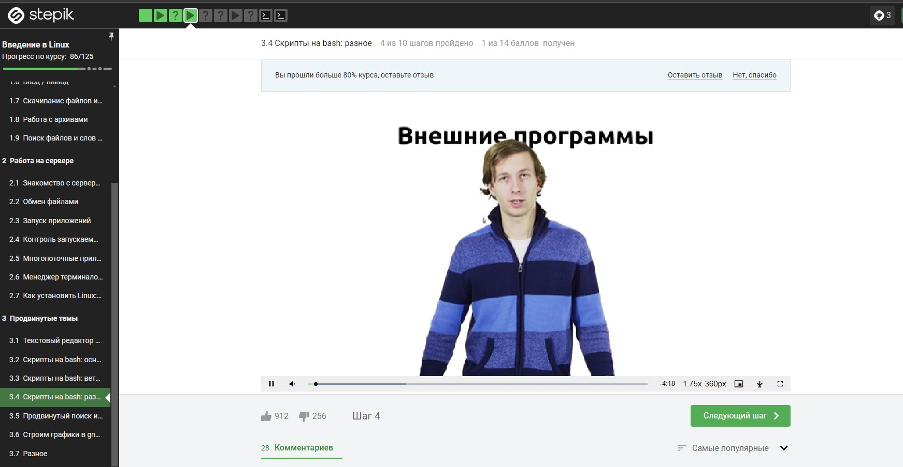{#fig:047 width=50%}

Пример теста к 4 шагу:

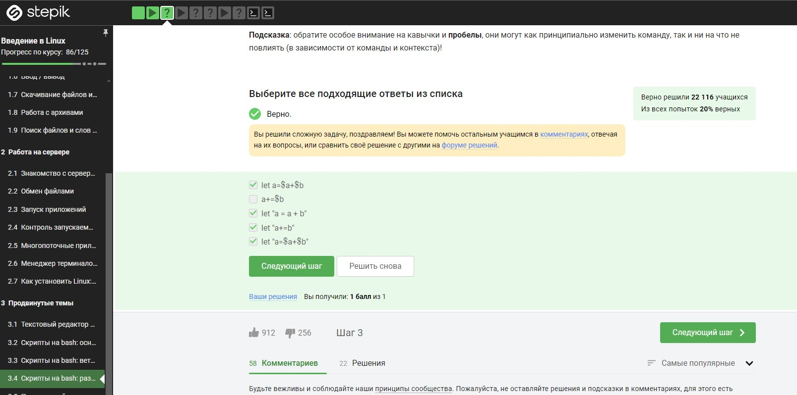{#fig:048 width=50%}

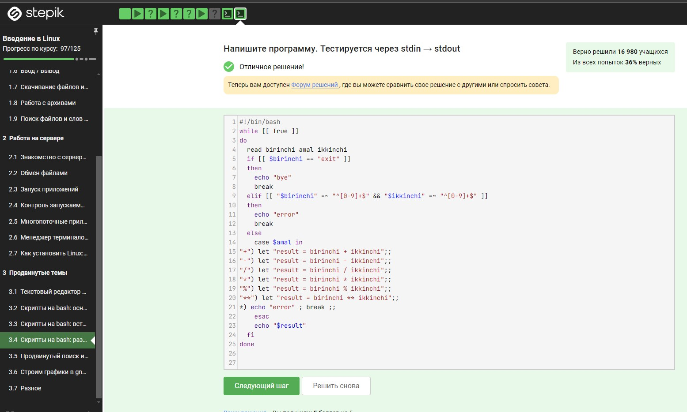{#fig:049 width=50%}

### 5 Шаг

На первой неделе курса мы уже познакомились с командами (точнее утилитами) find и grep, которые используются для поиска файлов по имени и поиску слов внутри файлов. Однако тогда мы рассказали только о малой части их возможностей. На этом занятии мы постараемся восполнить этот пробел, а также познакомимся с командой (точнее потоковым текстовым редактором) sed, который позволяет не только искать слова в файлах, но и сразу же эти файлы редактировать.

Пример видеоурока к 5 Шагу:

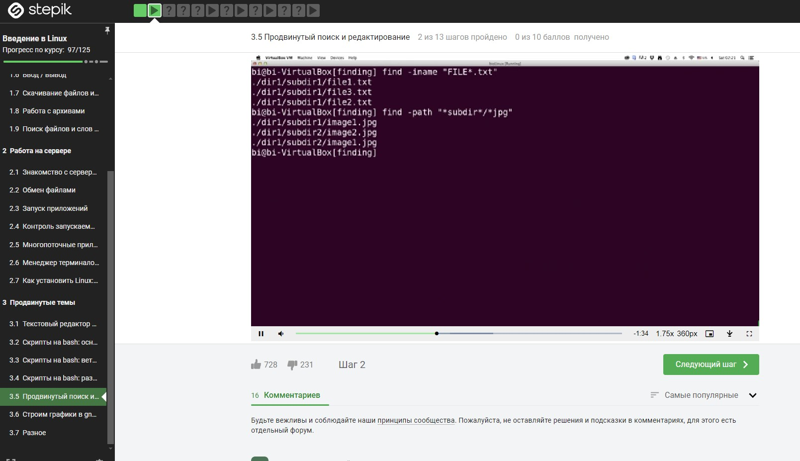{#fig:050 width=50%}

Пример теста к 5 шагу:

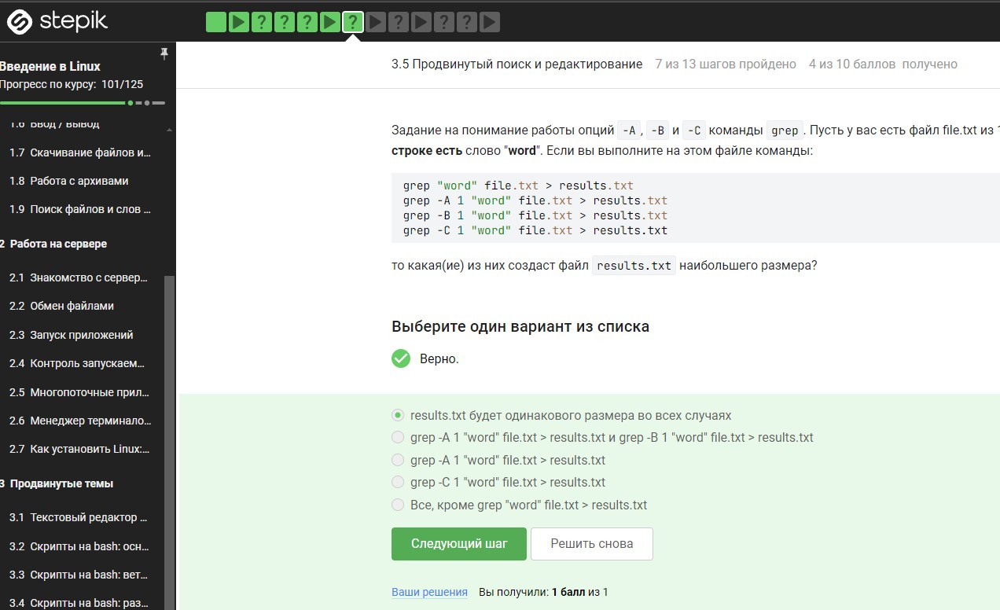{#fig:051 width=50%}

### 6 Шаг

На этом занятии мы рассмотрим программу gnuplot. Эта программа используется для построения двух- и трехмерных графиков. Мы изучим базовые команды gnuplot для работы в интерактивном режиме, а затем познакомимся с потоковым режимом работы и напишем несколько gnuplot-скриптов. В завершение занятия будут продемонстрированы некоторые из продвинутых возможностей gnuplot.

Пример видеоурока 6 Шагу:

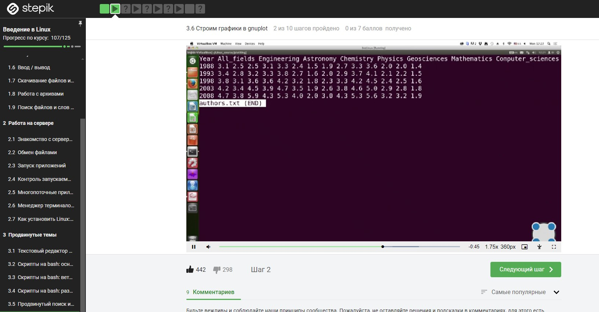{#fig:052 width=50%}

Пример теста к 6  шагу:

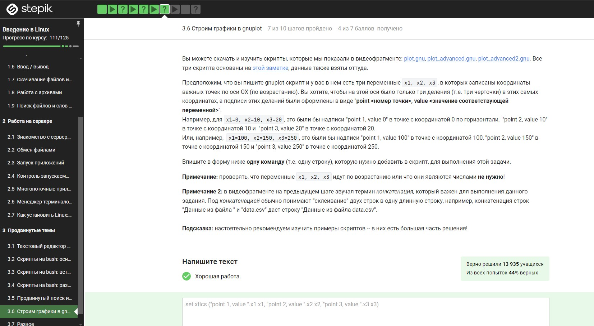{#fig:053 width=50%}

### 7 Шаг

На этом занятии мы рассмотрим несколько небольших, но довольно важных тем. Эти моменты не вошли в другие занятия курса, но мы считаем важным упомянуть о них хотя бы на завершающем занятии. 

Сначала мы обсудим понятие прав доступа в Linux, затем изучим несколько новых команд терминала, а напоследок рассмотрим несколько новых возможностей применения уже известных нам команд. Кроме того, данное занятие включает в себя шаг со справочной литературой и полезными ссылками, которые пригодятся вам при использовании и дальнейшем освоении Linux!

Пример видеоурока 7 Шагу:

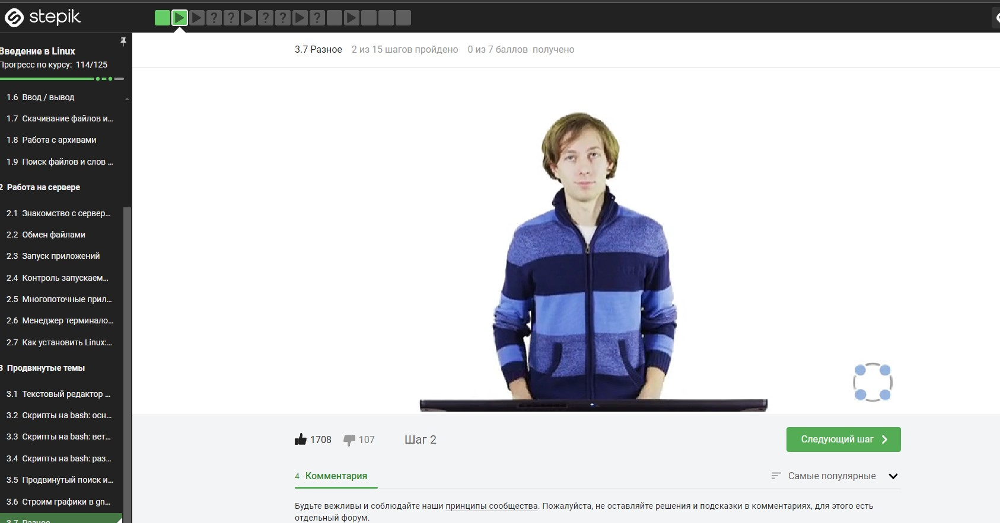{#fig:054 width=50%}

Пример теста к  шагу:

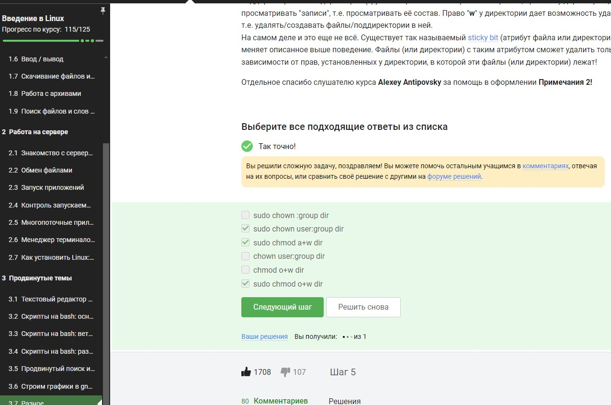{#fig:055 width=50%}

Вывод №3:

Третий этап курса оказался самым интересным и сложным. Главная тема - программирование. Преподаватели отлично объясняют всё в коротких видеоуроках, но всё становится понятно при решении задач. Очень много практики  и заданий для самостоятельной работы - это главное отличие от предыдущих уроков. Если решить задание не получается - всегда можно посмотреть в комментарии: многие пользователи делятся полезными ссылками и помогают найти ошибки в программе и разобраться с ними. Словом, третья часть курса - самая лучшая и полноценная из всех.

# Сертификат 

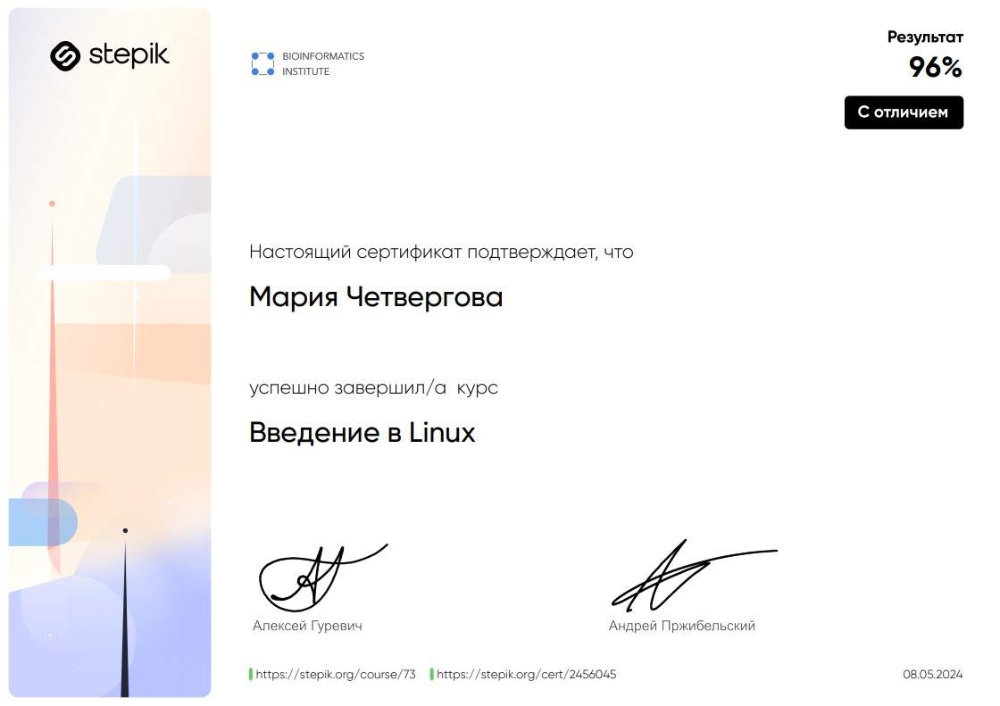{#fig:056 width=70%}

# Выводы

В ходе прохождения курса по основам Линукса, были получены ценные теоретические и практические навыки по работе с этой ОС. Видеоуроки и текстовые инструкции очень подробны и понятны. Интересно были составлены задачи: большинство представлены в виде теста и затрагивают вопросы, связанные с внимательностью к детаям. В то же время есть и практическкие задания, для выполнения которых нужно затронуть все темы, полученные из того или иного раздела. Словом, курс по основам Линукса составлен очень грамотно и продуманно: темы изучаются по порядку и не мешают друг друга, не сливаются "в кашу". Спасибо преподавателям этого курса и  составителям тестов и заданий. Это принесло настоящую пользу
